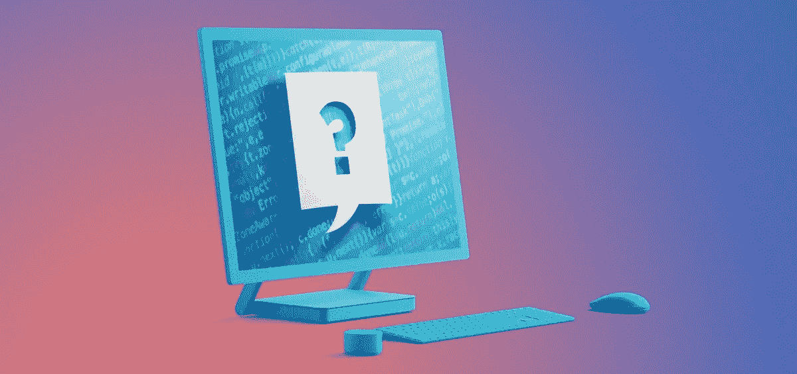
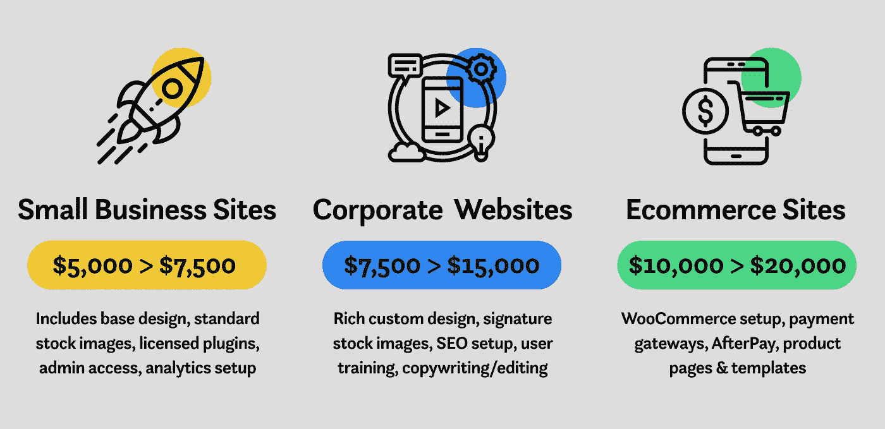

# 2019 年一个网站要多少钱？

> 原文：<https://medium.com/swlh/how-much-does-a-website-cost-in-2019-bb1ddb34814f>

How Much Does a Website Cost in 2019? A cost breakdown by Perth web design agency, Start Digital.

几乎我们收到的每一个询问都会问这个 600 万美元的问题。2019 年一个网站要多少钱？谢天谢地不是 600 万美元！为了提供一个大概的成本，我们需要了解你的业务和你需要从一个新的网站。

你和你的企业是什么类型的网站？您是否需要:

*   宣传册风格的网站只是现有客户发现信息的地方？
*   **营销网站**旨在推广您的服务/产品并赢得新客户？
*   **功能丰富的定制网站**，与其他服务整合，销售产品和/或管理和获取大量数据？
*   在线推广和销售产品的电子商务网站？

与所有基于服务的行业一样，需求越大，完成工作所需的时间就越长，因此价格也就越高。同样，需要更多的页面意味着需要更多的网页设计和开发。

为了尽可能透明，这篇文章对我们做事的方式进行了分类。也就是说，你在这里是因为你想要一个新的网页设计的价格指南。我们会放过你卷轴……

我们已经建立了数百个网站，从经验中我们知道，网站通常分为三大类——小型企业、企业和电子商务。在这些类别中，我们根据对设计和所需功能的理解来分配时间和资源。一般来说，我们的小型企业网站价格在**5000 美元**和**7500 美元**之间，而企业网站价格一般在**7500 美元**和**15000 美元**之间。电子商务网站是最昂贵的选择，从 **$10，000** 一直到 **$20，000+** 。(*请注意，所有价格均基于澳元。)

# 便宜有效呢？

是的，总有人会更便宜。便宜的网站便宜是有原因的。它的价格标签表明了投入开发的时间、精力和资源。从我们的经验来看，一个网站越便宜，无论是由当地机构还是由巴厘岛、印度尼西亚或泰国的人开发的，该网站在将访问者转化为参与性付费客户方面的效率就越低。通常情况下，一个便宜的网站会让你的生意看起来很便宜。

当然有 DIY 选项。像 Squarespace、Weebly 和 Wix 这样的 DIY 网站平台对于希望快速获得在线业务的小型个人企业来说是非常好的，但是当然也有不利的一面和一些不利因素。在一头扎进 DIY 的池子之前，我们建议熟悉一下 DIY 构建者和定制开发之间的区别。一个很好的起点是我们的文章 [**为什么你不应该使用 DIY 网站建设者。**](https://startdigital.com.au/shouldnt-use-diy-website-builder/)

最终，一个设计和开发良好的网站会吸引访问者，并把他们转化为客户。这应该是任何网站的目标。当与 [Start Digital](https://startdigital.com.au/) 合作时，你会得到一个高质量的、以转化率为中心的网站，它会给你带来投资回报。

# 网站成本明细

在 Start Digital，我们相信透明和信任是任何成功商业关系的基础。我们的希望是，通过提供一个网站所涉及的所有成本和组成部分的清晰洞察力，我们的客户明白(或假装明白)他们在支付什么。

# 必需品；要素

在我们讨论网站的昂贵部分之前，这里有一些在开发开始之前需要解决的要点。

*   **域名:**如果你目前没有域名，那就去访问 [GoDaddy](https://au.godaddy.com/) 和 [Crazy Domains](https://www.crazydomains.com.au/) 之类的注册吧。一个域名的平均价格在每年 15-50 美元之间。为了购买. com.au 域名用于商业用途，需要一个有效的 ABN。
*   托管:你的网站需要被托管在某个地方，这样其他人才能访问它。Start Digital 在珀斯、悉尼和墨尔本都有服务器。我们最基本的托管解决方案起价为每年 350 美元，包括每周网站备份和服务器维护。如果您的企业需要一个专用的托管环境，预计每年要支付从**2000 美元到 5000 美元不等的费用**。
*   内容管理系统(CMS): 我们所有的网站都建立在世界领先的内容管理系统[之上。我们还可以提供](https://startdigital.com.au/why-we-use-wordpress/) [Joomla web 开发](https://startdigital.com.au/our-services/joomla-websites-perth/)，不过这是我们将在 2019 年积极淘汰的项目。要设置[**WordPress**](https://startdigital.com.au/our-services/wordpress-websites-perth/)**，配置我们的模板并添加我们的标准插件套件将花费**大约 600 美元。****

# **内容**

**显而易见，没有内容的网站只是一个空白的页面。虽然简约设计很酷，但一个空白页面不会为你赢得客户。2019 年内容依然是王道。不可否认，文本和图像是任何网站最重要的组成部分。世界上许多最有吸引力和转化率最高的网站在某种意义上非常相似——它们都找到了吸引内容的正确平衡。**

**我们认识到，每个企业都是不同的，手头会有各种各样的内容，包括图像和文本。此外，我们知道，对如何为网络受众写作的深刻理解和对个人商业空间的深刻了解，是找到这种组合的关键。因此，Start Digital 提供了三个与内容相关的选项:**

*   ****客户提供一切:**客户提供所有内容，Start Digital 负责将提供的内容输入他们的 WordPress 站点。我们将使用批准的网页设计来指导内容的格式，调整和优化提供的图像，安装所需的字体，设置网站的颜色，并在各种浏览器和设备上测试网站。添加这些内容的费用大约是每页 150 美元，这取决于内容的数量和所需的设计。**
*   ****开始数字化创造一切:**我们的文案和内容创作者创造一切。这是一个常见的要求，通常会产生最好的结果——**[**sound lab**](https://startdigital.com.au/project/soundlab-portfolio/)和 [**Firesafe**](https://www.firesafegroup.com.au/) (以及许多其他的)将证明这一点。在了解您的企业和研究竞争空间后，我们制作了将您的企业定位为领导者的内容。我们的文案服务收费是每小时 120 美元，而半天的现场摄影是 500 美元。如果需要库存图像，我们会分配适当的时间来获取高质量的图像。任何曾经花时间寻找库存图片的人都知道，这很快就会成为一个摧毁灵魂的时间真空——谢天谢地，我们知道在哪里可以找到最好的图片 ！为一个 10 页的网站创建合适的内容可能需要 3 到 5 天的时间，所以预算在 1500 到 5000 美元之间是值得的。****
*   ****需要两种选择:有时一个企业需要两种选择的混合——我们很灵活。无论您的企业需要图像、视频还是文本，Start Digital 的内部创作团队都有能力开发必要的内容。这些服务的价格(文案、摄影、平面设计等。)都各不相同，取决于业务的具体需求。****

# ****网站功能****

****一旦我们建立了内容，是时候探索设计，结构和功能。****

*   ****网页设计:包括调色板、字体、布局、图形设计和导航。我们所有的设计都是完全响应的(它们适用于台式机、笔记本电脑、手机和平板电脑)，并专注于使用设计来鼓励参与和转化。一本小册子风格的网站设计将在****1500 美元到**2000 美元之间，而需要更多功能的网站设计可能高达**7000 美元，这取决于页面的数量。********
*   ********滑动标题/幻灯片:**我们授权最好的 WordPress 插件来扩展您网站的功能。在一个有 3-4 张幻灯片的页眉上添加图像、文本和动画的价格标签大约是**500 美元**。这还包括编辑图像以适应各种屏幕尺寸，并在特定屏幕尺寸需要时使用替代图像。******
*   ******图片库:** Start Digital 将为图片库添加、调整大小、优化和标记所有图片。费用很大程度上取决于想要的图片和画廊的数量，但预计支付 300 至 600 美元。****
*   ******社交媒体整合:**我们可以将 Instagram、脸书、Twitter 等社交平台与您的网站整合。根据添加的平台数量和所需的集成级别，集成成本在**150 美元到**500 美元之间。值得注意的是，整合一个脸书直播订阅源比嵌入 Instagram 订阅源需要更多的基础工作，因此费用因社交平台而异。****
*   ******SEO 设置:**持续的 SEO 策略对长期成功至关重要。如果你的企业对初始 SEO 设置感兴趣，起始费用从 **$500** 开始。这包括页面元标签，图像大小和压缩，Yoast SEO 设置和最小化代码的重量。****
*   ******电子商务:**我们提供两种 [**电子商务解决方案**](https://startdigital.com.au/our-services/ecommerce-web-design-perth/) ，一种是通过 WooCommerce，另一种是 Shopify。我们的解决方案从 **$2，000** 一直到 **$10，000+** 不等，取决于产品数量和所需功能。****
*   ****联系方式: Start Digital 可以开发任何东西，从基本的联系方式到详细的调查。**标准表单约为 150 美元**，更多**高级表单约为 300 美元+** ，但受其功能影响。****
*   ******事件管理:**我们可以使用 WordPress 中的插件(**大约 500 美元**)或者集成像 EventBrite 这样的第三方事件管理平台。我们可以设置和配置 EventBrite，并将其集成到一个网站中，费用约为 500 美元。****

# ****发布后/二级服务****

*   ****站点维护:维护包括保持你的 WordPress 是最新的并且没有错误。这可能需要更新插件以最大化网站功能，解决版本问题以保持性能，并更新网站内容。持续维护按月收费，根据现场和客户要求，每月从**200 美元到**500 美元不等。****
*   ******正在进行的 SEO:** 搜索引擎优化是帮助你的网站在谷歌和其他搜索引擎上“有机”排名的持续工作。统计数据证明，至少 75%的数字流量流向了在第一页上排名靠前的企业，所以你的网站排名越高，被未来客户发现的机会就越大。我们严格遵循 [**谷歌排名指南**](https://support.google.com/webmasters/answer/7451184?hl=en)——并有一些白帽 SEO 技巧。搜索引擎优化的费用从每月 750 美元开始。****
*   ******数字广告:**从谷歌广告到赞助的脸书和 Instagram 帖子，Start Digital 为我们的客户执行有效的付费媒体策略。价格很大程度上取决于你的商业空间和你的竞争对手的花费。重要的是，任何营销活动/策略都有一些明确的 KPI，以便投资回报得到清晰的管理。对于一个竞争相当激烈的行业，预计每月会消耗掉 500 美元甚至更高。****
*   ******社交媒体营销:** Start Digital 将根据您的业务情况制定并执行独特的社交媒体战略。我们将确定哪些平台和什么类型的内容最符合您的核心人群——在他们使用的平台上接触到您的受众非常重要。社交媒体营销的报价取决于交付的策略，但合理的起点是每月 450 美元。****

# ****请求网站报价****

****现在你知道了🙂如果你想收到你的网络项目的报价，请 [**填写这张表格**](https://startdigital.com.au/contact-start/fast-track-your-new-website/) 。我们是来帮忙的！****

*****所有价格均以澳元为基础。****

****本文原载于起点数码 [**网站**](https://startdigital.com.au/how-much-does-a-website-cost-in-2019/) 。****

********

## ****这篇文章发表在 [The Startup](https://medium.com/swlh) 上，这是 Medium 最大的创业刊物，拥有+446，678 名读者。****

## ****订阅接收[我们的头条](https://growthsupply.com/the-startup-newsletter/)。****

********