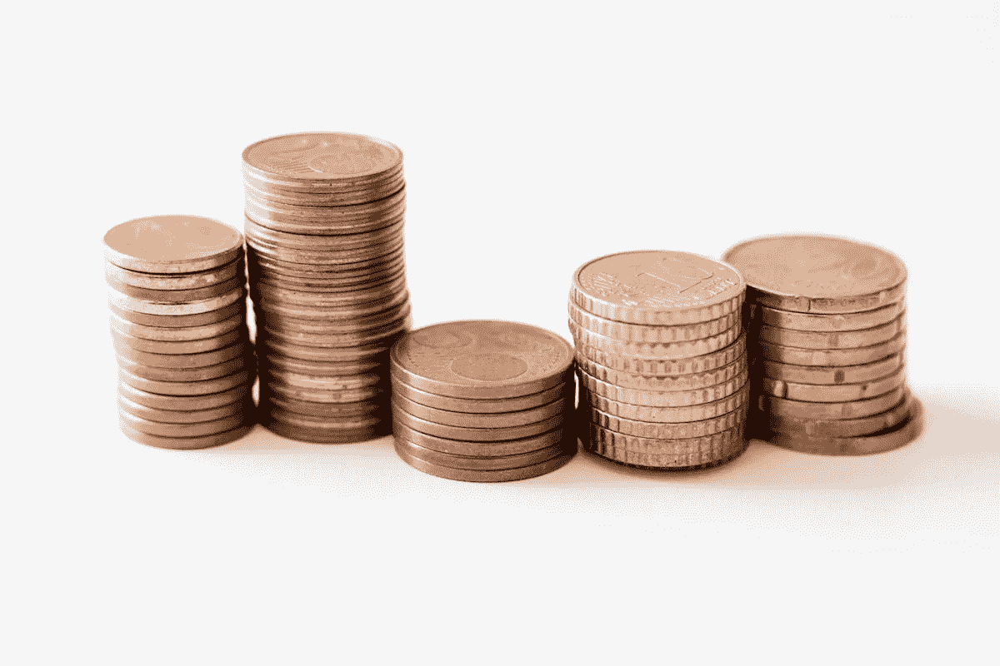

# “我该收多少钱？”—自由职业者、创意人员和顾问的初级定价指南

> 原文：<https://medium.com/swlh/how-much-should-i-charge-a-beginners-guide-to-pricing-for-freelancers-creatives-and-consultants-d184efd9c36a>

Photo by [Ibrahim Rifath](https://unsplash.com/photos/OApHds2yEGQ?utm_source=unsplash&utm_medium=referral&utm_content=creditCopyText) on [Unsplash](https://unsplash.com/search/photos/money?utm_source=unsplash&utm_medium=referral&utm_content=creditCopyText)

当我刚开始为自己工作时，我向其他自由职业者咨询如何给我的作品定价。我每次都得到同样的回应。

“哦，我只是太不擅长定价了！我从来不知道该收什么。”