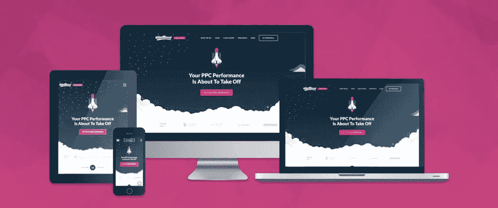
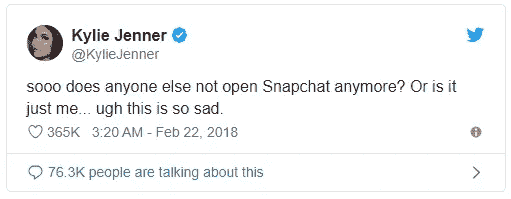
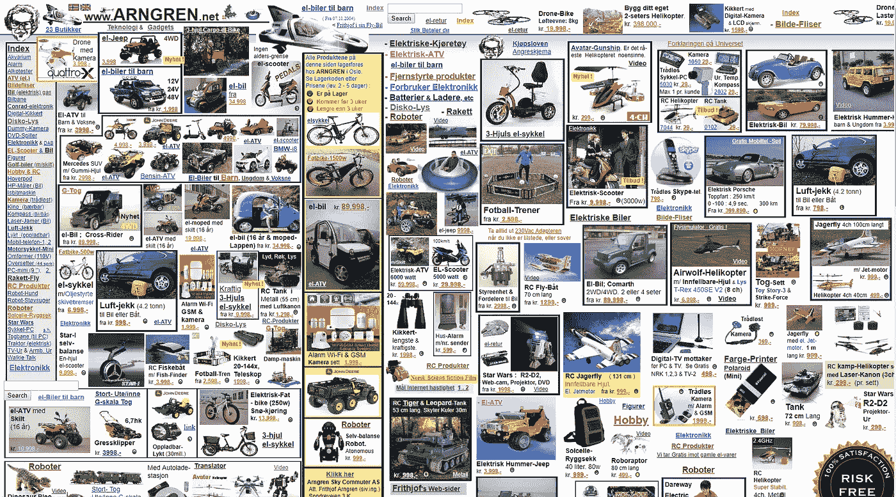

# 多少 UX 是太多了？

> 原文：<https://medium.com/swlh/how-much-ux-is-too-much-4630f6b3ca31>

在当今快速发展和不断变化的技术世界中，当“智能”数字平台已经成为人类生活不可分割的一部分时，用户需要在这些数字平台上获得最佳体验是最重要的理念。毕竟，好的设计就是好的生意。但是…

> 你的 UX 可能会痛！

2019 年，当你的 UX 设计有能力给出你的业务在最近的未来将如何表现的想法时，当你的用户体验太过压倒性时会发生什么？商业的成比例增长还是泰坦尼克号的沉没？UX 设计师是最终的故事讲述者，对于他们来说，在提供良好的用户体验方面成为禁酒主义者是不可接受的。在今天的这个时候，当 UX 设计被如此多的讲述、写作和谈论时，是时候反思一下 UX 设计是否真的饱和了，或者我们是否忽略了这一点？

有些人可能只是把 UX 设计归类为无关紧要和过度饱和，但我认为这是他们肤浅或短视的表现。UX 就在这里！！它不仅仅是给屏幕提供生命；UX 是关于理解用户，学习他们的用户行为，并通过设计来决定和影响它。

以下是我对限制你的 UX 走得太远以达到设计上的额外成就的看法。

## 1.UX 设计作为一门学科

将 UX 设计作为一门学科进行整体分析是一个很好的开始。你的 UX 必须更加注重改善人民生活；业务将因此增长！围绕你的 UX 使用的工具，应用的方法，围绕它设计的技术，经历的职业挑战，以及我们的 UX 将如何对周围世界发生的事情负责。有意识地分析这一切肯定能帮助你取得更好的成绩，至少可以肯定！

## 2.慢慢来

不要一开始就把你的 UX 设计成激进的、受收入驱动的、短期的设计。给你的 UX 足够的时间用中低火烹饪，让你的用户去品味它，并长久地记住它:P 你应该开放地每天重新设计，为你的用户找到一个甜蜜点。然而，避免激烈和苛刻的重新设计。

Instagram 每隔几天就会焕然一新，但 Snapchat 的同样策略却出了问题，因为它的重新设计导致其日用户数下降了 2%,从 1 . 93 亿降至 1 . 88 亿。广告浏览量和收入[下降了 36%](https://marketingland.com/forecast-downgrades-2018-snap-ad-revenue-outlook-by-36-percent-249332) 。这都要感谢这条千禧年推特！！😁

## 3.传统、简单和极简:新的咒语

一些应用程序看起来很好，色彩鲜艳，漫画风格，字体大胆，设计简洁。虽然有些人仍然相信简单和最小化的传统观念。行业巨头正在经历向简约设计的范式转变。新 UX 的目标是增加交互性、细节纹理和图案、响应式设计、定制和以用户为中心的方法！

Source: Uber India

## 4.乐观是关键

你的 UX 不是来从怪物手中拯救世界的，但它至少可以与无聊的屏幕恶魔战斗；将广告牌设计作为用户界面来实现是 90 年代的事情。2019 年是一个充满试验的时代，在颜色、文本、动作、动画、视频和活力方面为屏幕添加新奇的东西。直接的目标是在你的应用程序/网站上创造一个乐观的未来的幻觉。然而，不要在内容、颜色和文字上走得太远，否则你的用户会感到疏远和沮丧。

Arngren.net- Were you just created for us to put you #1 on bad UX?

## 5.追随潮流

UX 既考虑了服务提供商的利益，也考虑了用户的利益。UX 的主要目标是不断即兴创作用户与产品或任何相关服务的界面和感知的交互质量。因此，坚持最适合你的商业模式的传统/趋势有时很重要。运用商业智能、数据分析和各种其他策略以及多余的用户体验(UX)来为你的用户创造精心制作的体验并迎合他们的需求。

点击阅读更多关于 2019 年 UX UX 趋势的信息[。](/swlh/the-ux-trends-for-2019-8485b6704ed7)

## 6.相信你的“下午 5 点后”设计！！！！

从来没有。永远不要把你的设计和你公司的广度联系起来。就连脸书也曾是一家初创企业。不要沉迷于研究和设计方法。当然要遵循 UX 的设计流程，但是遵循你对用户行为、需求和要求的直觉是一件叫做*打破玻璃*的工作。

保持检查你的 UX 设计钟摆从上述点，你很好地得分作为布朗尼点的经典投资回报率！！

干杯！

## 这篇文章发表在[《创业](https://medium.com/swlh)》上，这是 Medium 最大的创业刊物，有+426，678 人关注。

## 在这里订阅接收[我们的头条新闻](https://growthsupply.com/the-startup-newsletter/)。

