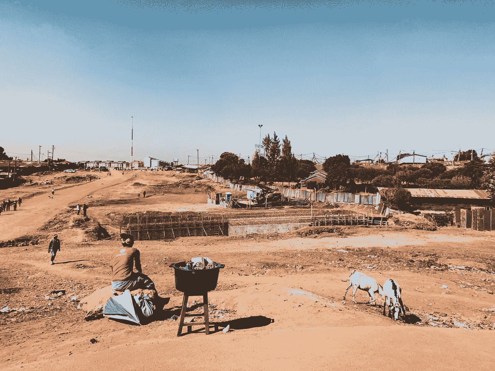

# 内罗毕如何改变了我的设计方式

> 原文：<https://medium.com/swlh/how-nairobi-has-changed-the-way-i-design-8d3d91dbb9ab>

## 讲述了改变我作为设计师视角的重要知识。

我目前在私营部门工作，为包括金融和医疗保健在内的多个行业设计解决方案。2018 年，当一个公益机会来到我面前时，我发现自己正在支持肯尼亚内罗毕的一家科技初创公司。这个机会让我能够…