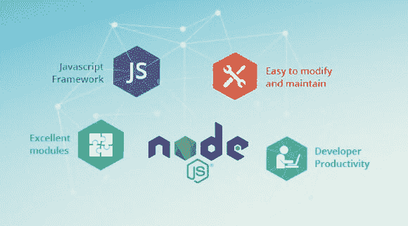

# Node JS 如何为你的在线业务带来成功？

> 原文：<https://medium.com/swlh/how-node-js-bring-success-to-your-online-business-aa5db90d3151>

如果你曾经研究过 JavaScript，那么你会同意 Node.js 是最好的 Javascript 平台之一，它建立在 Chrome 的 V8 JavaScript 引擎之上。它也是一个强大、快速、高效和可伸缩的 web 服务器。事实上，一些顶级应用程序开发公司使用它来获得各种安全好处。

*   高性能
*   客户端和服务器之间的耦合
*   廉价的托管服务
*   云技术
*   轻量级 Node.js 服务
*   支持快速本机绑定
*   支持最低可行产品(MVP)交付
*   易于使用开源包和模块
*   易于执行和安装
*   支持多平台代码

**事实&数字**

根据市场报告，Node.js 是最大的开源平台，每月下载量超过 1500 万次，每周收到约 10 亿次下载包请求。

根据 [**SimilarTech**](https://www.similartech.com/technologies/nodejs) *分享的报道，大约有。501，481 个实时网站和* ***156，658 个*** *唯一域名。美国的 Web 开发公司在使用 NodeJS 框架方面处于领先地位，俄罗斯位居第二。*

*全球品牌如****Dictionary.com、Flickr.com、*** *、Thesaurus.com 都利用 Node 建立了自己的网站。JS 说*[***W3Techs***](https://w3techs.com/technologies/details/ws-nodejs/all/all)*。*

**NodeJS 为您的企业带来的十大好处**

1) **真的很容易编码**

节点。JS 真的很容易学，它还允许 web 开发人员轻松地用 JavaScript 为服务器和客户端编写代码。用于两者的 Javascript 使得在客户机和服务器之间传输数据变得很方便，而客户机和服务器同时工作得很好。对于 web 应用开发者来说，Node.js 满足了开发过程中的所有需求。

2) **快速&易用套件**

NodeJS 是一个运行在 Google V8 引擎上的超快速平台，它不会降低工作速度。Node.js 允许构建 web 应用程序，包括网络连接、文件系统等功能，使用 node.js 平台可以快速读取或写入数据库。

例如， **LinkedIn** 使用 **Node JS** 构建各种 web 应用程序，目的是提高性能和减少服务器数量。简单来说，Node.js 是用来快速制作 web 应用的。

3) **最适合开发实时网络应用**

Node JS 用于以光速创建实时 web 应用程序，这是用 PHP 制作简单的博客网站、聊天应用程序和游戏应用程序所必需的。事件驱动架构服务于使用 JavaScript 编写的客户端和服务器。

4) **允许** **数据流**

如果你是一名 web 开发人员，那么你最好知道在 [web 应用程序开发](https://www.valuecoders.com/web-application-development)的过程中，HTTP 请求和响应是两个独立的事件。开发人员可以充分利用数据流，例如在加载和创建最佳属性时处理文件，因为这可以减少数据传输过程的持续时间。

5) **主持**

随着越来越多的 web 开发人员转向 Node.js，由于他们的项目需要，对 web 托管的需求也在增加。PaaS 服务提供商，如 Heroku 和 Modulus 都允许部署 node.js，这对于你的虚拟主机需求来说没有任何问题。

6) **动态 NPM**

作为最好的开源平台，NodeJS 通过共享动态工具和模块库提供了一个前沿的性能。在 NPM(节点包管理器)中，有超过 60000 个模块随着增长而增加，并将超过基于 Ruby on Rails (RoR)的平台。

7) **对** **客户**有用

除了它的核心竞争力，NodeJS 还是一个大型开源社区，提供了可以在任何地方工作的优秀模块。一个这样的模块是 **Socket.io** ，它帮助维护客户端和服务器之间的持续通信，并允许服务器向客户端发送实时更新。

8) **数据库查询高端解决方案**

使用 Node JS 开发可以很容易地解决数据库查询。诸如 MongoDB、NoSQL 数据库、CouchDB 等数据库查询都是在 JavaScript 框架上工作的。当连接 Node.js 和 NoSQL 数据库时，也不需要调整语法差异。

9) **帮助提高** **生产率标准**

所有 Node.js 程序都是用 JavaScript 开发的。背后的原因是 JavaScript 代表了前端和后端开发者之间的鸿沟。为了消除这种差距，许多大大小小的网站开发公司将前端和后端团队合并到同一个部门。

举个例子，比如 PayPal，它最近采用了 NodeJS 开发来构建应用程序，现在他们正在享受工作的平稳运行。

10) **代理服务器**

Node JS 开发为代理服务器提供了最好的解决方案。比方说，如果有一个服务器端应用程序处理第三方链接并收集数据，保存来自各种来源的视频或图像，那么 Node.js 可以作为没有适当基础设施来满足代理需求的组织的代理。

**底线**

节点。JS JavaScript 框架在创业公司中相当流行。然而，像贝宝，网飞，微软，易贝等大品牌。也在使用这个功能丰富的应用程序开发框架。今天，市场上充满了顶级的 [**IT 外包公司**](https://www.valuecoders.com/) 的选择，你可以在上面轻松地构建智能网络应用。或者你可以 [**雇佣 NodeJS 开发人员**](https://www.valuecoders.com/hire-developers/hire-nodejs-developers) 帮你构建智能应用解决方案，没有任何麻烦。那么，你还在等什么？

## 这篇文章发表在 [The Startup](https://medium.com/swlh) 上，这是 Medium 最大的创业刊物，拥有+435，678 名读者。

## 在此订阅接收[我们的头条新闻](https://growthsupply.com/the-startup-newsletter/)。

