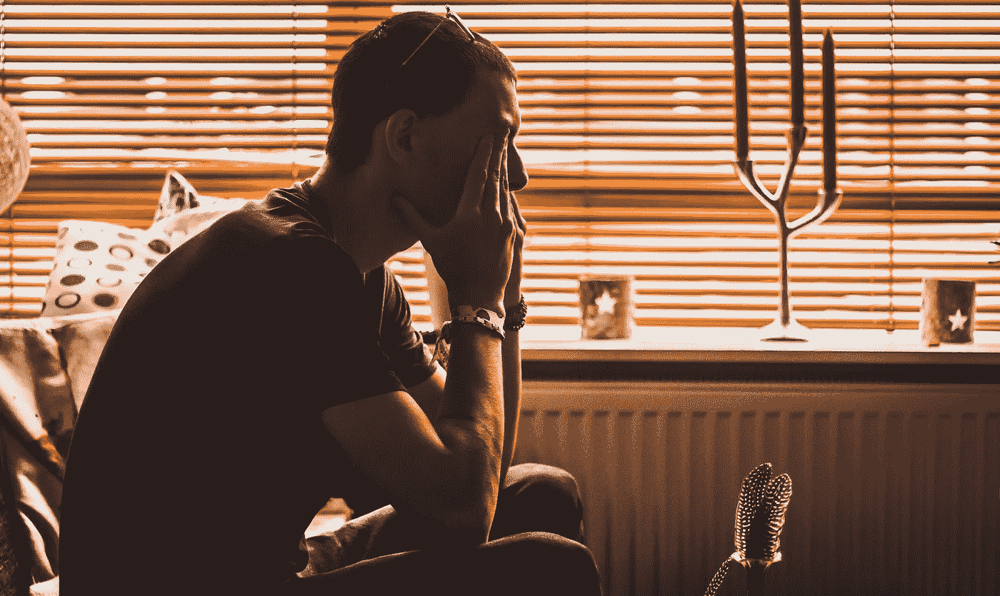

# 如何不成为企业家

> 原文：<https://medium.com/swlh/how-not-to-be-an-entrepreneur-2d58065c2a6f>

Image from [Christopher Lemercier](https://unsplash.com/@elevantarts) at [Unsplash](http://unsplash.com)

## 作为 21 世纪的企业家，从虚构中辨别事实

即使你不认为自己是典型的“创新&企业家”群体的一员，我想你肯定听说过它。毕竟，这几乎是不可能避免的。只要看看你最喜欢的新闻来源，我敢打赌，两三篇文章下来(或者也许…