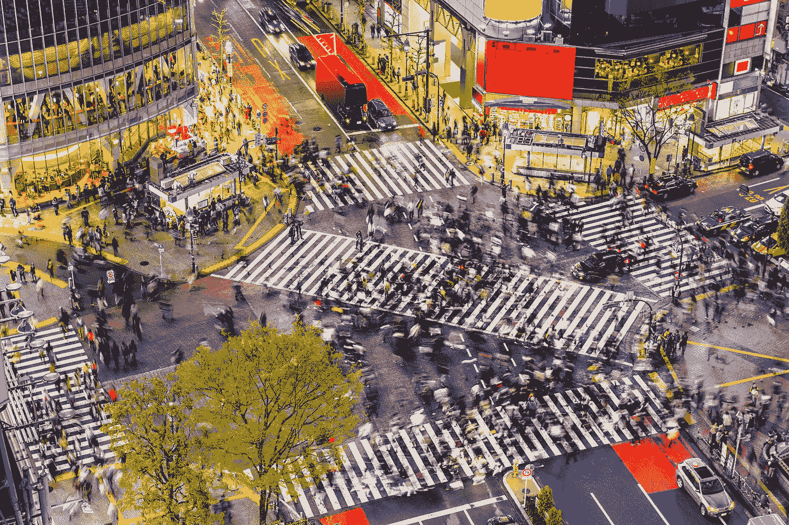

# 如何不被日本设计迷惑

> 原文：<https://medium.com/swlh/how-not-to-be-bamboozled-by-japanese-design-ad385a58e3dc>

## 当你对排版的所有了解都是错误的时候。

Shibuya Crossing in Tokyo ©SeanPavonePhoto

J 阿潘以禅宗美学闻名。人们带着某种期望而来。他们期望找到宁静的花园、宁静的寺庙和精美的书法。

事实是“日本完美”是一个神话。