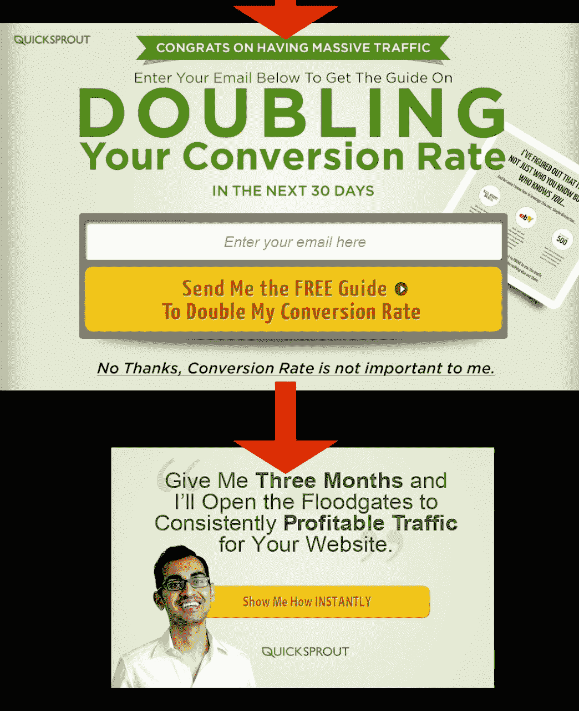

# 我们的初创公司是如何在失去电子邮件订户的情况下实现 8 位数收入的

> 原文：<https://medium.com/swlh/how-our-startup-reached-40m-revenue-while-losing-email-subscribers-8c97358fc913>

## 钱不在单子上

你在 Linkedin 上收到过陌生人的消息吗？

通常，有人希望我尝试他们的产品，推荐他们的服务，或者为他们提供营销建议。

但是，上周，我收到了另一种询问:

在定期访问我们公司的博客后，Uffe 还没有遇到过一个滑动、弹出或引导磁铁。考虑到选择加入黑客的标准化，他感到惊讶。

访问 [Ahrefs 的博客](https://ahrefs.com/blog/)，你会看到*的一个*表格，位于最底部，评论区的正上方，用于收集电子邮件地址。就是这样。

以下是我的回答:

在我们的内部通信数据库中快速搜索发现，乌菲确实在几个月前注册了付费试用。

换句话说，我们从未*需要*他的电子邮件地址。我们的博客内容足够吸引人，足以让我们卖出去。

我们发表的每一篇文章都强调了我们软件的功能，同时教导读者如何成为更好的 SEO。

我们的理念:

> 当你可以专注于将读者直接转化为客户时，为什么要专注于将读者转化为潜在客户呢？

到目前为止，它是有效的。

在过去的 3 年里，Ahrefs 在没有选择加入黑客、销售线索磁铁或培养序列的情况下，实现了 [+65%的同比增长](/swlh/how-we-achieve-65-yoy-growth-by-ignoring-conventional-startup-advice-24a3eef619c1)(以及 8 位数的收入)。

最疯狂的是——在那段时间里，我们失去的电子邮件订户比我们获得的还要多。

看看我们下面的 MailChimp 统计数据— *注意:我们在 7 月份合并了两个列表，这创造了一个“提升”的表象*

显然，我们的理念与大多数在线营销者、成长型黑客和数字机构所支持的建议直接矛盾。

和任何一个经验丰富的营销人员待久了，你可能会听到他说:*钱在清单里。*

或许，某个来自“直邮”时代的疯狂成功的营销人员创造了这个绰号——没人知道。

然而，我们不认为这种理念是当今将潜在客户转化为付费客户的最有效方式。这就是为什么我们的电子邮件营销工作基于以下前提:

# **1。这笔钱不在清单上**

而是在解决问题。

让我解释一下。

如果我向 Ahrefs 首席执行官兼创始人 Dmitry 以外的任何人汇报，我可能会因为忽视名单构建策略而受到批评。然而，德米特里是一个“产品第一”的家伙。

这意味着他优先考虑在持续的功能改进上投入资源，而不是执行所有的营销策略。这些产品功能是我们基于 SEO 的营销策略的基础。

同样，我们的经验表明，钱是通过吸引人的内容来解决问题的，这些内容:

1.  教导我们的读者如何成为更好的 SEO 和
2.  说明了我们软件的特点。

由于这个原因，Ahrefs 在许多搜索引擎优化相关的搜索中排名很高。我们网站和博客的搜索流量是我们第二大客户来源，仅次于经典的口碑。

对我来说，这就是传统的列表策略失败的地方…

假设有人通过谷歌搜索找到了一篇文章。他们到达是为了寻找一条具体的信息。

当他们主动阅读我们软件的间接推销时，我们为什么要打断他们？他们找到的文章教他们如何用我们的工具包解决他们的确切问题。

我们的作者花了大量时间来确保我们发表的每篇文章都非常相关、有价值和吸引人。将人们的注意力从我们努力生产的东西上转移开似乎是愚蠢的。

只要我们的 ARR 继续攀升，我们就会继续将资源分配给有效的项目。对我们来说，这就是创作内容，宣传我们有资格提供的东西:

一个 SEO 工具包，拥有世界上最大的实时反向链接索引和仅次于 Google 的第二大网络爬虫。

# **2。30%以上的打开率是奇迹**

另一个令人惊讶的事实？我们的邮件打开率有点低。

查看我们上次发布的指标:

根据 IBM 2016 电子邮件营销基准研究，美国的平均电子邮件打开率为[21.5%](https://www-01.ibm.com/marketing/iwm/dre/signup?source=urx-13772&S_PKG=ov56286)。

Hubspot 对超过 2500 万封电子邮件进行了另一项抽样调查，对“计算机软件”公司的平均打开率为 28%。

哎呀——我们比平均水平低 11 分。你可能想知道这是因为我们实际的电子邮件很无聊、不相关或无效。但是像这样的评论表明事实并非如此:

参与更好的列表细分、非活跃用户清除和其他因素可能会提高我们的打开率。但是这样的任务对于我们这个小的市场部来说并不是优先考虑的。为什么？

“做好每一件事”的公司仍然没有达到 30%的受众。简而言之，我们的 10 人团队没有时间在微不足道的收获上浪费精力。

我们的解决方案是创建一个应用通知功能；每当有新内容发布时，钟形图标会提醒 Ahrefs 用户。是的，我们抄袭了脸书的创意！

不幸的是，即使这种接触客户的方法也不完美。

虽然我们的数据显示，通知的表现比电子邮件好，但整体覆盖面仍然很低。这就是为什么我们依靠其他几种营销方法来确保我们的内容到达我们的观众。

# **3。选择加入的伎俩可能弊大于利**

好吧，你可能还在想:

> *但为什么不潜在地让你的清单变得更大呢？为什么不用选择加入的招数？*

如前所述，我们的首席执行官不喜欢营销“伎俩”，因为他们是虚伪的设计。但他也质疑它们的有效性。

对于每个通过弹出窗口订阅的访问者，你可能会惹恼其他人。不幸的是，没有确切的方法来追踪有多少潜在客户这样流失了。

然而，我经常遇到一些案例研究，比如这个关于美食博客作者 Nikki McGonigal 的案例。

在 8 个月的时间里，这位美食家通过灯箱弹出比侧边栏选择多获得了 1375%的订户。显然，这种策略有时会与优雅的执行相结合。

然而，这并不是许多网络营销者所提倡的。在连续收到三个弹出窗口后，SEO [丹·佩特罗维奇](https://plus.google.com/111588754935244257268/op/about)说他沮丧地放弃了营销人员尼尔·帕特尔的网站。

他在社交媒体上分享了他的经验，发表了一篇题为“如何在三个简单的步骤中失去观众”的帖子。

以下是佩特罗维奇在他的帖子中提到的弹出窗口:

事情是这样的——帕特尔正在向特定的市场营销人员进行营销，他通过测试证明这些技术对他们有效。这并不一定意味着它们会对你我的观众产生影响。

然而，我认为 Ahrefs 可以通过介于前两个例子之间的方式来改进其选择加入策略。

现在，我们利用位于每个帖子底部的“经典”订阅表单。我怀疑这些形式经常被忽视，因为它们被广泛使用。

发表这篇文章后，我们将尝试一些更吸引眼球的东西——一种离散的幻灯片形式。然而，在读者到达文章底部之前，选择加入不会出现。

我们能否用免费赠品来吸引读者，以换取他们的电子邮件地址？是的，但我们不想让他们觉得我们的电子邮件潜在客户培育序列中“只是另一个数字”。

我们的目标是维护一个个人电子邮件列表，这些人自愿注册接收新发表文章的通知，而不是一个可下载的贿赂。

设定并实现明确的期望会建立信任，而信任会转化为销售。

我们的博客为我们带来了新的客户，因为我们付出了 110%的努力来创建解决他们问题的内容，同时展示了我们平台的力量。

考虑到这一点，我们不想打断我们努力创造的阅读体验。一个弹出窗口要求某人离开网站，检查他们的收件箱，确认他们的电子邮件地址并重新聚焦。

考虑到我们花了多少时间和金钱来创作文章，为什么我们会主动地把潜在客户引走呢？

我们的大部分业务来自口碑。我们的读者定期在 Reddit、LinkedIn 和 Twitter 等平台上推荐我们的内容。

如果我们先用诱人的赠品分散他们的注意力，然后意外地用“引导培养”邮件淹没他们，这种情况就不会发生。

> 翻译:给人们他们想要的就是一切。

# **4。维护列表成本高昂**

最后，“不惜一切代价扩大你的清单”的最终缺点可能是维护它的成本。像 Mailchimp 这样的电子邮件服务提供商通常会根据“发送的邮件数量”提供不同的价格方案

考虑到只有不到 30%的用户打开普通的商务邮件，这对于 T4 来说真是一笔糟糕的交易。查看我们最近收到的通知，因为我们用完了信用点数:

未能建立“双重选择加入”——订户必须在加入前点击电子邮件确认链接——你可能会在桌面上留下更多的钱。

Mailchimp 为什么不根据“打开的邮件数量”收费？我不确定，但是为持续低投资回报率的东西付费应该总是受到质疑。

# **同样，钱*不在清单***中

我们有能力用有价值的内容来解决问题，在吸引有机搜索流量的同时推广我们的产品。现在，我们的买家之旅是这样的:

*   有人通过谷歌搜索答案。
*   他们在我们的博客上看到了一篇解决了他们的问题(并介绍了我们的工具)的帖子。
*   他们报名参加试验。

这个简单的顺序之所以有效，是因为这个人*希望*将他或她*刚刚*读到的东西付诸行动。

参与电子邮件漏斗优化将为旅程增加两个额外的步骤——电子邮件确认和额外的电子邮件参与——这将延长访问者阅读文章后的主要目标:玩软件！

你呢？你是如何建立名单的？你经历过什么样的弹出窗口、滑动条等等的结果？

请在下面的评论中告诉我。

//

> *感谢阅读。如果你喜欢这篇文章，请点击* ***👏按钮几次(👏👏👏👏)*** *帮别人找吧:)*

更多深入的营销文章，请访问 Ahrefs 博客。

//