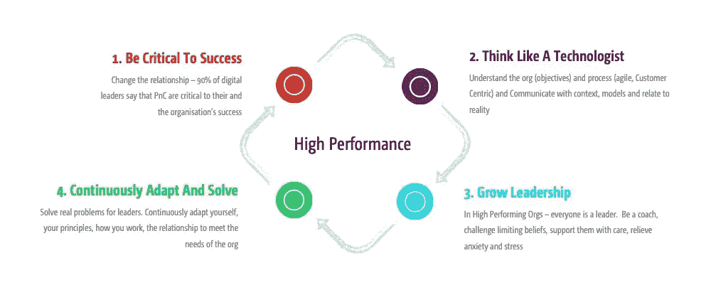
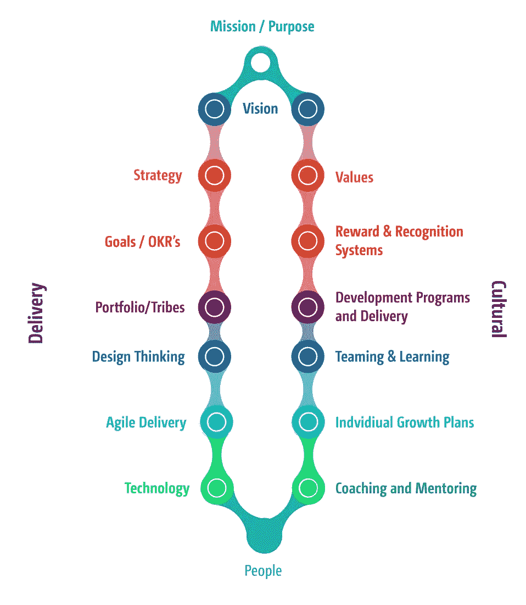
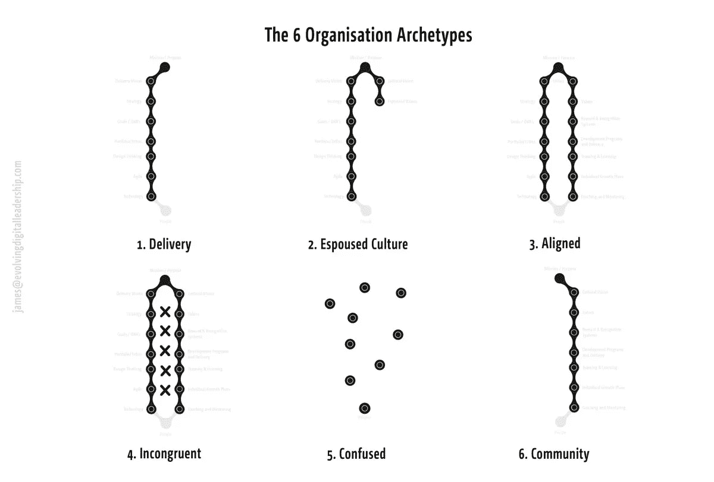

# 人员和文化(PnC)如何成为组织成功的关键:技术 2.0(第 1 部分，共 2 部分)

> 原文：<https://medium.com/swlh/how-people-and-culture-pnc-can-become-critical-to-an-organisations-success-tech-2-0-69555eb1a7d9>

今天，在竞争中保持领先的组织比以往任何时候都更加关注人和文化。而且不是以乒乓球桌和信任练习的形式。这是关于数字领袖、人和文化(PnC)放大彼此的优势。

那么，核心原理是什么呢？

让 PnC 成为组织成功的关键。

> *“人和文化是组织绩效的核心
> ，通常会推动成功和失败。”*
> 
> -德勤，数字化工作场所

我们不再生活在这样一个世界:组织的人力资源职能被用于合规、招聘、解雇和绩效管理。人力资源的传统职能**已经演变**并更名为**人员和文化** (PnC)。

如今，良好的 PnC 职能为组织及其员工创造和塑造积极的文化。这太棒了。

但是，这还不够。

为了在当今世界取得成功和发展，我们必须进一步发展 PnC 职能，以至于组织中的所有领导者都会说:

> “PnC 对我们的成功至关重要。如果不是因为我们与 PnC 的密切伙伴关系，我们根本不可能实现我们的目标”。

# **成为成功的关键**

PnC 要想成为成功的关键，其职能需要从创造伟大的文化演变为也有助于建设高绩效组织的文化。

在数字组织中，我推荐如图 1 所示的 4 步 PnC 高绩效组织周期。在本文中，我将讨论这个循环的前两步(第二部分将包含第 3 步和第 4 步)。

Fig 1: PnC High-Performance Organisation Cycle

这个循环始于 PnC 成为成功关键的意图和愿望。这种意图将我们的注意力和活动集中在正确的领域(有关意图的信息，请参见我的书的第三部分， [*演进的数字领导*](https://evolvingdigitalleadership.com/) )。

第二步，我们像技术专家一样思考。这包括使用最适合技术专家思维方式的方法进行交流。你可能听说过“一张图片胜过千言万语”这句话，对我们技术专家来说，“一个模型胜过一千张图片。”我们被训练在模型和框架中思考，以便理解技术的复杂性。

为什么这很重要？

嗯，组织是复杂的，以我的经验来看，大多数人不理解高绩效数字组织的组成部分(如使命、战略、敏捷等)以及它们是如何组合在一起的。为了应对这一挑战，我开发了 Tech 2.0 框架(见图 2)来帮助您诊断您的组织，创建并整合持续成功所需的所有组件。

# **技术 2.0 组织**

Fig 2\. Tech 2.0 Framework

就像一个伟大的 PnC 职能一样，一个高绩效的技术 2.0 组织**始于并终于人**。在顶部，我们有一个以人为中心的使命或目的，一个愿景，以及两个高度一致的流，分别解决高绩效交付(左手流)和高绩效文化(右手流)。这些流从使命和愿景向下流动，并由组织中的人员(你、我和我们的团队)支撑。

Tech 2.0 交付流由组织的使命、战略和目标(OKRs 等)驱动。然后，部落被用来组织人们(敏捷团队)解决以客户为中心的问题(使用设计思维)，并开发利用技术优势的产品和服务。

Tech 2.0 文化流也由相同的使命和愿景驱动，其中包括组织以人为本的本质。然后，这又会向下传递到支持个人和团队成长的有意义的价值观和认可体系。这些组织的领导者关心他们的员工，并且**不断发展他们和他们自己**——其中一部分是发展他们自己的教练和指导技能。

Tech 2.0 组织的目标是确保交付和文化的两个流是一致的，并且相互增强(而不是对立)。交付流认识到 PnC 对他们的成功至关重要。同样，PnC 知道，分娩的成功是他们自己的成功。在当今混乱的世界中，高绩效的组织不断调整这些流程，以适应和满足不断变化的业务需求。

**但是作为 PnC，如果我的组织不“一致”会怎么样？**

如果你的 PnC 职能目前在你的组织内感觉错位，不要担心。许多组织在不同程度上都经历过这种情况。有些人拥有“文化”的所有元素(装满啤酒的冰箱、健身房、贴在墙上的价值观)，但实际上只关心送货上门。有些人有大量的文化，但没有交付。

通过对数字组织的广泛采访和体验，我发现有 6 种主要的组织模式(见图 3)。

6 种模式中哪一种最像您今天的组织？

Fig 3\. The 6 Organisation Archetypes

1.  **发货组织**
    最常见的一种模式。交付组织重视绩效，但矛盾的是，由于缺乏对文化的重视，它们从未实现过绩效。
2.  这些组织实际上是传递组织，他们说他们也重视文化，但他们的行为却证明并非如此。
3.  **协调一致(目标状态)**
    协调一致的组织关注全局，整合交付和文化，以创建人们喜欢的真正高绩效的组织。
4.  **不协调**
    这些组织都有交付和文化的成分。然而，这些组成部分是错位的，会在培养中造成摩擦，降低输送性能。
5.  **迷茫**
    迷茫的组织有一些成分，缺失了另一些成分。通常，他们拥有的组件在整个组织中并不一致——这是经历转型的组织的常见模式。
6.  **社区**
    与交付组织相反，社区过分强调文化，以牺牲绩效和影响为代价。多见于慈善机构和 NFP。

组织处于不断变化的状态。但是有了明确的目标和一致的愿景，交付流和文化流可以一起工作来克服不平衡并适应成功。

为了帮助你的 PnC 团队成为成功的关键，遵循高绩效组织周期的前两步:第一步。保持对成功和第二步至关重要的意图。像技术专家一样思考，并使用 Tech 2.0 模型来可视化和讨论组织中组件的存在和排列。

通过与组织中的关键人物分享这个框架，你可以开始成为组织成功的关键部分。"

记住:

> 没有所谓的高绩效组织，只有目前****表现**的组织。**

**请继续关注本文的第二部分，我将在其中讨论高绩效周期的第 3 步和第 4 步，以及让您的组织向更高绩效发展的步骤。**

**【https://evolvingdigitalleadership.com/】查看我的新书《进化中的数字领导》的更多信息和细节**

**在推特上找到我 https://twitter.com/JamesCuriously**

**接上:[https://www.linkedin.com/in/james-brett/](https://www.linkedin.com/in/james-brett/)**

****

## **这篇文章发表在 [The Startup](https://medium.com/swlh) 上，这是 Medium 最大的创业刊物，拥有+435，678 名读者。**

## **在这里订阅接收[我们的头条新闻](https://growthsupply.com/the-startup-newsletter/)。**

****