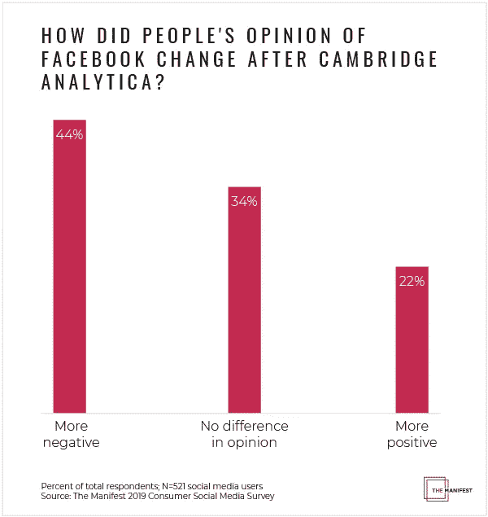
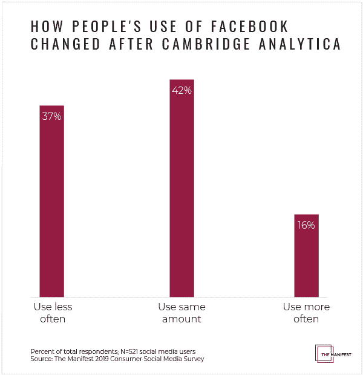
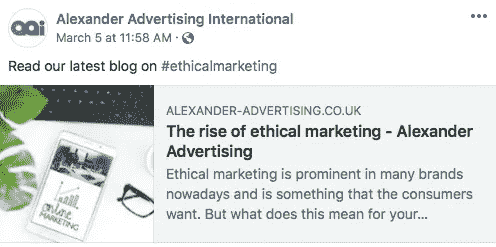

# 剑桥分析数据泄露后人们如何看待脸书

> 原文：<https://medium.com/swlh/how-people-view-facebook-after-the-cambridge-analytica-data-breach-4dc1261a0249>

## 三分之二的社交媒体用户知道剑桥分析公司的隐私泄露事件，该事件在一年前的 2018 年 3 月成为新闻头条，但不到一半的用户因此对脸书持负面看法。

2018 年 3 月,《纽约时报》爆料称，政治咨询公司 Cambridge Analytica 未经许可获取了超过[5000 万脸书用户](https://www.nytimes.com/2018/03/17/us/politics/cambridge-analytica-trump-campaign.html)的个人数据。

新闻披露后，脸书的可信度急剧下降——剑桥分析公司丑闻发生后，仅 [27%的人信任脸书](https://www.nbcnews.com/business/consumer/trust-facebook-has-dropped-51-percent-cambridge-analytica-scandal-n867011)，低于去年的 79%。

但是隐私泄露仍然影响人们使用和看待脸书吗？

该清单调查了 521 名社交媒体用户，以了解剑桥分析数据泄露是否仍然影响他们的脸书使用。

企业可以使用这份报告来帮助创建一个透明的脸书战略，以减轻消费者的隐私问题。

*   近三分之二的社交媒体用户(65%)熟悉剑桥分析公司的脸书数据泄露事件，该事件在 2018 年 3 月成为头条新闻。
*   剑桥分析公司丑闻继续影响人们对脸书的看法——近一半的社交媒体用户(44%)对脸书的看法更加负面，其中 15%的人对它的看法更加负面。
*   由于剑桥分析公司丑闻，超过三分之一的人(37%)较少使用脸书，这表明即使人们对脸书有负面看法，他们仍然使用它。
*   丑闻对千禧一代的影响最大，自数据泄露以来，41%的这一代人较少使用脸书，相比之下，x 世代和婴儿潮一代的比例分别为 37%和 24%。

# 大多数人都熟悉剑桥分析公司在脸书的数据泄露事件

社交媒体用户仍然知道剑桥分析公司丑闻——65%的人熟悉数据泄露。

专家表示，剑桥分析公司的数据泄露对脸书用户产生了巨大影响，仅仅是因为它获得了如此多的新闻报道。

爱荷华州社交媒体营销机构 [Sculpt](https://wearesculpt.com/) 的创始人兼首席执行官乔希·克拉考尔说:“对我来说，超过一半的美国社交媒体用户知道一家公司及其行为，这令人惊讶。”。“这是一件大事。”

虽然剑桥分析公司是一家公司，但社交媒体用户仍对其数据泄露记忆犹新。

# 剑桥分析数据泄露后，近一半的社交媒体用户对脸书的看法更加负面

剑桥分析新闻给许多社交媒体用户留下了持久的印象。

44%的人(44%)在数据泄露的新闻曝光后对脸书的看法更加负面。

剑桥分析公司丑闻摧毁了许多消费者对脸书的信任。

盐湖城在线声誉公司 [Friendemic](http://www.friendemic.com/) 的首席执行官史蒂夫·皮尔森说:“脸书真的试图给人一种印象，这种事情不会发生，他们的数据是安全的。”。“看到这样的东西出现，对许多原本信任的消费者来说是一个打击。”

> *“这对许多原本信任的消费者来说是一个打击。”*

人们对脸书在哪里分享他们的数据变得更加谨慎，这导致人们更加负面地看待这个平台。

由于剑桥分析公司的数据泄露，一些企业也更加负面地看待脸书，包括总部位于苏格兰的自助存储公司 [Storage Vault](https://www.storagevault.com/) 。

“我认为剑桥分析公司丑闻是我们利用脸书作为我们业务营销平台的最后一根稻草，”商业总监 Kraig Martin 说。“丑闻发生后，我们肯定会更加负面地看待这个平台，我们已经大幅缩减了它的运营规模。”

由于剑桥分析新闻，Storage Vault 过去每天在脸书上发布两次，但现在每周只发布一次。

Storage Vault 缩减了其脸书业务，因为马丁认为该平台无权分享用户的私人信息。

“我认为科技公司有保护个人信息的道德义务，”他说。

马丁认为，像脸书这样的企业不应该在没有每个人明确同意的情况下，将人们的信息提供给其他公司。

在剑桥分析公司爆出脸书侵犯隐私的新闻后，个人和企业对脸书的看法更加负面，一些人因此改变了他们使用脸书的方式。

# 由于剑桥分析数据泄露，三分之一的人较少使用脸书

尽管大约一半的社交媒体用户因为剑桥分析数据泄露而对脸书持更负面的看法，但只有大约三分之一的人较少使用脸书。

根据剑桥分析，约 37%的社交媒体用户使用脸书的频率下降，但 42%的用户使用相同的数量，16%的用户使用更频繁。

许多人抱怨剑桥分析公司的丑闻，但他们是通过在脸书上发帖来抱怨的。

印第安纳波利斯社交媒体营销机构 [Firebelly Marketing](https://www.firebellymarketing.com/) 的社交媒体服务副总裁查德·理查兹(Chad Richards)说:“人们喜欢口头上保护隐私。“我们在哪里看到人们抱怨脸书隐私和剑桥分析公司丑闻？在脸书的所有地方。”

> “我们在哪里看到人们抱怨脸书隐私和剑桥分析公司丑闻？在脸书的所有地方。”

人们可能不喜欢自己的隐私被侵犯，但许多人并不认为这是减少他们使用脸书的足够理由。

“虽然他们可能会说他们有顾虑，但我认为他们中的许多人少用脸书还不够，”Richards 说。"“退出脸书”运动失去了动力。"

数据显示，剑桥分析公司丑闻对脸书的伤害没有很多人最初认为的那么大。数据泄露后大约两个月， [74%的脸书用户](https://www.marketwatch.com/story/want-to-delete-facebook-read-what-happened-to-these-people-first-2018-07-27)已经离开了这个平台，改变了他们的隐私设置，或者删除了它。

然而，久而久之的许多人仍然像数据泄露前一样经常使用脸书。[脸书仍然是最常用的社交媒体渠道](https://themanifest.com/social-media/how-people-interact-social-media)，52%的社交媒体用户表示他们访问脸书的频率高于任何其他社交媒体渠道。

阿拉巴马州伯明翰的社交媒体机构 Sociallyin 的创始人兼首席执行官基思·卡卡迪亚说:“脸书已经深深融入了人们的生活，很难脱离这个生态系统。”。“你知道数据共享是一个问题，但娱乐和连接超过了它的安全漏洞。”

> “脸书已经深深融入了人们的生活，很难从这个生态系统中走出来。”

人们很难离开脸书，因为它是普通社交媒体用户生活中如此重要的一部分。这也是为什么许多企业仍然使用脸书的原因。

[英国广告公司 Alexander Advertising](https://www.alexander-advertising.co.uk/) 并未因剑桥分析数据泄露事件而改变其脸书战略。

“我们继续像以前一样频繁地使用脸书，”亚历山大广告公司的数字营销人员凯瑟琳·佩沃斯说。“我们还没有看到我们的参与率有巨大的差异，并继续将脸书纳入我们所有的数字营销活动和战略。”

脸书仍然是 Alexander Advertising 社交媒体战略的重要组成部分，该公司尚未注意到参与度的下降或追随者的流失。

如果说有什么不同的话，那就是数据泄露帮助亚历山大广告公司的追随者建立了信任。

Pebworth 说:“人们更清楚他们在关注谁，为什么关注。“这意味着，如果人们使用我们的页面，他们会更加信任我们。”

Richards 也注意到人们正在改变他们对脸书的态度，但不一定减少他们的使用。

“我们已经看到品牌的脸书页面上的墙贴在稳步下降，”理查兹说我们看到了直接信息的大幅增长。人们不再在公司的墙上公开张贴他们的抱怨，我们看到私人信息的大幅增加。"

人们现在更有可能通过私人信息与品牌沟通，而不是公开他们的互动。这有利于企业，因为他们可以私下处理不满意的客户，而不会让其他客户看到。

尽管由于剑桥分析公司的调查，大约三分之一的人较少使用脸书，但大多数人仍然经常使用脸书，即使他们使用该平台的方式发生了变化。

# 剑桥分析数据泄露让年轻一代对脸书敬而远之

数据泄露对年轻一代使用脸书的影响超过了老一代。

由于剑桥分析公司的丑闻，41%的千禧一代较少使用脸书，相比之下，x 世代为 37%，婴儿潮一代为 24%。

老一辈人倾向于使用脸书作为他们主要的社交媒体平台，所以他们可能会觉得如果离开脸书，他们会错过很多机会。

与此同时，克拉考尔表示，千禧一代通常活跃在多个社交媒体渠道上，因此离开脸书不会对他们的在线交流产生太大影响

“当(千禧一代)离开脸书时，他们并没有完全失去社交媒体上的信息和归属感，”克拉考尔说。“对他们中的一些人来说，这并不像生命线被完全切断，而对年长的用户来说可能是这样。”

年轻一代活跃在几个社交渠道上，在剑桥分析公司丑闻后决定少用脸书时，他们可能不会觉得这是多大的牺牲。

尽管这一丑闻让许多千禧一代不敢去脸书，但 Pebworth 说这也可能有剑桥分析公司之外的原因。

“过去一年，我使用脸书的方式略有改变，但我认为这表明我的社交圈越来越多地使用 Instagram 和 Twitter，而不是剑桥分析公司丑闻的直接结果，”她说。

Pebworth 还注意到，作为一个整体，千禧一代对数据泄露不太担心。

“我认为我们这一代人一直敏锐地意识到社交媒体带来的数据风险，因此没有像数据泄露的直接结果那样改变他们的习惯，”她说。

千禧一代比老一代更精通数字技术，因此他们更清楚网站分享他们的信息。

然而，为了子孙后代，企业需要在脸书变得更加透明。

“透明度和真实性对人们来说确实很重要，”理查兹说。“如果人们有问题，你也要变得平易近人、积极响应。品牌确实需要改善他们的社区管理工作，提高他们的回复率和时间，以建立信任。”

> 透明和真实对人们来说确实很重要

脸书仍然是企业的一个成功战略，但对于社交媒体经理来说，重要的是让他们公司的形象透明，并对所有代人的吸引力做出反应。与[社交媒体机构](https://themanifest.com/social-media/agencies)合作可以帮助企业制定建立消费者信任的策略。

# 剑桥分析数据泄露一年后，脸书仍然很强大

剑桥分析公司丑闻并没有像许多人认为的那样杀死脸书。

数据泄露使许多人对脸书的看法更加负面，但大多数人仍然使用脸书的频率与泄露前相同，甚至更频繁。

剑桥分析新闻曝光后，千禧一代倾向于较少使用脸书，但几代人仍广泛使用脸书。

企业需要通过在脸书和其他社交媒体渠道上尽可能透明来缓解消费者的隐私担忧。

# 关于调查

清单调查了美国各地过去一周使用社交媒体的 521 人。

百分之六十五(64%)的调查受访者是女性；36%是男性。

大约 42%是千禧一代(18-34 岁)，36%是 X 一代(35-54 岁)，22%是婴儿潮一代或更老的一代(55 岁以上)。

大多数调查对象要么是全职(42%)要么是兼职(13%)。其他人是家庭主妇(13%)、退休人员(13%)、个体经营者(5%)、学生(4%)、失业且目前正在找工作的人(5%)或失业且目前没有找工作的人(5%)。

调查受访者的教育水平为 8 年级或更低(1%)，一些高中(5%)，高中毕业或同等学历(23%)，一些大学学分，没有学位(25%)，副学士学位(13%)，学士学位(21%)，硕士学位或更高(12%)。

受访者来自南部(38%)、中西部(24%)、东北部(21%)和西部(17%)。

【themanifest.com】最初发表于**。**

**

## *这篇文章发表在 [The Startup](https://medium.com/swlh) 上，这是 Medium 最大的创业刊物，拥有+438，678 读者。*

## *在此订阅接收[我们的头条新闻](https://growthsupply.com/the-startup-newsletter/)。*

**