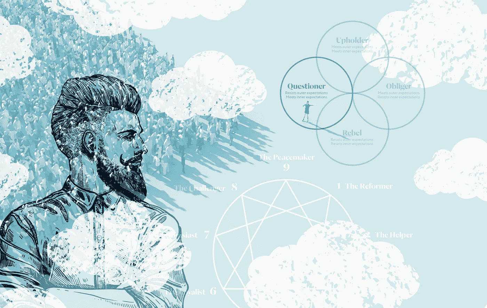

# 性格类型如何影响品牌信息

> 原文：<https://medium.com/swlh/how-personality-types-affect-a-brands-message-64a17185e659>

在过去五年左右的时间里，我一直在钻研人格类型这个主题，以及它与品牌的关系。我将要写的两个“模型”是**四种倾向**和**九型人格**。

我对人格类型这个主题很感兴趣，因为它们揭示了人们的心理驱动力、动机以及他们认为有价值的东西。人们发现什么…