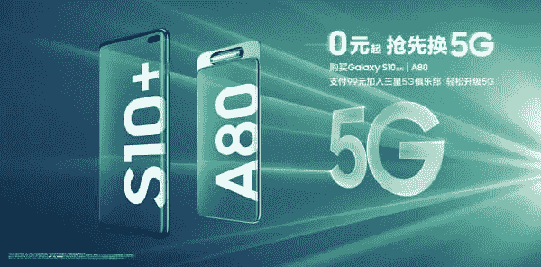

# 5G 时代三星如何赢回中国市场

> 原文：<https://medium.com/swlh/how-samsung-plans-to-win-back-china-market-in-5g-era-cb84c15f3b47>

近年来，三星在中国智能手机市场一直处于劣势，在 2016 年 Galaxy Note 7 惨败后，这种下滑变得更加明显。随着许多中国人转向华为、小米、Vivo 和 Oppo 等国产品牌，三星在中国的市场份额降至较低的个位数。

