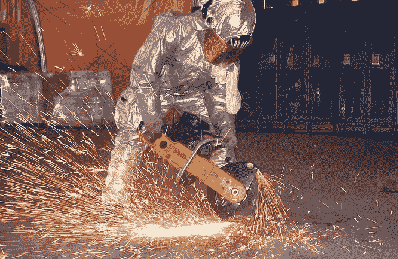
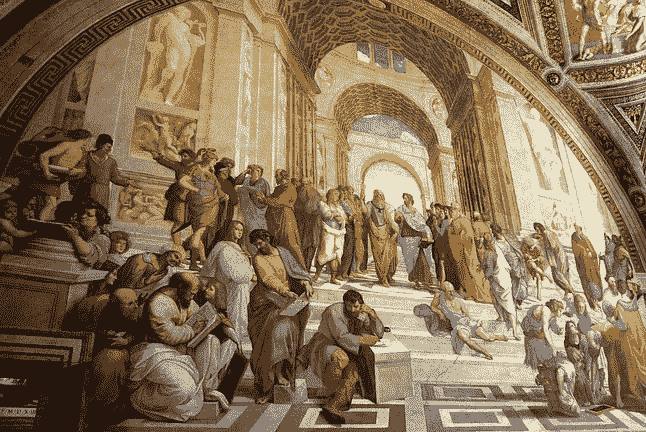

# 一个人应该怎样度过一生？思考还是行动？

> 原文：<https://medium.com/swlh/how-should-one-spend-their-life-thinking-or-doing-af5c1f5afc04>

## 思想与行动

Image by [skeeze](https://pixabay.com/users/skeeze-272447/?utm_source=link-attribution&utm_medium=referral&utm_campaign=image&utm_content=821367) from [Pixabay](https://pixabay.com/?utm_source=link-attribution&utm_medium=referral&utm_campaign=image&utm_content=821367) Image by [Gianni Crestani](https://pixabay.com/users/pcdazero-2615/?utm_source=link-attribution&utm_medium=referral&utm_campaign=image&utm_content=478105) from [Pixabay](https://pixabay.com/?utm_source=link-attribution&utm_medium=referral&utm_campaign=image&utm_content=478105) Image by [Malachi Witt](https://pixabay.com/users/889520-889520/?utm_source=link-attribution&utm_medium=referral&utm_campaign=image&utm_content=2284501) from [Pixabay](https://pixabay.com/?utm_source=link-attribution&utm_medium=referral&utm_campaign=image&utm_content=2284501)

这篇文章标题中的问题可能是一个不该问的问题。思考和行动不都很重要吗？

然而，人们经常会落入这样或那样的类别。实干家做事；思想家思考我们应该做什么或不做什么。