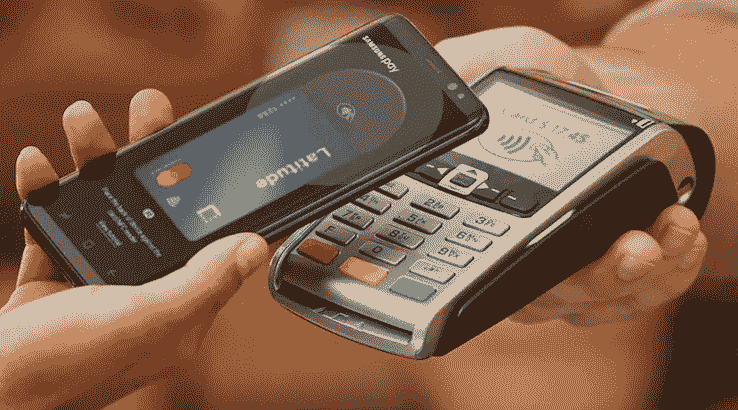

# 硅谷是如何加速支付中断的

> 原文：<https://medium.com/swlh/how-silicon-valley-is-accelerating-the-disruption-of-payments-6781c68a6f81>

看到亚洲市场在支付领域的创新和发展速度之快令人难以置信。在中国和印度这样的国家支付给商家的体验远比西方优越。消费者只需在印着二维码的智能手机上闪一下，就能付款。钱立即从消费者的数字钱包转移到商家的钱包(微信支付、支付宝、PayTM)。该系统简单、灵活，除了金融机构和支付技术公司之外，没有任何中间参与者。

source: [https://www.finder.com.au/](https://www.finder.com.au/)

然而在西方，支付主要是由信用卡驱动的。商户损失了相当一部分收入，其形式为兑换费、卡网络费和支付网关费。

但是，为什么在西方很难实现数字钱包(或托管)的采用呢？

历史给了我们一些关于这个问题的见解。在亚洲市场，**数字钱包取代了现金**，现金对于消费者和商家来说本来就难以管理，使用数字钱包的好处要大得多。这自然推动了采用和随之而来的网络效应。

在西方，**我们在与信用卡竞争。**这是一个完全不同的问题空间。信用卡已经解决了现金的固有问题，一个试图取代信用卡的新系统将需要比数字钱包提供的更多的东西。

为了了解西方公司如何喜欢 Square、PayPal、Stripe 等。都在接近这个问题，让我们试着去了解信用卡到底解决了什么。

> 信用卡将购物的能力与手头现金的需要分开，而且它甚至消除了拥有现金的要求——至少在短期内。

这是信用卡的根本成就。而用户体验呢？只需要把它从死牛钱包里拿出来，在你最喜欢的超市里的 NFC 终端上点击一下。对于普通消费者来说，这种体验太好了，无法替代。

让我们从商家的角度来看这个问题。一般来说，支付系统有 4 个组成部分——支付网关、收单银行、卡网络和发卡行。

**支付网关** —这是交易的入口点。传统上，我们有庞大笨重的信用卡机。他们赚钱的方式是从交易中抽取很小的百分比( **~2.65%** )。网关的基本功能是将卡信息安全地传输到网络。PayPal 通过引入网络网关打破了这一领域。后来，Square 发布了革命性的销售点(POS)阅读器，将您的手机转变为支付网关。这导致了这一领域的良性竞争，PayPal 推出了自己的阅读器版本，而 Clover、Shopify 等其他公司也很少推出。推出同一产品的不同版本。

**收单银行** —这是商家的银行，通常是交易后资金存放的地方。收单银行还从交易中抽取一小部分%(**~ 19 美分/100 美元**)作为收单费。

**信用卡网络** — VISA 和 MasterCard 是主要的信用卡网络。卡网络是卡支付系统的轨道。卡网络的功能是从网关接收安全传输的信息，与信用卡银行账户对话并检查客户是否有足够的信用可用，与收单银行对话以验证商户的账户信息并最终拒绝或批准交易。同样，信用卡网络通过收取一小部分网络费用来赚钱。

**发卡银行** —这是客户的信用卡发卡银行。在典型的交易中，发卡银行以交换费的形式获得最大的折扣(**～每 100 美元 2.20 美元**)。因此，在一个典型的 100 美元交易中，商家损失了近 3 美元的交易费用，而这 3 美元分散在 3-4 个中间玩家之间。

当我们观察中国或印度的典型交易时，资金从用户的银行账户直接转移到数字钱包中。在典型的零售交易中，资金从客户的数字钱包转移到商家的数字钱包，并留在商家的数字钱包中，而不会回到商家的银行账户。这是因为消费者和商家都有强烈的动机，在他们最喜欢的咖啡店、餐馆和商场以优惠、交易和折扣的形式将钱保存在他们的数字钱包中。实际上，数字钱包积累了大量的自由现金，公司可以用这些现金以更高的存款利息投资银行。

为了理解这是什么意思，让我们来理解为什么普通银行储蓄账户的存款利率太低而贷款利率高。典型的实体银行一般通过 [**利差**](https://www.bloomberg.com/news/articles/2018-03-12/ant-financial-consumer-lending-is-said-to-reach-95-billion) **赚钱。**利差是赚取的贷款利息和提供的存款利息之间的差额。当客户存入 100 美元时，她赚取 0.10 美元的利息(利率为 0.1%)，当她贷出 100 美元时，她损失 10 美元的利息(利率为 10%)。银行实际上赚了 9.90 美元(10-0.10 英镑)。这是银行赚取的净息差。

但是，当一家大公司决定将巨额资金存入银行时，他们通常拥有谈判权，最终会获得高于 0.1%的存款利息。这缩小了实体银行的利差。但是，这为钱包公司创造了一个可持续的收入流，将存储在所有客户数字钱包中的闲钱进行投资。

还有什么？这也开辟了收入渠道，比如贷款服务。由于数字钱包的主要用户体验是通过应用程序，这些公司能够以比普通银行更好的利率向客户和商家提供贷款。这是因为软件不是有形资产，扩展服务的成本远低于实体银行。换句话说，数字钱包公司正在通过与零售商合作提供增值服务来聚集存款账户的需求。这实际上使商业模式多样化，使它们比西方的同类产品更有价值。

回到西方，支付网络的轨道是卡网络(VISA/MasterCard)。尽管软件公司在系统中铺设新的轨道听起来并不太难，但要实现广泛采用所需的网络效应却极其困难。这是因为它涉及到从客户手中更换 VISA/MasterCard 信用卡和借记卡，并重新布线支付网关和银行的软件基础设施。这只有在像苹果或亚马逊这样的大摇钱树决定建立一个新系统，并在很长一段时间内保持无利可图的情况下才有可能。这也解释了为什么苹果公司决定在现有的信用卡网络基础上推出 Apple Pay 服务，而不是与之正面竞争。这解释了为什么很难颠覆 VISA 和 MasterCard。

但是，这最终会如何改变呢？

直到最近，美国才推出了[点击支付](https://usa.visa.com/visa-everywhere/innovation/tap-to-pay-with-contactless-cards.html)信用卡和借记卡。这意味着所有的商家都被迫将他们的 POS 系统更换为支持 NFC 的系统。很自然地，Square、PayPal 和其他公司推出了支持 NFC 的 POS 系统。但是，在我看来，这种变化的最大赢家是苹果和谷歌。因为，Apple Pay 和 Google Pay 可以与支持 NFC 的终端一起工作，这加快了这些系统的采用速度，无论谁在他们的应用程序上创造更多价值，都可以加快使用速度。实际上，这有可能将手机转变为支付的主要途径。但是，商家端的体验仍然属于 Square 和 PayPal 这样的公司。

看看这些公司在用户体验的每一方面如何相互竞争以拥有整个体验将是有趣的。而且，我坚信最终用户(客户和商家)将是这场战斗的明显赢家。

Square 最近与万事达卡合作推出了 [Square 现金卡](https://cash.app/help/us/en-us/1108-cash-card)。PayPal 已经有了类似的卡。这一举措背后的战略显然旨在拥有客户体验。更重要的是，这旨在使交易的钱留在各自的数字钱包(Square Cash 账户和 PayPal 账户)中，有效地模仿亚洲支付公司的策略。

通过提供由 MasterCard 支持的卡，Square 为其商家和客户开辟了一种新的方式，可以立即使用其 Square 账户中的余额，而无需将钱转回银行账户，也不会损失大约 1%的即时存款费用，这实际上是 Square 最初的价值主张。实际上，Square 正在自我瓦解。

这是一个很好的策略，因为当客户在 Square 支持的商户终端使用现金卡时，支付网关(Square POS)、收单银行和发卡银行都是 Square 的。这实际上削减了常规银行的交易/交换费用，并将资金放回 Square 的口袋。这里不涉及卡网费，因为交易发生在 Square 的不动产和网络内部。每 100 美元支付 3 美元作为交易网络费的商家会很乐意支付 2 美元，而 Square 则承担所有费用，创造了一个双赢的局面。这为 Square 创造了一个可持续的循环，而不会改变最终用户的行为。

除此之外，Square 还通过提供[工资单](https://squareup.com/payroll)、[借贷](https://squareup.com/us/en/capital)等服务，为其商户增加了更多价值。为了将商家和商家的员工留在 Square 的生态系统中，从而提高其服务的[粘性](https://labs.openviewpartners.com/how-to-build-stickiness-into-your-product/#.XE47dXpKi2w)。

**但是，最终谁会同时拥有顾客和商家的体验呢？**

我觉得苹果和 Google Pay 要想驾驭非接触式支付的浪潮，还有很多事情要做。首先，他们必须为客户构建增值服务，以加快采用速度。可以改变游戏规则的事情之一是，根据用户的使用情况为他们建立一个资金管理服务。

我再次感觉到，Square 和 PayPal 比苹果或谷歌更有条件建立这种关系。这是因为，当顾客使用 Square POS 在咖啡店购买“抹茶拿铁”并使用他们的 Square 现金卡付款时，一切都发生在 Square 的房地产内。这意味着，Square 可以很容易地将信息以分析的形式呈现给客户和商家。顾客可以在她的 Square 应用程序上看到“ ***这个月花了 12 美元买抹茶拿铁*** ”，商家可以看到“ ***抹茶拿铁比上个月*** 多卖了 45 倍”。对于苹果或谷歌来说，这涉及到的不仅仅是向客户展示这种精细信息的软件魔法。

最终，银行将面临更大的风险，失去从交易费、透支费、收购费和科技公司利差中赚取的利润。

但是信用卡真的会被颠覆和取代吗？

回到我们对信用卡的定义，它将购买能力与手头现金的需要分离开来，同时也消除了拥有现金的要求。

当然，Square 或 PayPal 的万事达卡解决了手头现金的需求。但是，如何提供信贷呢？我觉得为商家建立借贷服务是朝着这个方向迈出的良好的第一步，因为提供信贷只不过是借钱。但是，所有增值服务，如加油站返现、旅游福利、租车保险等。由普通信用卡提供的是一个很大的覆盖和管理。但是，真正的问题是，

**在按需服务时代，信用卡会有用武之地吗？**

我们正慢慢从所有权时代转向按需服务时代。例如，优步、Lyft 和 Waymo 等自动驾驶出租车服务正在让拥有汽车变得无关紧要。订阅网飞、Hulu 等。让拥有碟片变得无关紧要。Spotify 和 Apple Music 让拥有音乐内容变得无关紧要。这有效地将离散的不规则高价值支付转变为连续的低价值定期支付。只有时间能告诉我们，当支付变得周期性和低价值时，信用卡是否真的有用。

VISA 和 MasterCard 怎么样？

最终，当客户和商家的体验完全被科技公司掌控时，rails 必然会被取代。卡网络将只是哑管道，将变得无关紧要，除非他们继续创新，并在其护城河上建立价值。

## 我希望你喜欢阅读我的想法。如果你这样做了，点击下面的掌声按钮，这将有助于其他人看到这个故事。

**相关阅读:**

*   【https://alexdanco.com/2015/09/01/no-more-visa/ 
*   [https://stratechery.com/2014/problem-payments/](https://stratechery.com/2014/problem-payments/)
*   [https://www . Bloomberg . com/graphics/2018-payment-systems-China-USA/](https://www.bloomberg.com/graphics/2018-payment-systems-china-usa/)

## 这篇文章发表在 [The Startup](https://medium.com/swlh) 上，这是 Medium 最大的创业刊物，拥有+416，678 名读者。

## 在此订阅接收[我们的头条新闻](http://growthsupply.com/the-startup-newsletter/)。

