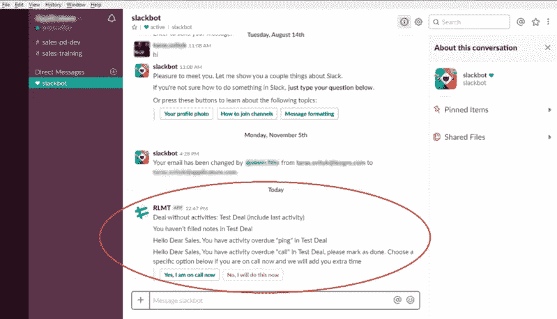
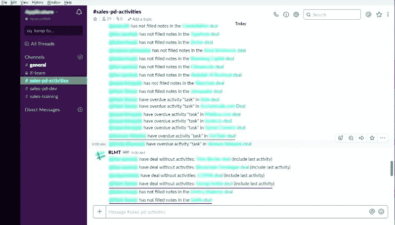

# Slack 如何帮助我们完成 100%的 Pipedrive 交易

> 原文：<https://medium.com/swlh/how-slack-helped-us-close-100-of-the-pipedrive-deals-4e5d0abc49d8>

如今，我们生活在全球自动化的时代，所有的业务流程都将被简化。手工作业不再高效，因为它很耗时。因此，自动化工具提高了企业生产力。所以，你可以把宝贵的时间和注意力放在其他增加收入的事情上。

众所周知，对企业运营最有用的应用是 Slack 和 Pipedrive。当 Pipedrive 是帮助管理客户数据库的 CRM 系统时，Slack 用于公司消息传递、工作流管理。我们决定使用这两个应用程序自动化工作流程，并与我们的读者分享这些信息。见见我们懒散的销售助理，他能管理有效的团队合作。

但首先，让我们讨论一下 Realomat 的目标是什么，以及我们如何为客户提供高效的商业策略。

# 什么是 Realomat？

在 Realomat，我们已经找到并研究了扩大收入和优化成本的方法。现在，我们为您提供了一个有价值的解决方案。该系统适用于中小型企业的销售策略师、营销人员和代理商。

如果你想明智地经营你的企业，Realomat 正是你所需要的。我们的主要优势是您用于业务管理的工具和应用程序的顺利集成，收集和优先排序您客户的数据库，更重要的是，定义您客户的情绪。

让我们看看我们最近完成的产品——借助 Slack [bot](https://chatbotslife.com/) 的管道驱动集成。我们也将从现代技术的角度来看它的优势。

# 技术方面:我们如何整合 Slack 和 Pipedrive

自动化流程基于 Pipedrive Dealboard 与 Slack 的内置集成。我们可以肯定地说，它不仅仅是一个工具，而是整个 CRM 学科。在 Slack bot 的帮助下，很容易管理 Pipedrive 通知。让我们详细检查一下这个过程。

# 时差通知

自动化过程如下所示:

我们新开发的应用程序检查 Pipedrive 用户的工作效率，并根据这些信息为 Slack bot 生成消息。特殊的 API 键有助于确定一个明确的松弛通道来发送消息。首先，关于 Pipedrive 用户(如销售助理)活动的通知会出现在他/她的直接消息中，因此很容易跟踪您未完成的任务。他/她可以选择这些活动的特定选项。此类交易有 3 种类型:

*   “未填写说明”表示该通知没有足够的信息
*   “无活动交易”没有进一步的步骤
*   “逾期活动”意味着销售助理没有采取任何行动，时间用完。

# 执行时间

如果销售助理点击“我正在通话”按钮，他/她就有更多的时间来完成任务。您可以确定该时间延迟的持续时间以及该按钮可以被按下的次数。

在多次忽略此消息后，它会出现在通用频道中，并对所有用户可见。这个选项有助于不错过任何交易，轻松管理员工工作。

与 CRM 系统的松散集成是一个强大的工具，你无法想象它如何在日常生活中发挥作用

这种同化的主要好处是:

*   降低未完成任务的可能性
*   帮助部门主管控制员工及其工作
*   提高沟通质量，因此，销售经理不会忘记按时给客户打电话。

因此，你将达到 10%的营业收入。

# 结论

我们的新开发有助于更好、更快地组织销售，因此您不会失去宝贵的时间。要做的交易更具体，专注于解决问题，易于导航。在几个级别控制活动鼓励不要错过任何通知。

> 因此，使用集成，您将简化实现业务目标的方式。

# 相关文章:

[**如何将 CRM 的手动工作减少 15%: Pipedrive 示例**](https://chatbotslife.com/how-you-can-reduce-manual-work-on-your-crm-by-15-pipedrive-example-d29ddeb047ab)

***订阅我们的社交网络:***

www.facebook.com/realomat/脸书

LinkedIn:https:[www.linkedin.com/company/realomat/](http://www.linkedin.com/company/realomat/)

推特:[twitter.com/realomat_biz](https://twitter.com/realomat_biz)

insta gram:[realomat _ biz](https://www.instagram.com/)

我们的网站:[***realomat.com***](https://www.realomat.com/)

## 这篇文章发表在 [The Startup](https://medium.com/swlh) 上，这是 Medium 最大的创业刊物，拥有+411，714 名读者。

## 在这里订阅接收[我们的头条新闻](http://growthsupply.com/the-startup-newsletter/)。

