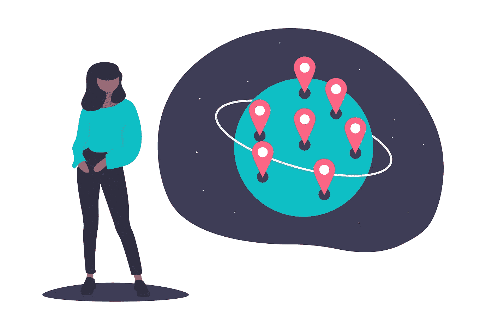

# 多小打多大

> 原文：<https://medium.com/swlh/how-small-beat-big-76abc7fa2965>

是的，它是敏捷的和社会化的..和一些智能自动化

在之前的一篇文章— [创业自己—](/swlh/startup-yourself-927389564c2c)中，我展示了在个人层面上采用创业实践的案例，以变得更专注、更有动力，并最终在你做的任何事情上取得成功。

但是一个小团队甚至一个独立的专业人员如何在市场上竞争呢？这似乎是一场不可能赢的比赛，但即使得到注意。

在这篇文章中，我讨论了一种倾向于个人通过 reach 社交网络的趋势。但如果你按照他们的规则行事，你将是在为平台工作，而不是为你自己。你需要衡量自己。

# 市场是不公平的，但是越大并不总是越好

最拥挤的市场不仅竞争激烈，而且支离破碎，转瞬即逝。

> 有许多替代品、竞争对手或简单的“东西”会把客户的注意力从你身上带走。

市场比以往任何时候都更薄，细分成一条长长的细分市场尾巴。通常，小到一群人，甚至一个人都可能是你的市场(例如，一份工作或一项投资)

你的任何营销行为、视频或活动都会有一个非常短暂的聚光灯——几乎是短暂的——然后被下一个有趣的帖子埋没。所以不能再拍大片了。市场需要持续不断的小而精的内容。

与直觉相反，长尾市场对小团队或个人来说是一个积极因素。大玩家确实有更大的预算，但没有规模经济来生产适合长尾的内容和价值主张。没有一个单一的市场可以通过大众媒体——广播电视或媒体广告——进入。

你可以通过开发针对一系列利益相关者的超具体的内容片段来发挥你的优势。找到自己的定位，非常个性化。

# 买家之旅不是线性的，甚至不是单向的

直到销售人员帮助他们把东西放在一起并下订单，买家才会顺利地从认知到转化。现代购买者发起这个过程。似乎非常接近-当研究。在查看演示或价格页面时，似乎进入了购买阶段，但随后又消失了。可能几个月。或许，在非官方渠道的影响下，这种前景会再次出现。有人——一个学生，一个联系人分享了一些引发他们注意的事情。

在这种情况下，您不能使用独特的集中分销，在这种情况下，市场营销部门负责特定点的需求生成，然后将它交给销售部门。

企业仍然以旧的方式塑造他们的组织，将营销和销售、对内和对外分开。分裂不是真的。它不存在于顾客的头脑中，而只存在于我们的组织中。

> 问题不仅仅是业务效率，而是与现在人们——客户——与业务的联系方式完全不一致。它已经改变了——我们都知道，因为我们自己就是消费者和买家。

我们不喜欢接到电话、广告或冷冰冰的电子邮件，也很少关注内容——即使是好的内容。但当我们戴上商务帽(或西装)时，这就是我们的经营方式。

顾客发现如何用我们的解决方案解决他们的问题，两者之间的交流越自然越好。本质上，这就是初创公司如何获得最初的客户群。一位顾客或朋友听说一些技术人员正在从事一些很酷的工作，这可能会对他们的业务有所帮助。变得好奇，去看看。然后与他们交谈，他们一起想出了解决问题的方案。

简单到他们甚至不称之为销售。

关键点是:I)听说过；ii)好奇心/兴趣 iii)将问题与解决方案匹配起来。I)你的关系网，ii)包含你的价值的东西，iii)需求中的激光焦点。

# 市场已经社会化了。

市场已经成为个人的集合。社交是个人的(如果你读了这篇文章并理解了它，你可能是一个人…如果是真的，请鼓掌😉)

人们消费信息的方式已经从被动的海量转变为人们定义他们所获得的模式。

通过选择频道和订阅。然后观察你饲料中的任何东西。被动元素被证明是会上瘾的..

人们通过选择追随谁来创造他们的媒体——学习、信息——体验。人们追随其他人，而不是品牌。没有人想通过广告(或者顺便通过人)获得垃圾邮件。

但是人还是要学习，要解决问题，要在事业上进步。所以他们渴望与任何能以任何方式帮助他们的人联系。

# 社交是均衡器，但不是公平的游戏

社交网络是一个虚拟世界，它融合了同一层次的人和公司。有影响力的人、高管和新人与强大的公司、初创公司和独立专业人士分享相同的空间和注意力。

> 唯一重要的是你的信息与你和大人物们试图影响的人的相关性。在那一刻，你是在和任何人在同一水平上进行一对一的战斗。

当然，不完全公平的是整个社会游戏——也不是裁判不偏不倚:

你的关系网越大，你得到的曝光就越多。社交平台的“算法之神”也青睐那些已经拥有更多追随者的超连通者。他们向更多的人、更多的时间展示推广的出版商(在时间线的顶端…)

还有，大佬们在关注秀上的“票”更多。他们从社交平台上购买赞助更新。让媒体和其他有影响力的人提及他们。

生活是不公平的，如果你没有足够的钱，社交生活就更不公平了

> 你不能在他们的游戏中打败他们，但是你可以在很多方面胜过他们💪

# 照章办事是逆流而行

在网上分享你的内容就像大海中的一滴水。

对于个人或小型创业团队来说，这似乎是一场不可能获胜的竞赛。如果你逆着时间线逆流而行，这确实是不可能的。

你制作的每一件作品——经过几个小时，甚至几天的努力——都会得到一点点关注。偶然发现的几个赞。在被源源不断的新帖子淹没之前。

一个好的视频或一篇好的帖子可以让你时不时地获得一些点击，但它会很快被遗忘。

> 喷祈祷策略即使对于营销口袋很深的企业品牌来说，也是一种资源浪费。

你的策略必须与众不同——游击营销，你知道你的目标，并确保你的内容到达你需要的地方。但是怎么做呢？

如果你按常规进行社交销售——字面意思是 LinkedIn book([link here](https://business.linkedin.com/content/dam/me/business/en-us/marketing-solutions/cx/2017/pdfs/Sophisticated-Marketers-Guide-to-LinkedIn-v03.12.pdf))——你将为他们工作，而不是为你工作。

我并不是说 LinkedIn 或社交销售是浪费时间。不，恰恰相反，我确信它是任何专业销售人员的最佳工具。但是按照大多数 LinkedIn 认可的权威人士告诉你的“公式”,你将收获甚微。

在销售中，做一百万件事情而没有多少进步是容易的。社交媒体放大了风险；随意的评论、约定或新的联系可能会带来一些意外收获和希望。

有利于建立关系网，但销售很少——机会成本很高，即你的时间。

# 捷径是行不通的——建立一个基础，然后从那里开始跳

使用像基本的自动应答器或机器人这样的捷径并不能解决问题。即使外包你的 LinkedIn 也不会给你带来任何东西，而且风险很大。像自动回复器或大多数 LinkedIn 机器人这样的基本自动化将会适得其反。

> *自动化如果被发现，就会错过建立信任的关键。*

有一个基本的互惠原则，当有人努力联系时，一个人倾向于回应。当我们知道这是一个大规模的促销信息时，我们就失去了这一点。

你需要工具来提升自己，而不是替你工作。这就是智能个人自动化可以发挥作用的地方。但是你首先需要一个过程，然后使用工具。因为是的，有工具可以帮助自动化一些低层次的任务，让你可以做人类做得更好的事情。

这是关键，使用自动化能够集中你的时间建立更好的人际关系

以个人建议结束——你不需要开始购买大量昂贵的工具或构建复杂的系统。

创业公司从建立 MVP 开始，这是他们所做的任何事情的最小版本。

当你学习一项新的运动或爱好时，你不会在第一天就购买最先进最昂贵的设备(好吧，有时我们可能会被那些很酷的东西诱惑，但我们知道我们不应该这样做)

在尝试你的需求挖掘策略时也是一样——把你的过程和便宜的、免费的或试用版放在一起，看看它是如何为你工作的。不要被大平台的承诺所牵引。投资于学习过程，而不是工具。

# 创业公司把事情做好

这里是创业公司如何运作的最后一点。就是把事情做好。

成功的创业公司是骗子和黑客——他们找到方法或使用任何变通方法来完成任务。他们有意愿，他们找到自己的方式。

你必须全神贯注于与你的目标发展关系。它们非常独特，但并不独特——你可以复制工作。创建一个流程。自动化。你可以提出非常细分的主张和信息，并寻找具有非常相似需求的集群。

使用工具和过程来接近你的目标。帮助你最大化接触目标的工具——但是——永远保持个人接触。

所有这些都不是试图让你气馁，而是让你做好准备。为艰苦的工作做好准备，并集中精力以正确的方式去做。

因为正确的方法会有回报。但最重要的是去做。开始做吧

在接下来的几篇文章中，我们将会看到如何才能赢得比赛。

