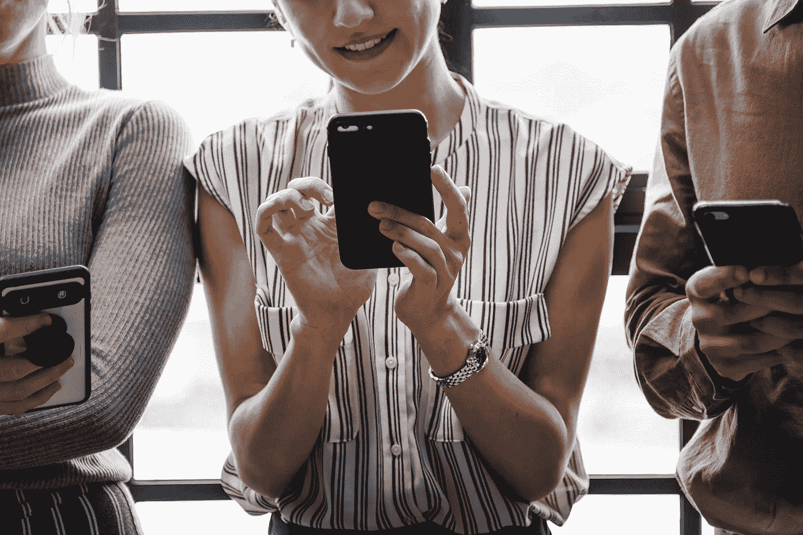

# 社交媒体和互联网如何让我们无所畏惧

> 原文：<https://medium.com/swlh/how-social-media-and-the-internet-made-us-invincible-to-shame-6a8efd9464af>

没有人会感到羞耻了。继续尝试浏览互联网头条和社交媒体源。我谅你也不敢。争议很多。永远不会缺少卷入丑闻的高调政客，因金融欺诈而受审的演员，或者总是抵御热情评论员反弹的有争议的脸书/推特朋友。