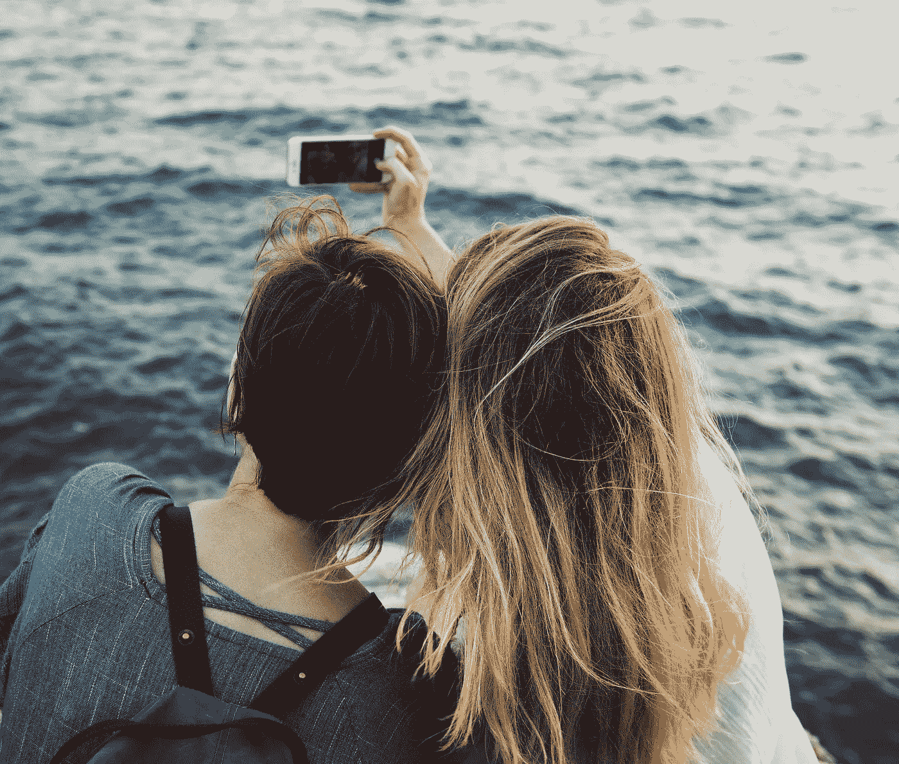

# 社交媒体过滤器如何导致焦虑

> 原文：<https://medium.com/swlh/how-social-media-filters-are-causing-anxiety-51ab5495afd2>

## 以及为什么我们允许他们这样做

Pexels

> 眼见为实…对吗？

我们生活在一个图像时代。

无论我们往哪里看，图片、图像和视频都在告诉我们故事。我们相信我们所看到的。但是我们应该相信我们的眼睛吗？