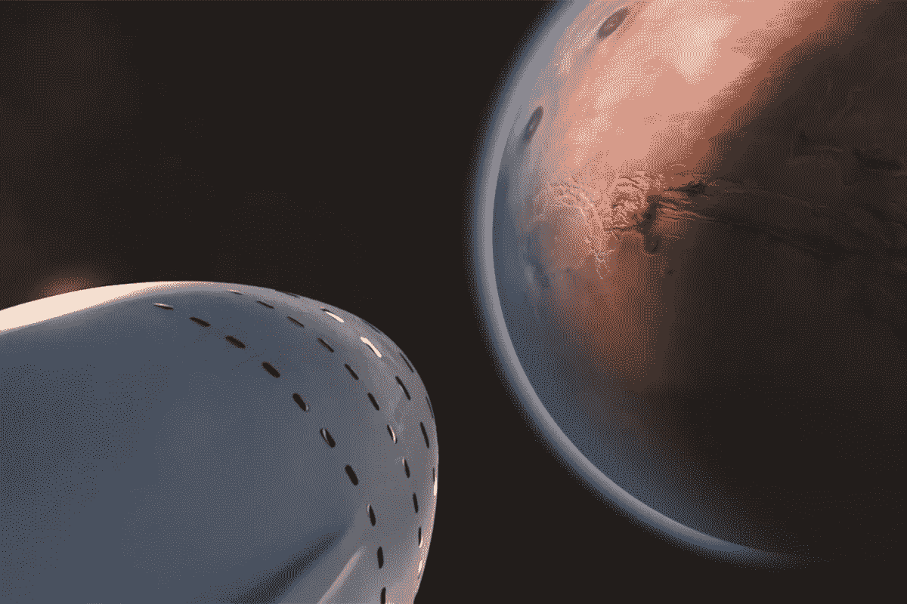

# SpaceX 如何在火星之旅中创造人造重力

> 原文：<https://medium.com/swlh/how-spacex-will-create-artificial-gravity-on-the-journey-to-mars-5da33e86aa9c>

Copyright SpaceX 2019

看着斯科特·凯利在太空行走一年后艰难前行，对那些计划去火星旅行的人来说应该是一个清醒的提醒。尽管有广泛的锻炼方案和 50 年来太空医学所能收集到的最好的治疗方法，从长期零重力状态中恢复仍然是一个巨大的身体挑战。