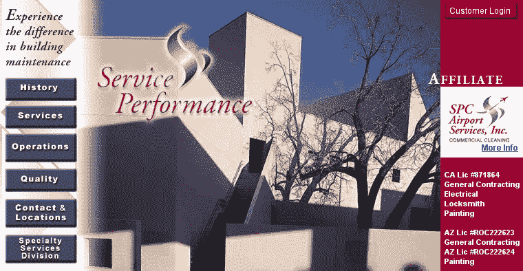

# SPC 如何在八年内从 1700 万美元增长到 2 . 5 亿美元

> 原文：<https://medium.com/swlh/how-spc-went-from-17m-to-250m-in-eight-years-972899ef3fb3>

## 品牌如何发展业务

左图是 SPC 在 2012 年的年度运营成本约为 1700 万美元。右侧是如今的旗舰设施，运行成本在 2.5 亿美元左右。这是如何发生的故事。

当我们聘用他们时，他们是“服务性能公司”(SPC)。