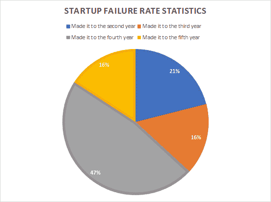
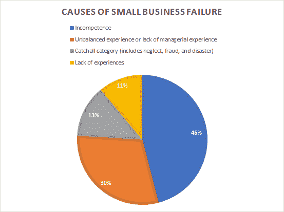
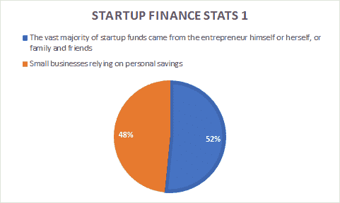
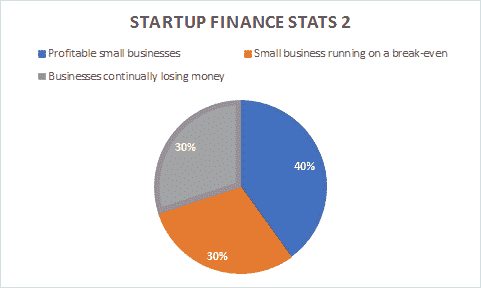

# 创业公司如何自掘坟墓

> 原文：<https://medium.com/swlh/how-startups-dig-their-own-grave-24cbacabd6cc>

跟随这些错误，学习如何成为一个不死的创业公司！

> “我的一个同事曾经跟我说过，开公司是 30%理念/战略 70%执行；我认为执行力更像是 80%——正如任何想法一样，无论它有多好，都可能不幸地被复制。想法是必要的基石，如果你的想法与众不同并具有大众吸引力，它肯定是一笔财富”**卡洛·思科**

今天，在谈论我们周围的世界时，人们不能不意识到技术深刻地驱动着它。IT 行业在过去几十年中取得的进步在推动许多初创企业在市场上碰运气方面发挥了至关重要的作用。

# 启动失败率

超过 50%的创业公司在前四年都会失败。

事实上，在 2011 年开始的所有创业公司中:

*   21%的学生坚持到了第二年
*   16%的学生升到了第三年
*   47%的学生升到了第四年
*   16%的学生坚持到了第五年

启动失败的主要原因:

*   不称职:46%；
*   经历不平衡或缺乏管理经验:30%；
*   总括类(包括忽视、欺诈和灾难):13%；和
*   缺乏经验:11%。

如果你明白 42%的初创公司失败是因为他们开发了市场上已经存在的产品，并且销售消费者不想购买的东西真的很难，这将会有所帮助。

有一些创业公司改变了人们对一些产品和服务甚至社交媒体平台的看法，这是值得注意的例子。然而，今天不是关于成功，而是失败的创业公司的坟墓将被挖掘出来，那些无法在现代商业世界中取得成功的人，我们将试图了解哪些因素决定了创业公司的成功或失败。

我想到的第一个问题是，创业公司是如何遭遇这种命运的？我的意思是，是什么以这种方式影响他们，使他们的过程停止，整个系统崩溃。各种各样的市场专家提出了他们的假设来回答创业公司提出的最令人困扰的问题。因此，让我们合理化这个假设，并详细了解创业公司必须如何运作才能保证成功。

# 不想要的产品

消费者寻找指出他们的痛点并帮助他们解决日常生活中面临或经历的问题的产品和服务。创业公司必须密切观察和研究普通人的生活方式，并找出他们的产品可以提供什么解决方案。

创业公司开发产品是基于这样一种想法，即他们的想法是独特的，实际上是他们的摇钱树，但他们没有考虑到由强大的创新支持并提供独特东西的产品很少有失败的机会。

消费者不愿为抄袭或对他们毫无用处的产品和服务付费。此外，客户将避免这种不能解决他们问题的服务，或者解决方案已经在市场上。

超级本地杂货交付应用**“胡椒塔”**是 2016 年最令人失望的事情。这家总部位于古尔冈的初创公司于 2014 年底开始其旅程，并迅速扩大融资规模，融资超过 5000 万美元，包括由基于网络的商业玩家 Snapdeal 推动的 3600 万美元的 B 轮融资。它是继 BigBasket 和 Grofers 之后第三个资金最雄厚的玩家，但之后[也很快结束了](https://blog.peppertap.com/2016/04/23/the-peppertap-journey-our-story/)。

# 产品问题

就像酸味菜肴中许多不需要的配料一样，营销不善的产品或不适合市场的产品是创业失败的另一个原因。有时候，对于初创公司来说，这种情况很棘手。即使在执行了最好的营销策略或经过适当的验证后，最终产品也不能完全满足市场需求，这就迫使必须进行适当的再开发。

这个阶段推动了创业公司的现金限额，因为他们必须重建一切，这意味着燃烧更多的现金。即使产品需要成型以满足市场需求，成本对初创公司来说也太大了，特别是如果他们有风险投资的话。当这种情况发生时，自资创业公司已经深陷坟墓，这样的现金短缺将意味着创业公司甚至无法获得一个适当的葬礼。

# 团队

作为创业公司，你必须多才多艺；你的团队成员的各种技能和特点帮助你成为一个多才多艺的企业。“人越多越开心”这个词很符合团队的定义。

然而，比你的技能更重要的是你的团队成员的心态。这不是你能承受多少打击的问题，而是你如何能迅速从打击中恢复过来，重新站起来。

一个有能力的团队需要有一个强大的心态，这是每个创业公司都需要的，因为他们的心态将帮助创业公司改变产品，采取创新的营销方法，转移行业，甚至拆除整个业务(显然是重新开始)。

与由一个创始人经营和管理的初创公司相比，有联合创始人的初创公司有更高的成功率。

## 不受管理的团队

管理是任何初创公司如果想在这个市场生存下去都必须学习的基本教育，因为对资源、资金、时间和与初创公司有关的其他一切事情的不当管理将意味着整个业务的崩溃。

*   团队无法验证产品和服务的想法。
*   这与创业公司所必需的走向市场策略形成了鲜明的对比。
*   盲目地把钱投入到不会被客户接受的东西上，就像是把还没有停靠在港口的船火化了一样。
*   如果你的管理团队没有能力执行上市策略，那么你的产品就不会按照你预期的方式开发。
*   最坏的情况是它会被延迟，不能在正确的时间上市，导致你的团队混乱。

# 无法将资本资本化

成长是渴求；就像冰淇淋一样。这将有助于你利用你的投资，否则一切都会化为乌有。市场、投资者和初创企业都在寻求更快的增长率。作为一家初创公司，你永远不应该满足于这样一种情况，即企业盈亏平衡就很好。如果你的成长停滞不前，它不会奇迹般地自我加速。

# 创业融资统计

*   大多数启动资金(82%)来自企业家本人或家人和朋友。
*   77%的初创公司依靠个人储蓄获得初始资金。

*   40%的创业公司盈利，30%盈亏平衡，30%持续亏损。
*   有两个创始人，而不是一个，会大大增加你的成功几率，因为你会:
*   多筹集 30%的资金，
*   用户增长了近 3 倍，并且
*   过早扩展的可能性降低 19%。
*   82%的失败企业是因为现金流问题。
*   NSBA 调查的 27%的企业声称他们无法获得所需的资金。

1000 家初创公司中有两家获得了风险投资，这些投资者要求增长，因为他们的资金岌岌可危。如果创业公司不是以增长为导向，他们将无法获得后期风险投资，如果发生这种情况，他们的资金将很快枯竭，从而又一次失败。

# 烧掉现金

任何初创公司的创始人都必须跟踪他们的资金，因为现金的可用性为未来的扩张奠定了基础，并有助于理解正现金流。

根据行业规则，一个组织绝不能超过其营销预算的 30%。然而，初创公司为了获得新客户会花费更多的钱。不必要的支出还会导致一些初创公司烧钱，因为他们无法控制自己的总体资本。

初创公司在很大程度上依赖于它们的年度估值，为了获得完美的会计数据，初创公司必须设立里程碑，帮助它们扩大增长规模，并帮助它们获得保持业务正常运转所需的营运资本。

这可以通过将里程碑分为不同的可实现阶段来实现:

*   为你的财务增长设定一个小目标。给你的财务周期设定一个时间表，这样你就可以一步一步地成长。
*   不要，我重复一遍，不要过度和过早扩张，不要把钱花在初创企业第一阶段不需要的东西上。

# 不切实际的商业模式

很多时候，初创公司没有意识到，他们需要比较客户获取成本(CAC)和客户的终身价值(LTV)，然后才能决定他们已经建立或将要建立的东西肯定会获得预期的客户。

创业公司在考虑周全之前，一定不要冒险进入开发阶段。即使是风险投资家也需要确保投入创业公司的资金不会浪费在获取新客户上，因为如果发生这种情况，投入的资金将无法获得任何实质性的回报，这意味着创业公司将无法在恶劣的市场环境中生存下来。

# 导师的重要性

创业公司的创始人需要导师。让我为你重新措辞一下，在我看来，每个创业公司都应该寻求一个拥有相关领域专业知识的强有力的导师的指导。导师有他们自己的一套规则，我们可以称之为“老派基本原则”。有时，即使你一直渴望从你的导师那里得到意见，你的创业要做的某个决定也会与你导师的意识形态相冲突。

我并不是说你必须永远听从你的导师，或者你应该做你的直觉告诉你要做的事情。这很简单。创业公司是一种希望通过向客户提供服务来赚钱的企业。但是最终，你需要自己做一些决定，记住“当前的市场趋势”。

# 那么公司为什么会失败呢？

虽然我认为资金耗尽是失败的决定性原因，但总有其他因素会导致创业公司命运的最终结果。根据 Statistic Brain 进行的研究和我根据自己在创业公司的亲身经历撰写的文章，创业失败的主要原因有:

*   缺乏重点
*   有时候，创始人也会失去动力、承诺和激情
*   不愿意听取建议或了解真实的市场趋势
*   来自不合适的人的错误建议
*   缺乏有效和及时的指导
*   缺乏特定领域的业务知识

# 那么，如何为你的创业创造一个成功的故事呢？

读完这篇文章，你会明白，每个创业公司在确保市场安全之前都会面临挑战。但是，在应对这些挑战时，初创公司应该记住什么解决方案呢？

# 挑战 1:竞争

即使作为一家初创公司，你有突破性的想法，也有其他企业在和你争夺同样的客户资金。当你不是唯一一个让他们相信自己的产品和服务的人时，让他们在你身上而不是在竞争中花钱是一项艰巨的工作，但这是必须要做的。

## 案例点:

汉堡王与麦当劳正面竞争。简单的口号“随心所欲”帮助汉堡王为自己赢得了市场份额。在麦当劳，顾客可以很容易地“随心所欲”,但由于他们没有向顾客指出这一点，汉堡王很好地利用了这一点。

**解决方案:**

严格建议你保持对周围环境的了解，但永远不要让你的竞争思想阻碍你进入市场。首先，停止搜索竞争对手的网站或他们的社交媒体页面，开始发现他们缺乏的领域。

你的 USP 总是基于你的产品与竞争对手的不同之处来决定的。

# 挑战 2:丰富的营销选择

数字新闻和社交媒体的持续涌入为众多数字营销选项铺平了道路，增加了现有的营销渠道。有时，初创公司会在这些过多的选项中感到困惑，并错误地选择了一个从来没有被用来推广他们想法的选项。

## 示例:

耐克在 Instagram、脸书、Youtube 等网站上投放了大量视觉上吸引人的广告。但它不是强制性的让你在不知道最终结果的情况下跳同一辆马车。

**解决方案:**

底线是，如果你要推出一种产品或服务，那么你必须首先解读目标市场，研究它，每天都生活在其中，以便有一天你能主宰它。

# 挑战 3:专注

创业公司永远不应该轻视销售和营销挑战。如果你生活在一个错误的观念中，认为你不需要一个完美的销售和营销策略，那么你必须再考虑一下。如果你认为你的策略带有故障保险，那么你必须知道，即使是最好的销售和营销策略也会失败。

**解决方案:**

技术在过去十年中取得了巨大的进步，现在市场上有许多销售管理和营销自动化工具，这些工具对初创公司来说很方便，这些公司通常由每天从事许多其他活动的个人经营，除了专注于业务及其各种其他流程。

使用[工作流自动化](https://www.salesmate.io/workflow-automation/)自动化各种不那么高效的任务可以节省你的时间、金钱并避免大量的压力。

# 挑战 4:有限的营销预算

众所周知，初创公司预算紧张，营销也要花钱。即使是得到投资者支持的创业公司，也必须就执行各种业务流程所花费的资金提交一份详细的报告。

# 创业失败及其对创业世界的启示

说实话，创业公司采取的是一个想法的形式，因为一些糟糕的决策，他们就倒下了。然而，他们教会了初创企业和所有企业家很多东西。

# 1.多普勒实验室

成立时间:2013 年 11 月，美国纽约州纽约市
关闭时间:2017 年 11 月 1 日

**资助总额**
[【5110 万美元](https://www.crunchbase.com/organization/doppler-labs)

多普勒实验室仅运营了四年。该公司的梦想是在每个人的耳朵里放一个电脑扬声器和麦克风。

**挑战:**

多普勒正在与时间和生产能力更强的大型硬件巨头如苹果、微软、谷歌、亚马逊和脸书争分夺秒。机组的生产比预期的时间推迟了。这对多普勒实验室来说是一个严重的损失，因为他们无法在市场上击败 Airpods，也无法利用[假期销售](https://www.salesmate.io/blog/sell-holiday-season-without-losing-opportunity/)。说到产品，新的 Airpods 已经标榜五小时充电，而在这里，一个人的电池只能坚持两个小时听音乐。

**课:**

如果你想冒险创办一家硬件公司，确保你的产品比巨头们的好。

# 2.Juicero

成立时间:2013 年
结束时间:2017 年 12 月 1 日

**资金总额**

[1.185 亿美元](https://www.crunchbase.com/organization/juicero)

Juicero 以其昂贵的榨汁机而闻名。售价 699 美元的 Wi-Fi 连接的豪华榨汁机需要专有的果汁包来提取果汁。

彭博发布了一段视频，展示了用手挤压 Juicero 果汁包的速度一样快，如果不是更快的话。消费者很快被过时的大型机器说服了。

作为对负面报道的回应，Juicero 团队将其机器成本降至 399 美元！

生产团队转移资源以降低机器和果汁包装的价格。然而，Juicero 于 2017 年 12 月关闭。

**课:**

用户在进入市场之前测试你的价格和产品是非常必要的。

# 3.Shyp

成立时间:2013 年 7 月 1 日
截止时间:2018 年 3 月 27 日

**资金总额:**

[6210 万美元](https://www.crunchbase.com/organization/shyp)

创建 Shyp 背后的想法是，只需在智能手机上点击几下，就可以将物品运送到全球任何地方。

在推出后的几个月内，Shyp 就获得了《纽约时报》的报道以及投资者的浓厚兴趣。因此，对于创始人来说，很明显，他们正在解决的痛点引起了大量观众的共鸣。

消费者增长放缓，Shyp 无法跟上自身的增长进程。Shyp 没有重新调整客户获取策略，而是继续前进。当凯文·吉本最终接受了减缓增长并重新定位公司的建议时，一切都结束了。

**课:**

永远不要过度关注虚荣指标。快速行动，如有需要，及早行动。

# 4.珍珠

成立时间:2016 年
关闭时间:2017 年 6 月

**资助总额**

[$ 5000 万](https://www.crunchbase.com/organization/pearl-7#section-overview)

Pearl，一家由前苹果工程师创立的公司，致力于汽车设备的制造。2016 年，该公司推出了固定在车牌盖中的备用摄像头。

虽然该公司最初因这样做而受到称赞，但消费者在听了它的定价后被劝阻了。Pearl 因将其设备定价为 500 美元而饱受批评！

消费者不愿意为备用相机支付如此离谱的价格。

另一方面，备用摄像设备已经成为大多数车辆的标准配置。Pearl 在短短一年内就倒闭了。

**教训:**

彻底的市场调查，尤其是对你所在领域即将到来的技术的调查，对于避免这样的失败至关重要。另外，在投放市场之前，先测试一下你的价格。

# 创业公司必须保持弹性和专注

大多数时候，市场不接受企业家自己开发和推出的第一个产品，而没有考虑其市场适用性或日常用途。然而，这并不是创始人必须克服的主要挑战，因为要使它完全适应市场，你可能必须做出某些修改。这样你可以削减不同部门的预算，这样你就可以花更多的钱在产品的研发上。

然而，如果产品没有任何修订的范围，并且必须废弃，那么这将导致一个完全崩溃和烧毁的场景。这种情况真的很危险，因为有了钱，你自己在市场上的声誉也会下降，尤其是如果你得到了风投的支持。

## 这篇文章发表在 [The Startup](https://medium.com/swlh) 上，这是 Medium 最大的创业刊物，拥有+443，678 读者。

## 在此订阅接收[我们的头条新闻](https://growthsupply.com/the-startup-newsletter/)。

