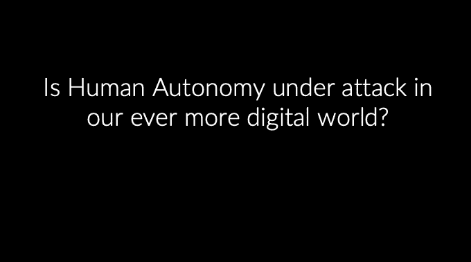

# 技术如何塑造我们:在今天的数字环境中我们是文盲吗？

> 原文：<https://medium.com/swlh/how-technology-shapes-us-are-we-illiterate-in-todays-digital-environment-7481f8ec6285>

Read my article, if you are curious why I educate business students to code and understand technology.

我们习惯上把读写能力定义为阅读和写作的能力。所以当我以书面形式问你“你识字吗？”你阅读问题的能力标志着答案。你可以读，也可以不读。我们关于有意义地参与社会和民主、我们作为消费者的独立机构以及我们过上体面生活的能力的许多想法…