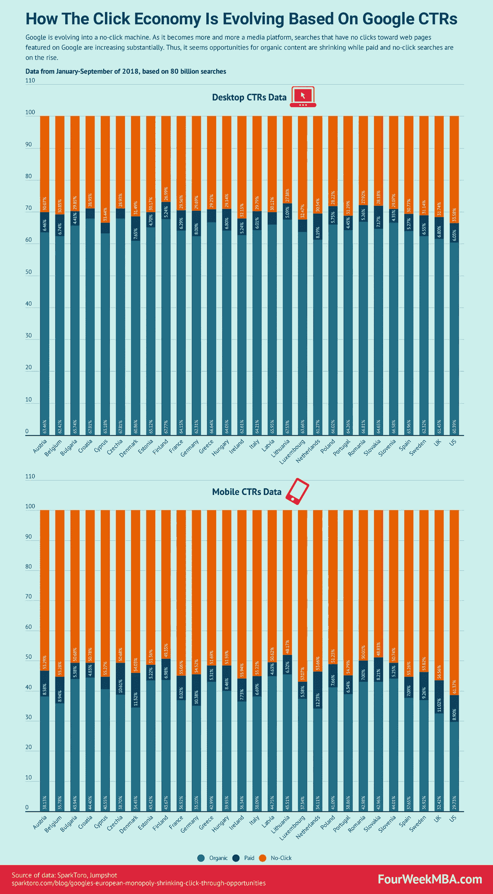
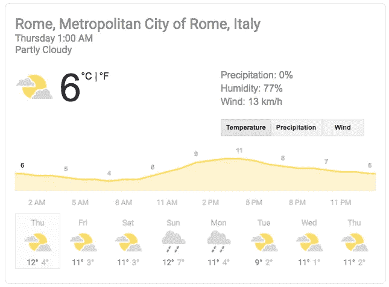
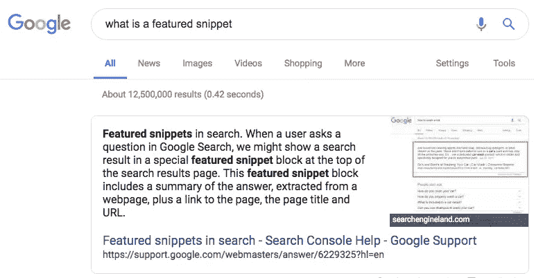
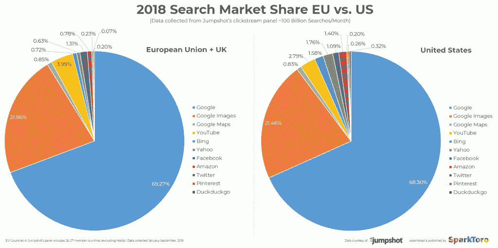

# 基于谷歌的点击率，点击经济是如何发展的

> 原文：<https://medium.com/swlh/how-the-click-economy-is-evolving-based-on-googles-ctrs-59cf452dc130>

二十多年来，整个网络经济都建立在人们点击网页的能力上。超链接，或者我们今天简单地称之为链接，是连接网页的东西。

当谷歌接管网络时，它设法让可见互联网上的任何页面都可以通过其搜索结果页面点击。谷歌搜索结果的成功有两个关键因素:

*   谷歌在付费列表上引入了一个**质量评分**，因此要求基于文本的广告具有相关性
*   谷歌还允许出版商在不花一分钱的情况下，在其搜索结果页面上展示与**相关的有机内容**。好的内容就足够了

随着我们向更高级的搜索功能发展，谷歌也越来越演变成一个媒体平台。第三个因素正在流行，那就是抛弃出版商:**无点击搜索**。

# 内部无点击搜索

从根本上来说，无点击搜索是从谷歌[开始，到谷歌](https://fourweekmba.com/how-does-google-make-money/)结束的搜索。有些搜索是有意义的，因为用户的意图可能非常简单。例如，如果我搜索“罗马的天气”,我得到的是:

我为什么要别的东西？这是有道理的，我不认为有任何出版商可以反对。当然，曾经获得数百万点击量的气象网站已经不在了。

然而，谷歌无点击搜索还有另一个令人担忧的方面:

谷歌推出了一些高级功能，比如特色片段，在某些情况下，这些片段可以消化掉用户的全部意图。

因此，他们允许某人对在[谷歌](https://fourweekmba.com/how-does-google-make-money/) [搜索结果页面](https://fourweekmba.com/what-is-seo-hacking/)上找到的信息感到足够满意，而无需访问其中的任何一个网站。

在阅读了兰德·菲什金的文章“谷歌的欧洲垄断(&减少点击机会)后，有几点需要考虑。

我们都很喜欢认为我们有一个谷歌的替代品，我们在欧洲谈论了多少谷歌的统治地位，实际上，Jumpshot 收集并提供给 SparkToro 的数据让我们清楚地看到了这一点:

欧洲对谷歌的依赖程度不亚于美国，如果不是更高的话。

另一个有趣的方面是，移动设备上的有机点击率(点击由[谷歌](https://fourweekmba.com/how-does-google-make-money/)在其[搜索结果页面](https://fourweekmba.com/what-is-seo-hacking/)上提供的链接的人的百分比)正在大幅下降:

***来源*** *:* [*谷歌的欧洲垄断(&不断萎缩的点击机会)*](https://sparktoro.com/blog/googles-european-monopoly-shrinking-click-through-opportunities/)

如上图所示，在欧洲和美国，免费出现在谷歌搜索结果页面上的机会在欧洲和英国从 45%下降到 36.7%，在美国从 40.1%下降到 29.7%。

与此同时，欧洲和英国(从 4%到 8.8%)以及美国(从 3.9%到 8.9%)的付费点击率都增长了一倍以上。

# 用户心理:用户意图及其重要性

就此而言，你必须清楚你在和谁说话。他们想要什么？他们的偏好是什么？他们为什么要搜索特定的关键词？是什么驱使他们？

一旦你理解了这一点，你就能深刻理解谷歌的每个[查询是如何帮助或破坏你的业务的。每一次花费在优化查询上的时间都不会给你带来明确的投资回报(T21)。](https://fourweekmba.com/how-does-google-make-money/)

你如何获取用户意图？分析你的流量。它从哪里来的？和你的人谈谈。

他们是谁？为什么他们看你的博客，媒体渠道，而不去别的地方？如果你有一家商店，或者提供一种产品/服务，访问你的客户的日志和互动，看看他们告诉你什么。

你有很多关于他们的信息，但是如果你想避免被谷歌吃掉，你需要仔细听。下一步是什么？

# 在无点击搜索经济中，你能做些什么来生存和发展？

作为出版商，你需要更加小心你的有机策略。您将需要理解每个查询背后越来越多的意图。就此而言，有几个关键因素需要记住:

*   **品牌，品牌，品牌！如果你所在行业的人脑子里想着你的品牌，他们就不需要搜索引擎；他们会打你的名字，并寻求你的信息。在这方面，人们通过谷歌搜索你的品牌是在向谷歌表明你的网站是相关的。随着时间的推移，这对谷歌来说是一个给你带来更多有机流量的强有力的信号**
*   **内容质量:**好的内容已经不够了。要么你成为观众信任的内容来源，要么你很快就会消失
*   **平台和作者的权威性:**随着谷歌在 2018 年推出一些算法，其中一些可能与平台和作者在平台上写作的权威性有关
*   建立一个网络:网络是一个重要的元素，当谷歌不再帮助你的时候，它可以帮助你推出你的内容
*   培养你的听众:你的听众可以告诉你一些你可能一直忽略的关于你的公司的基本事实。和他们谈谈。邀请他们给你写信，听听他们为什么喜欢阅读你的内容
*   **使你的流量来源多样化:**其他领域，如社交媒体和电子邮件营销，对使你的内容多样化也至关重要。不一定要有其他几十个流量来源或者四面八方盲目。你可以选择另一个你感到自信的领域。例如，我喜欢电子邮件营销，因为它允许与大量的人建立更私人的关系，我会全力以赴！
*   **换个方式做！**不要跟随你所在行业的其他人的做法。从其他领域的成功人士和企业中获得灵感，并将其应用到你的工作中！同时发展你的独特性。是什么让你在市场中独一无二？你的[价值主张](https://fourweekmba.com/value-proposition-canvas/)是什么？你提供内容的商业模式是什么？

*原载于 2019 年 1 月 24 日 fourweekmba.com**T21*[。](https://fourweekmba.com/google-ctr/)

## 这篇文章发表在 [The Startup](https://medium.com/swlh) 上，这是 Medium 最大的创业刊物，拥有+415，678 名读者。

## 在这里订阅接收[我们的头条新闻](http://growthsupply.com/the-startup-newsletter/)。

