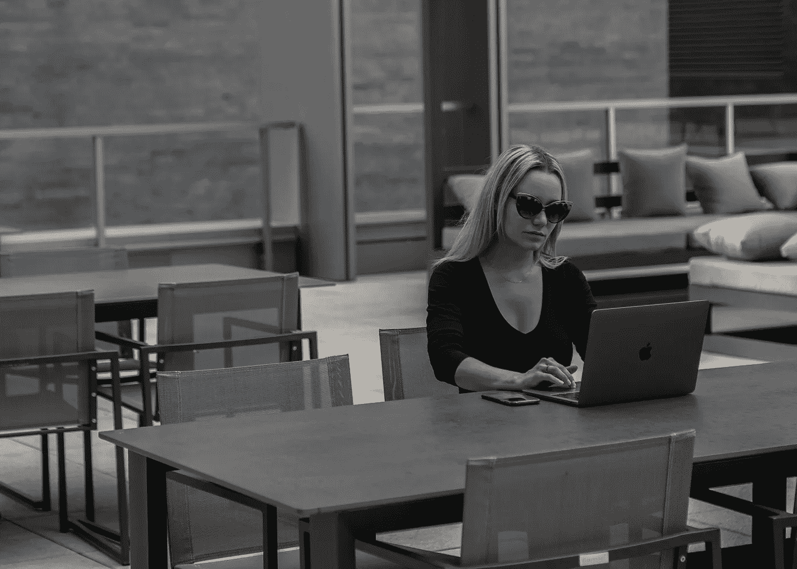

# 如何去除生活中的“非必需品”。

> 原文：<https://medium.com/swlh/how-the-disciplined-pursuit-of-less-will-allow-you-to-uncover-the-real-you-cd4ef977fba>

## 混乱的三步解药。

Photo by [Shamim Nakhaei](https://unsplash.com/@shamimnakhaei?utm_source=unsplash&utm_medium=referral&utm_content=creditCopyText) on [Unsplash](https://unsplash.com/t/business-work?utm_source=unsplash&utm_medium=referral&utm_content=creditCopyText)

你曾经有过内心深处的焦虑感吗？

不，不是蝴蝶，是另一只。

你知道，那种你几乎不能集中精力在你应该做的事情上，因为你被压在你头上的其他工作压得喘不过气来？