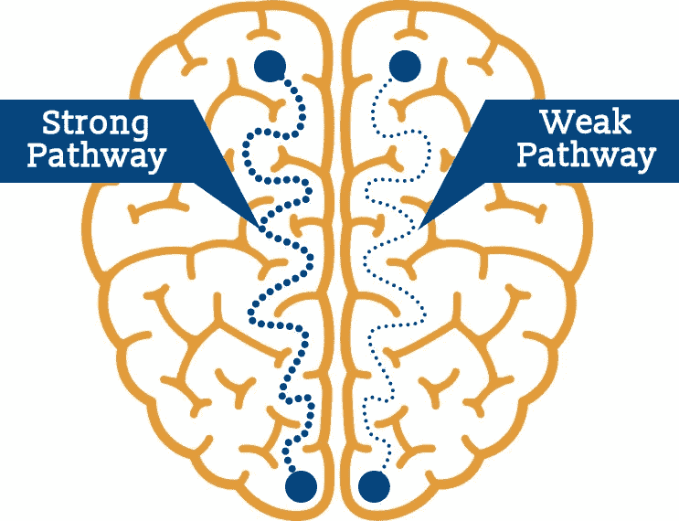
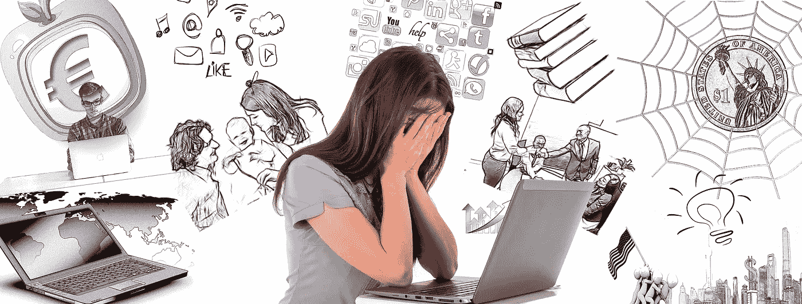
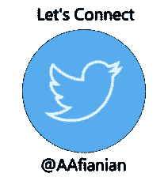

# 互联网是如何分散你的注意力的，以及 3 种找回你的注意力的方法

> 原文：<https://medium.com/swlh/how-the-internet-is-tearing-your-focus-apart-and-3-ways-to-claim-your-focus-back-47268482e03>

The Broken Focus

仅仅读了一篇文章中的几段，你会感到厌烦吗？

你走进你的房间只是为了忘记你为什么在那里吗？

你是否一直渴望从一项脑力劳动中跳出来，打开你的脸书或 Instagram？

如果你对以上某个问题的回答是肯定的，你可能正遭受着注意力分散的痛苦。

# 神经可塑性及其如何定义我们的行为

把你的大脑想象成一个由街道、公路和高速公路组成的电网。每当你思考、感受或行动时，这些路径的组合就会被点亮。

这些路径中有一些人走得更多。那些是我们的 ***行为习惯*** 比如吸烟或者锻炼或者 ***心理习惯*** 比如对未来持续焦虑或者乐观，用乐观的眼光看待一切(是的，这些也是习惯，是可以改变的)。

Strong vs Weak Pathways — Photo Credit: [Alta Mira](https://www.altamirarecovery.com/clinical-care/neuroplasticity-recovering-brain/)

每当你想到一个想法，感受到一种情绪，或者对一个特定的任务采取行动，你都在强化它们在你大脑中的路径。 ***重复得足够多，那些通路变得如此强大，以至于相应的思想、情感或行动变得无意识。***

比方说，你已经受够了不断遭受模糊未来的恐惧和随之而来的焦虑，你想改变这种状况。

鉴于 [*焦虑的解药*](https://theascent.pub/flow-a-productive-antidote-to-anxiety-and-boredom-27c9c83f777b) 是让你的注意力集中在当下，你必须努力掌控你的头脑，让它保持在当下。

当你试图这样做的时候， ***你正在围绕那条持续焦虑的旧的可怕路径建立新的神经路径。***

最初，创建这条新路径需要大量的努力和关注。就像在未铺砌的道路上开车比在高速公路上更费力一样，实践这个新习惯比简单地屈服于旧习惯更困难。

***但是……***

每一次你练习新的思维方式，你都在让它的路径变得更强更顺畅。与此同时，不良习惯的潜在途径正在逐渐开始衰退。

这个重组你大脑的过程被称为神经可塑性。换句话说，我们的大脑是可塑的，我们可以潜在地改变它的结构。

需要注意的是，我们用的是塑料的**和非弹性的**。这意味着形成新的通路是艰巨的。一旦他们形成深度，他们可以锁定你在特定的行为或思维模式。

> 一旦我们把一个新的神经回路(路径)连接到我们的大脑，我们就渴望保持它的活跃。尼古拉斯·卡尔

鉴于神经可塑性的概念及其力量，让我们看看互联网的冲动使用是如何重新连接我们的大脑并打破我们的注意力。

# 互联网是如何摧毁你的注意力的

> 互联网抓住了我们的注意力，却把它撕成碎片。尼古拉斯·卡尔

B 在媒体、互联网以及现在的社交网络激增之前，获取信息的主要媒介是阅读。

例如，阅读书籍**需要一种思维练习**，**需要持续、不间断地关注一个单一的、静止的物体**。它要求你将自己置于 T. S .艾略特在《四个四重奏》中所说的“旋转世界的静止点”。

现在，从神经可塑性的镜头来看看书的做法。当试图保持我们的焦点时，我们保持焦点的神经回路(路径)活跃，因此使它们变得更强。

不幸的是，随着信息媒体技术的转变，这种阅读习惯受到了几次巨大的冲击。最初是广播、电视的出现，现在是互联网和社交媒体。

现在，请回想一下您在流行的社交媒体网络上消费的内容类型，如脸书、Instagram、Snapchat、Pinterest 等。

**在你进入下一个网络之前，你在这些网络上的每一个内容上花了多少时间？**

**他们需要多少努力和注意力？**

**您一天中使用这些网络的频率如何？**

Short Duration of Attention Spent on So many Attention Seekers

对我来说，这种认识是可怕的。

我们不断地从一小段内容跳到另一小段内容。Instagram 上的一分钟视频，随后是不到 10 秒的其他帖子的查看。跳转到脸书来滚动浏览提要并消费金块大小的内容。

## 后退一步，看看你使用互联网的方式

你看到发生了什么吗？

这里一分钟，那里两分钟，从一个任务跳到另一个任务，从一个内容跳到另一个内容，每跳一次都要持续几分钟甚至几秒钟。这种一心多用是使用互联网的固有产物，已经成为一种习惯，消耗和破坏我们的注意力。

这就是我们注意力分散的原因。我们正在重新连接我们的聚焦回路，创造长度和能量都微不足道的注意力范围。

在这一部分，我看到人们和朋友对焦点不集中的例子产生共鸣时露出微笑:

你开始读一本书或一篇冗长的文章；读完一段左右后，你会感到不安，或者感到无聊，渴望跳到浏览器的另一个标签页，或者跳到你订阅的下一个内容，或者干脆跳到你的手机上，浏览你的 Instagram。

> 你越是一心多用，就变得越不谨慎；思考和推理问题的能力越差。你变得更有可能依赖传统的想法和解决方案，而不是用新颖的思路去挑战它们。——唐·塔斯考特，

不过，多亏了神经可塑性，重建你的注意力是可行的。

# 如何重建你的关注点

## 1.以自然的方式加强你的注意力

也许你去过健身房，或者至少看过人们举重的场景。

当你重复举起一个对你来说很重的重物时，你会感到肌肉轻微疼痛。

你会感觉到肌肉的疼痛或灼烧感，因为你的细胞正在分解。

之后，当你休息时，你的身体会注意到分解的细胞。这告诉你的身体**对它有更高的要求**。

接下来发生的是，除了重建这些细胞，你的身体还会在它们上面建立一层额外的细胞，为你提供更多的肌肉力量。这就是为什么经过一段时间的锻炼后，身体会变大。

这个过程类似于重建焦点。实际情况是这样的:

*   **蓝图。**下次当你开始阅读一本书或一段文字，无聊的怪物爬进来的时候，**不要屈服于它**。相反，至少试着多读几分钟。**这额外的几分钟正是你延伸注意力并使其更强的地方。**

几次尝试之后，你会注意到，在接下来的阅读尝试中，你不会像以前那样很快感到厌倦。这意味着你的注意力持续时间有所增长，可以更长时间地抵御无聊怪物。

这是重建注意力的自然方式，就像游泳运动员不去健身房锻炼身体一样。然而，有一种更直接的加强注意力的方法，类似于直接去健身房练举重。

## **2。提高注意力的前额锻炼**

前额锻炼是冥想的一个别出心裁的名字。

大脑中受调解影响最大的区域之一是大脑的额叶前部皮层(PFC)，这是所有人类技能的所在地，即想象力和创造力、意志力、决策、解决问题，当然还有**注意力**。

对冥想仅 11 周的人的大脑扫描显示，他们 PFC 的灰质显著增加，这意味着他们有更多的专注能力。

*   **蓝图**:冥想，指定一个特定的时间和地点。舒服地坐着，挺直脊柱，双脚着地，闭上眼睛，开始呼吸。这里有两个要点。首先，你必须专注于你的呼吸。你可以把注意力集中在鼻孔吸气或呼气的感觉上，或者当你呼吸移动它们时，你可以把注意力集中在你的胸部或腹部。第二，一旦你的思想走神了，你注意到了，把你的注意力放回到你的呼吸上。

## 3.首先要保护你的焦点

现在你知道了你日常看似良性的行为是如何变成一种心理习惯的，你就可以更有意识地对待事情了。总是问自己:

> ***我的这种做法、行为、态度，怎么会随着时间的推移而改变我。***

你和我一样用 GPS 吗？你也把你的记忆外包给数字设备吗？

从表面上看，这种行为似乎无害。但是，总的来说，从长远来看，他们将如何重塑我们？

我想引用罗马诗人贺拉斯的一句话来结束这篇文章:

> 控制你的思想，否则它会控制你。

# **总之**

*   我们就是我们反复做的事情。我们重复的行为和想法以神经回路的形式印在我们的大脑中。在它们形成之后，我们渴望让它们保持活跃，它们自己运作，不需要我们重复。
*   神经可塑性使我们能够在大脑中建立新的神经通路，绕过旧习惯。
*   不断接触社交媒体和重复消费大块内容正在分散我们的注意力和注意力。
*   注意力分散后，我们无法长时间专注于任何主题，很快就会感到厌倦。
*   当感到无聊的时候，继续多呆几分钟，就像为我们的注意力增加重量，并随着时间的推移而变得更强。
*   冥想是一种完美的锻炼，可以直接提高注意力。
*   不管是什么新技术，新媒体等等。，你参与进来，停顿片刻，问自己:从长远来看，它将如何改变我…

## 这篇文章发表在 [The Startup](https://medium.com/swlh) 上，这是 Medium 最大的创业刊物，拥有+411，714 名读者。

## 在这里订阅接收[我们的头条新闻](http://growthsupply.com/the-startup-newsletter/)。

