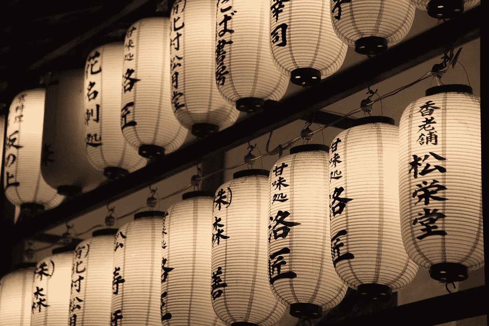

# 我在日本生活时学到的经验如何在今天仍然帮助我

> 原文：<https://medium.com/swlh/how-the-lessons-that-i-learned-while-living-in-japan-still-help-me-today-98f674b91074>

当我 16 岁的时候，我决定去日本参加一个为期 12 个月的高中交流项目。我痴迷于日本武术，并认为只有生活在它的起源国，我才能精通它。

我几乎立刻就爱上了这种文化和生活方式。日本绝对改变了我对很多事情的看法…