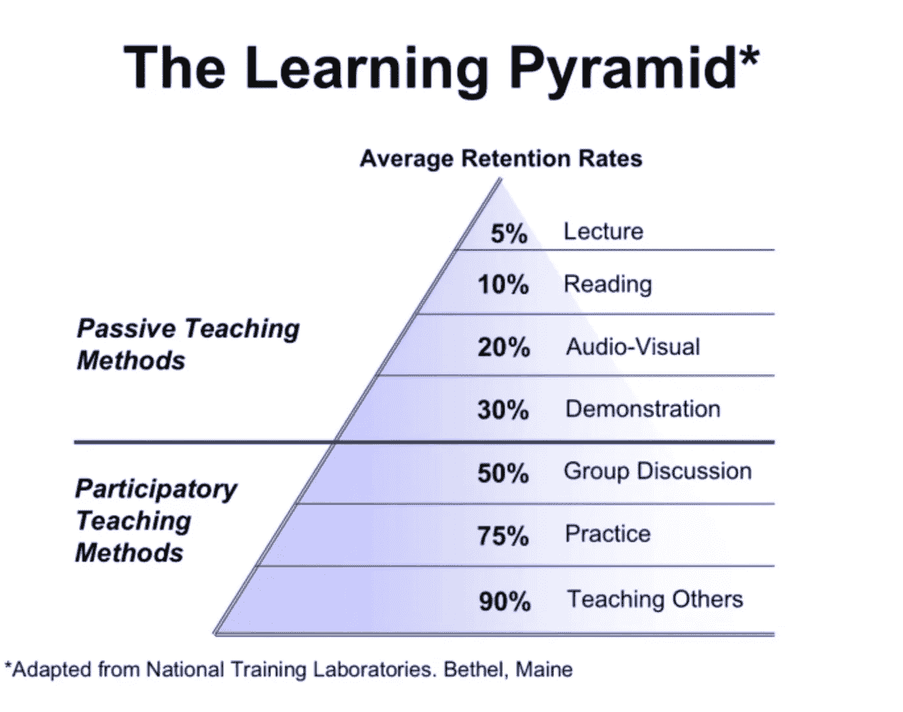
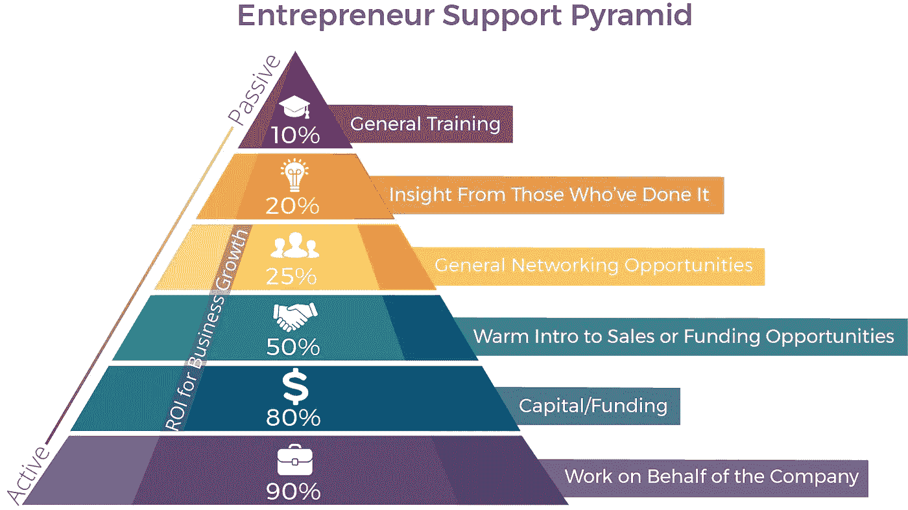
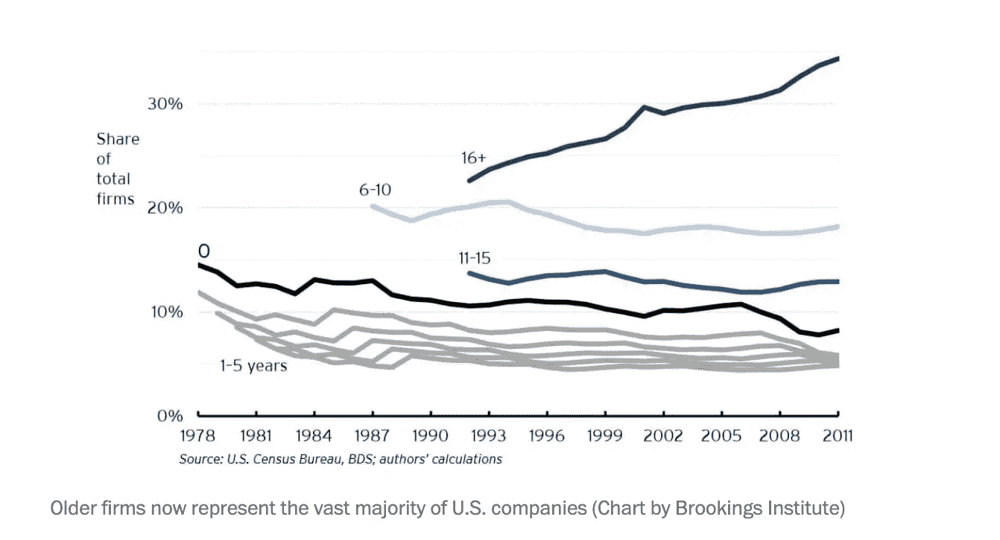
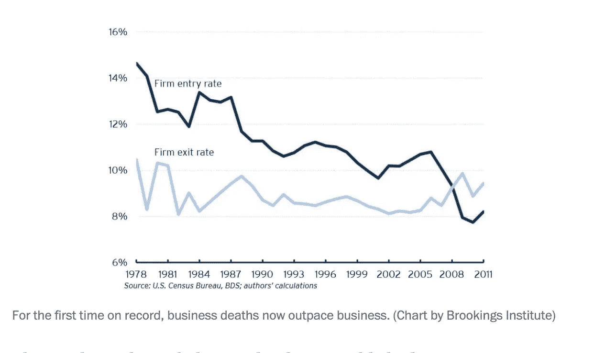
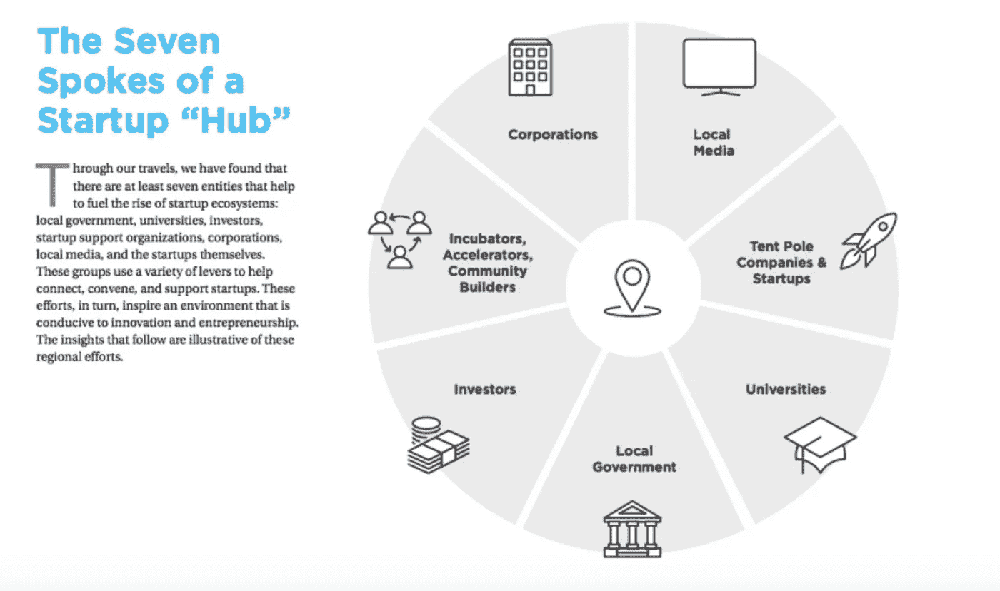

# 中西部如何与沿海独角兽竞争

> 原文：<https://medium.com/swlh/how-the-midwest-can-compete-with-coastal-unicorns-cb05a14d5e74>

在任何地方发展繁荣的企业家生态系统指南

Image taken from [Zebras Unite,](https://www.zebrasunite.com/) a movement to inject reality into the startup world. Image created by Arthur Jones.

什么样的土壤有利于独角兽的生长？我说的独角兽土壤，并不一定指的是成长十亿美元上市公司的土地。我指的是一个孕育出优秀企业家的地区。许多人(尤其是[斑马联盟](https://www.zebrasunite.com/))开始重新想象创业公司是从他们反过来培育的社区中有机涌现出来的东西。

我最近完成了一门城市农业的课程。作为一个以前只在花盆里种植东西的城市女孩，大规模种植最可怕的部分是土壤。当你选择一块土地时，你拥有的土壤决定了你能种植什么。如果粘土太多或沙子太多，你将面临一场艰苦的战斗。如果土壤没有结构(有机物质很少)，你需要花很多钱来改变平衡。如果你因为过度使用而弄脏了土壤，可能需要几年的时间来纠正。

如果这个比喻成立，你在一个地区拥有的土壤最终决定了哪些企业可以发展，哪些不能发展。

如果你一直关注亚马逊总部竞赛，很明显，许多地区都希望发展出非常成功的公司，尤其是那些正在努力应对如何在新经济中与沿海地区竞争的“锈带”城镇。对此我有话要说。

20 年来，我住在洛杉矶和奥斯汀这样的新兴城市。去年，我回到了俄亥俄州的克利夫兰，我的家乡，一个永远渴望创造非凡的小镇。比较很难。像奥斯汀、洛杉矶或海湾这样的新兴城市是美国最强劲的经济体之一。克利夫兰经常被列为美国十大最贫穷的城市之一

像克里夫兰这样一个挣扎中的中部地区，真的能与目前获得 80%风险资本的[三个沿海州竞争吗？他们能为下一个大家伙的成长提供更好的土壤吗？这取决于你认为什么样的土壤养分是创业所必需的。](https://www.recode.net/2018/3/20/17136652/comeback-cities-tour-bus-midwest-investment-incubation-local-youngstown-detroit-flint-ryan-khanna)

> 我认为初创企业的成长需要三个地区条件:1)开放性 2)风险偏好和 3)支持。

# 创造力需要开放性。哪些地区会让你“思维不一样？”

Does a Dominant Cultural Startup Ideal Push Out Other Ideals?

一位硅谷顾问将克利夫兰的创业场景描述为“新生的”，这意味着在他看来它几乎不存在。谈到开放性，这可能是一个优势。

为什么？因为当你生活在已经展示了某种成功模式的巨兽的阴影下时，很难想象出一条不同的成功之路。

打个比方，想想自然界的巨大破坏。恐龙统治了地球将近 2 亿年。恐龙时代确实存在哺乳动物。它们像鼩鼱一样小，在裂缝中跑来跑去，以免被踩在脚下。然而，一旦恐龙消失了，哺乳动物就可以出来为自己创造一个新世界，这就是我们今天经历的世界。

也许没有隐约可见的苹果或谷歌园区的好处是，有空间想象完全不同的东西。

我认为，许多企业家会希望在人迹罕至的地方找到开放的环境，如果他们真的考虑过的话。企业家通常是极具创造力的人。他们不想局限于以前的事情。他们不在乎行业教条。他们想发挥他们的创造力。正是这种渴望造就了我们最欣赏的企业家大卫和歌利亚式的英雄主义。这就是为什么一个创业公司的创始人可能能够解决整个公司都无法解决的问题。

# 谁对不同类型的创新者持开放态度？

底线是，如果企业家想要成功，他们需要被认真对待。然而，在“繁荣村”，许多类型的人很难被认真对待。被边缘化的企业家在别处更容易被重视吗？很有可能。

当我在 Boomvilles 的时候，我一次又一次地听说投资者投资的是“团队”而不是想法。对于外行人来说，这意味着他们希望投资于最有才华的团队，因为很多人都有好主意，但很少有人能实现它们。

理论上说得通。然而，它的实践方式却带来了大量的偏见。我雇佣并管理团队。我知道除非你和他们一起工作了至少几个月，否则你对他们一无所知。机构对新员工实行六个月试用期是有原因的。真正了解一个人的能力需要那么长时间。

因此，我对在 5 分钟的推销过程中如何评估“团队”的实力感到困惑。最后，我意识到团队的“实力”通常等同于常春藤盟校的教育，过去在大型科技公司或财富 100 强公司工作的经验，黑客天才，或以前的科技退出。这排除了 99%的企业家。

“新生”生态系统的一个优势是，它们可以让不同类型的创业物种蓬勃发展。坦率地说，越来越多的女性、老年人、有色人种和低收入企业家占据了这里的中心舞台。我怀疑这是因为他们得到的信息越来越少，无论是明确的还是隐含的，他们做不到，所以他们更可能相信他们能做到。当资源有限时，它们不太可能被其他种类的企业家完全挤出去，就像在其他地方占主导地位的那种企业家。我讨厌为了多样性而谈论多样性，因为这很容易破坏这种观点。多元化对一个国家和一个地区都很重要，因为它创造了更多真正的创新。如果你只选择黑客天才和常春藤联盟成员，这可能会选择黑客和常春藤联盟成员所经历的问题的解决方案，而忽略了世界上的大多数问题。如果你解决影响不同人的不同问题，你会得到更多不同的创新。句号。

多元化也拓宽了发现真正人才的渠道。资助者所说的团队的重要性是真实的。我见过很多企业家，很少听到坏主意。我经常从那些没有勇气去执行的人那里听到好主意。

你如何发现有勇气的人？首先你要知道它长什么样。这不一定与常春藤盟校教育或任何其他声望标志有关。很简单。寻找喜欢采取行动并能从结果中快速学习的人。你在 Boomvilles 中反复听到的一个口号是，受资助的人需要是“可辅导的”，这可能意味着他们需要接受某些想要提供建议的当权者的建议。

学习的能力与是否能被“专家”指导没有多大关系。学习能力是与你的特定商业环境对话的能力。例如，如果你有一家餐馆，当你收到顾客的负面反馈时，你应该能够通过改善经营迅速做出反应。如果你有一项技术发明，如果你的测试结果不是你想要的，你应该能够迅速做出调整。

所有种族、性别、经济阶层的人都可能产生错觉，与世隔绝。但如果我必须在人身上打赌，那就是那些无法爬回泡沫的人。多元化为找到更多这样的人打开了大门。

# **谁愿意接受新的创新模式？**

我住过的几个地方都试图模仿硅谷，甚至取了一个别称:硅草原、硅海滩、硅山。如果你有允许你轻松复制硅谷的土壤，为什么不去做呢？

但是如果你没有土壤来种植类似的东西呢？很难想象一个 36%贫困率的地区会产生……硅大湖。然而，这迫使你去创造别的东西，这可能是一件好事。毕竟，当你在特许经营一个由另一个地区创造的概念时，你能有多创新呢？

除了硅 X 还能生长什么？当我搬到克利夫兰时，我很高兴地发现，这个地区的创业文化似乎是由那些认为社会责任只是做生意的方式的人引领的。

在最近一次克利夫兰区块链倡议的公民论坛上，一名观众问了一个问题，关于区块链的努力将如何帮助克利夫兰最脆弱的社区。我无法想象这个问题会在硅谷或奥斯汀被问到。

为什么社会企业家在这个地区更占优势？也许这是因为企业家解决了他们每天看到的问题，并且他们觉得对此负有责任。我在西海岸的经验是，像无家可归这样的社会问题在商界是看不见的。这被认为是职业政治家、社会工作者或警察的问题。这种超然可能是生活在大都市的特征之一。

然而，作为对比，在中西部地区，当你环顾四周，看到贫困、失业、阿片类药物成瘾和其他社会弊病时，更明显的是，这正在发生在你的社区和你认识的人身上。周围社区的健康和你的商业前景之间有着更直接的联系，因此社会问题成为你商业思维的一部分。

把它想象成一个数学方程式。当你改变一个变量时，你会得到不同的结果。同样，当你改变企业家的约束时，你通常会得到新的解决方案。例如，一家决定必须在商业模式中解决当地无家可归者问题的公司，看起来会与没有这样做的公司大不相同。常识告诉我们，在商业模式中考虑当地无家可归者的问题是荒谬的，但如果这成为一个必须发生的先决条件，那么你就可以自由地释放你的思维，思考它将如何发生。这种限制可能导致创新商业模式的激增，这些模式将服务、产品、公共要素、私人要素、资本主义战略和社会主义战略结合在一起。

# 风险偏好:创新是必需品还是必需品？

老实说，我们无法回避这样一个事实:投资新企业是有风险的。你为什么要冒险尝试新的商业模式或新型企业家？很可能是因为你需要这些新业务来生存。对风险的部分偏好意味着风险是唯一真正滋养你的东西。没有别的东西吃了。

Boomvilles 目前做得足够好，以至于在不同的人或策略上冒险是一件“很好的事情”，但不是“必须要做的事情”。这可能会让美国其他地区在第二个标准上获得优势:风险偏好。

对于追求多样化创业战略的多样化企业家来说，你可能想去国家的中心。你可能更容易被认真对待，因为他们比沿海地区更需要你成功。

# 风险是谁最爱吃的饭？

不幸的是，在地图上的任何地方都很难找到鼓励早期公司冒险的地方。据业内人士称，就连硅谷也不鼓励风险。

事情不应该变成这样。就在几年前，2014 年,《经济学人》预测了创业创造力的大规模繁荣。他们设想了一个“寒武纪大爆发”,科技创业公司尝试每一种可能的想法，尝试每一种可能的变化。

可悲的是，事实恰恰相反。大型科技公司创造了一个“杀戮地带”，在那里他们收购或扼杀任何潜在的新兴竞争对手。

私募股权公司 Elevation Partners 的罗杰·麦克纳米是脸书的早期投资者，他说:

“大平台的主导地位对硅谷的创业文化产生了有意义的影响。它改变了动机，从试图创建一个大平台，到创造一小块可口的食物，被巨头之一收购。”

基本上，硅谷实体没有理由冒险投资一些雄心勃勃或极具创新性的项目。他们不想培养下一个脸书，因为他们认为在那种环境下不可能。他们认为，这需要大量的资本来摆脱被大型科技公司“借用”和吸收(像博格一样)他们的创新功能。因此，他们转而通过投资那些产生增量创新(一种更好的算法)的公司来赚钱，而大型科技公司很可能会收购这些公司。

这可能是种子投资[自 2014 年以来下降了一半的原因。](https://techcrunch.com/2017/11/30/theres-an-implosion-of-early-stage-vc-funding-and-no-ones-talking-about-it/)投资者不想在面临压倒性优势的早期公司身上冒险。相反，他们将投资集中在风险较低的后期公司。

这似乎是该行业的一个长期可持续性问题，因为通过让年轻公司挨饿，未来将会有更少可行的投资。然而，似乎很少有人认为这是他们的问题。还没有。

# 游戏中的皮肤

这凸显了热点市场中创业生态系统的另一个挑战——它们充斥着风险的不对称。这意味着，在这种商业安排中，脆弱的企业家承担所有风险，而他们寻求支持的人不承担任何风险。

这实际上是什么样子的呢？高调的硅谷风险投资家 Chamath Palihapitiya 透露，许多风险投资公司的合伙人几乎没有把他们的个人资金投入到 T2 的风险投资中。作为个人，如果他们投资的商业模式损害了社会，或者最终让企业家一无所有，或者只是简单的乏味和愚蠢，他们不会承担任何后果。这是因为他们要想获得晋升，所要做的就是给公司打气，让其大肆宣传，这样其他投资者就会效仿，然后他们就可以在下一轮融资中赚回自己的钱。

在商界工作的人知道，不对称的关系对权力较小的人来说永远不会有好结果。理想情况下，你希望与依赖你的供应商或客户合作，就像你依赖他们一样。这样你就不会和对方搞得太僵，因为你们都会和船一起沉下去。

# ***国家中心是否有更多的风险偏好？***

就个人而言，我认为这是其他地区填补空白的一个机会，如果它们能够承受风险的话。

从理论上讲，国家中心城市可以在某种程度上引起企业家的共鸣，而硅谷可能再也不能做到这一点了。初创企业家知道，一小群敬业的团队成员必须比拥有大量资源但已经变得软弱的大型企业竞争对手“想得更好”。

由于国家中心地区的资助者不在海湾地区索伦杀人区的眼里，他们没有得到相同的劝阻真正冒险的信息

除了行业灌输，非沿海投资者可能更有可能与他们的企业家拥有相同的风险/回报比，这使它成为一种更对称的关系。

例如，爱荷华州的地区投资者可能无法与安德森·霍洛维茨基金(Andreessen Horowitz)直接竞争，他们可能永远不会被邀请与沿海投资者进行大宗交易。他们可能无法制造足够的宣传来吸引大量的投资者。因此，他们可能不得不通过寻找被忽视的交易来竞争，这些交易在没有大量投资者资金的情况下实际上是盈利的。

理想情况下，企业家希望找到与他们的命运直接相关的投资者/地区。对称关系更可能出现在国家的中部，因为投资者、地区基础设施和企业家的世界观可能更接近。

从理论上讲，挣扎中的中西部社区，他们可能正处于跌入死亡螺旋的边缘，可能直接理解创新或死亡的需要。他们是凝视深渊的人。他们可能会直接体验到这样一种世界观，即真正害怕的人或团体是一个饥饿的人，没有什么可以失去，却可以得到一切。

当世界感觉就像你的自助餐台时，这不是你倾向于持有的世界观。当我住在 Boomville 的时候，很容易感觉到下一次会议就在眼前，尽管下一次会议通常以同样虚幻的结局结束。我想，如果我坚持下去，等它结束，我的船就会进来！

那些生态系统中的许多人倾向于分享同样的幻觉。可能没有其他原因，当你生活在一个熙熙攘攘的地方，可能性似乎是无穷无尽的。当现实是即使他们是，他们也不适合你，因为你不太可能找到他们。

我在这些城镇的那些年里，很少看到企业家的船只进入，但企业家之间的联系不够紧密(因为热门市场太吵了)，无法交换意见，也无法理解发生在他们身上的事情是整个系统的失败。所以，培养紧迫感和意识到如果你不做些不同的事情，你将会挨饿，需要更长的时间。

此外，在 Boomville 我遇到了一些非常有才华的人，包括；拥有计算机科学学位的斯坦福毕业生或在金融、华尔街、科技或好莱坞从事高薪工作的人。当创业生活变得艰难时，他们可能会在其他地方找到一份高薪工作。事实上，他们经常走这条路。

但是，对于选择较少的创业者来说，可能没有其他选择。你要么成功，要么别无选择。这是一种他们可能会联想到国家中部挣扎地区的方式。

不能固步自封的人和地区之间会有强烈的竞争。

如果大多数地区系统都不参与游戏，那么就有机会做一些不同的事情。如果其他人都谨慎行事，如果你孤注一掷，实际上会增加你成功的机会。

从理论上讲，有很多理由可以在国家的中心地区评估风险。然而，在实践中，可能存在类似类型的抑制风险的因素。例如，尽管事实如此，政府资金仍在继续流入，而健康的大都市的早期公司增长率为 2.5%，克利夫兰的增长率为[. 01%](http://www.the2tomorrows.org)……如果你感觉不到痛苦，你就不太可能冒险去做一些不同的事情。

# 好的创业扶持是什么样子的？

如果这个地区对你开放并愿意为你承担风险，那么你需要适当的支持来爬上成功的阶梯。 ***好的支援是什么样子的？***

作为类比，让我们看看学习金字塔，它描述了什么最能支持人们学习新的东西。基本上，学习者越积极，他们记住的课程就越多。大多数人从讲座或阅读中几乎什么也记不住，因为这些都是被动的学习形式。他们从不得不教另一个人这门学科中保留了最多，因为它需要最积极的精神努力。

Image taken from this [article](https://zivazmanov.com/the-learning-pyramid/)

***同样，支持越积极，对创业者的价值就越大。***

My business works with emerging companies. This concept comes from my experience and those of the entrepreneurs I’ve talked to.

然而，大多数生态系统中提供的 90%都是一般性培训，回报率只有 10%，是企业家可以获得的最软弱的支持。这与帕累托原理相反。

培训有助于学习特定的技能，以特定的方式进步。但是标准培训并不适合企业家精神的许多任务，企业家精神通常是关于开辟新的道路。有时提供的培训不容易实施。例如，管理培训只有在你有资源雇佣员工时才有用。标准的课堂培训也与企业家气质根本错位。大多数人做得越多，学到的东西就越多。以行动为导向的企业家是这种哲学的典型代表。

那么，为什么培训师模型是几乎每个人都做的方式呢？这是风险最小的工作，而且还能拿到薪水。

> 然而，这种策略造成了恶性循环。企业家被认为太不可信，无法获得实质性的支持(资金、销售线索)；因此，他们在企业家训练营接受“再教育”。但这种支持并不能推动企业前进，所以他们更有可能失败，然后被视为需要接受更多教育的高风险赌注。对于企业家和支持生态系统来说，这是一个失败的开始。

# 以下是提供更适合成长中的优秀企业家的支持的方法。

## 第一:制定一个你可以信任的审查程序，这样你就可以更好地信任你想帮助的企业家。

如果你不信任你的企业家，你就会害怕支持他们。因此，制定一个你信任的审查程序，找到你可以信任的人。

例如，俄克拉荷马州的塔尔萨市最近向那些想从 T4 搬到塔尔萨市并远程工作的人才提供了 1 万美元。他们收到了 100 个职位的 10，000 名申请人，这让他们能够挑选出最好和最聪明的人。高排名的申请人有一个现有的盈利业务(展示才华和成功)。

塔尔萨也了解他们的区域品牌和他们能提供什么。他们明白他们的目标市场不仅仅是寻找廉价住房的沿海居民，而是想成为社区领袖的沿海居民。他们试图用在沿海大城市永远得不到的影响力来吸引人们(或吸引他们回来)。

对于那些想要扭转人才外流的城市来说，这可以成为一种模式。人才外流一直是五大湖、中西部、平原和阳光地带的主要问题。

## **二:尽量减少不必要的中间人和官僚主义**

我有在政府工作的亲身经历，以推动新的计划。我筹集了数百万美元，并在加州大学洛杉矶分校启动了五个不同的奖学金项目。

我们提供的正式培训很少，80%以上的受资助者达到或超过了他们的目标。这比标准的风险投资或当前的企业家服务的成功率要高得多。

我们没有干预受资助者的日常活动，而是专注于我们能够带来卓越的流程部分:

1.  制定严格的审查程序，以确保我们资助那些已经表现出基本能力的专业人员/机构
2.  促进同行之间的学习过程，在这一过程中，受赠方在实地经历时相互学习。
3.  建立数据收集系统并进行严格的评估，以确定可以向其他人传播和推广的最佳做法。

我们为什么选择这样的策略？*这在一定程度上是因为我们的资助者迫使我们将结果置于产出之上。*

想想看，如果你，作为一个资助者，说为了继续资助你的加速器/企业家服务组织，我们衡量的唯一标准是企业家业务的增长，那么该组织应该有强大的动力让他们的企业家增长。

由于加速器对企业家的业务没有直接控制权，他们更有可能将资金转给企业家来雇佣员工，以使他们的业务更有可能增长。在这种情况下，区域生态系统、企业家和企业家服务组织的目标更加一致。 ***创业服务的最终目标不就是业务增长吗？如果是这样，激励结构应该与这个目标相匹配。***

## **三:让审批决定更加公平有效**

如果你处理的是公共资金，我知道你希望(也可能是法律要求的)保持公正。然而，尽管进行了大量的股权培训，并让创始人标记种族和性别复选框，由多元化人士领导的公司的融资率仍然令人沮丧。一个原因是因为标准的间距/应用模型非常主观，因此存在固有的偏差。

以下是一些消除主观性的方法:*首先在判断一个想法的竞争力时，潜在客户是唯一需要权衡的专家。新观念和麦当劳的特许经营不一样。没有一个标准的评价。如果你在创造新的东西，没有专家也没有同行。因此，他们的意见没有什么分量。什么东西应该有重量？企业的目标客户对它的反应。这对他们有帮助吗？他们想要吗？*

如果对可行性有疑问，特别是围绕尖端或投机性技术，可能会有另一个步骤。在这种情况下，相关学者和技术专家(工程师、建筑师、医生)的支持信可能有助于评估该技术是否有很大的成功可能性。但你仍然需要与技术的目标终端客户联系，以评估其竞争力。

如果验证了潜在客户需要它，第二步是评估团队是否能够执行。不管是一个人还是十个人的团队。执行的第一步意味着你要从那些空谈者中剔除出真正执行的人。*重要的是，“做”意味着他们可以创业——不仅仅是任何工作，甚至是一家老牌公司的相关工作。*创业的任务往往与许多已建立的企业的工作任务不一致。

我建议使用模拟企业家在现实生活中如何运作的审查程序。为什么不把你的比赛时间定为六个月呢？这更像是真正的创业马拉松。召集一群早期公司，在接下来的几个月里给他们(或让他们设定)基准(把这些想象成跑道上的障碍)，看看谁能通过基准测试。在真正的早期公司，他们缺乏资源，你想衡量他们的毅力，足智多谋，以及快速迭代和创造性的能力。

我还建议创建模拟这些企业实际面临的障碍的基准。目前，我见过的几乎所有用来审查企业家的竞争策略都需要一份书面的小型商业计划，或者站在观众面前进行几分钟的正式推介，涵盖从创意到财务的所有内容。对于大多数企业来说，这些任务与收入的实际来源没有任何关系。

我听说过这样一种观点:生意就是销售，如果你不能销售，你就不会成功。这有一些优点，但还不够。例如，如果一个整天坐在实验室里的技术天才在与普通观众交谈时舌头打结怎么办。如果紧张不安的 nelly 的目标受众是其他技术人员，他们不期望华而不实的演示，事实上喜欢深入探究神秘的细节，这可能并不重要。

是的，你需要那些足够了解自己业务的人简明扼要地解释。但请记住，标准类型的竞争往往会奖励优秀的空谈者，而不一定是优秀的实干家。比起前者，你更需要后者的技能。即使对一个销售人员来说，我也想不出一个企业会在五分钟的电梯推销后赢得一个大客户的例子。

反映行动的基准可以是:让 50 个潜在的可验证的客户给出关于他们使用潜在产品的意愿的视频证明，来自客户调查的硬数据，与潜在的供应链或客户管道合作伙伴发展的新的正式合作伙伴的数量，即使他们没有资金来构建整个事物，也能获得技术构建或测试的特定部分(具有可验证的结果)等。,

基准应该很难，但却是可行的。相信我，上面列出的这些基准很难。作为对比，优步的创始人特拉维斯·卡兰尼克通过给三藩市的豪华轿车司机打电话来评估他的生意是否会腾飞。第三个人挂了他的电话，第三个人听了 90 秒后挂了电话，第三个人说他们对拼车感兴趣。以 1/3 的潜在客户接受率，卡兰尼克获得了资金，一只独角兽诞生了。

重点是设置挑战，奖励具有真正企业家竞争精神的人。一个好的沥青甲板可以买到。这些其他种类的东西更难伪造。

作为附带的好处，这种结构实际上有助于所有参与的企业家，激励他们专注于发展自己的实际业务。这让他们不必到处跑去推销比赛或从事其他不支持其核心业务职能的辅助活动，他们感到被迫这样做只是因为他们迫切需要种子资本来达到下一个水平。

这种策略是有先例的。美国能源部最近发起了一项太阳能创新竞赛，在竞赛的多个阶段给予资助，并向在此期间进步最快的人颁发更高的奖项。

俄亥俄州也采用了[多阶段竞争](https://development.ohio.gov/bs_thirdfrontier/ootc.htm)模式来寻找抑制阿片类药物成瘾的技术。

实施这些战略需要巨大的承诺。在评委席上坐一个小时评判一场投球比赛并不太难。观看 50 份视频证明，并确定这些是真正的潜在客户还是某人的朋友，或者解读来自学术研究人员的五封技术支持信，这些工作要多得多。基本上，你需要花时间去了解企业家明白(或不明白)什么。

然而，劳动是有回报的。

## **第四:通过专注于支持不足的创新领域来进行区域竞争**

目前，如果创业者被像 Y Combinator 这样的顶级加速器录取，他们更有可能成功。为什么？因为他们将很容易通过管道转移到企业家支持金字塔的底部，并获得资助者的个人介绍和其他重要的业务增长机会。但是，99.9%的创业者不会进一个精英加速器。

而那些没有被录取的人可能仅仅因为他们的发明类型而被拒绝。例如，在 Y Combinator 投资组合中的前 100 家公司中，只有一家农业公司(仍然是软件公司)。这是因为没有潜在的高增长农产品吗？我表示怀疑。我怀疑这是因为 Y Combinator 倾向于认可其具有区域理解能力的商业模式中的优秀之处，而农业设备可能不在这些领域之内。

这意味着各地区有机会创建(或吸引)精英加速器，专注于目前尚未覆盖的内容领域。事实上，这可能是区域成功的最佳途径。你为什么要和专门从事这类业务的硅谷竞争下一个谷歌呢？找另一种类型的业务来专攻。

注意:精英加速器不仅仅是训练(原谅我重复我自己)。他们拥有强大的销售、资金和人才渠道，所有这些都是企业家支持的实质性形式。

你会问，在一个不存在功能支持金字塔的真空中会发生什么？根据我的经验，一个寄生的“支持”层往往会形成，就像通常在有梦想的人周围一样。这个提取层是企业家面临的最大危险之一。

## **五:提供与提取相反的支持**

前面提到的提取层是什么样子的？相比之下，我在洛杉矶住了很长时间，有几个朋友想成为演员、音乐家、作家等。他们遇到了一个没完没了的表演和写作“教练”层，他们希望技能发展得到报酬，但他们也明确或含蓄地表示，他们与业内人士有联系，可以分享。那一天很少到来。

类似地，我也见过企业家加速器声称他们的公司筹集了很高比例的资金。然而，当你在引擎盖下达到顶峰时，这是因为他们只接受已经筹集了大量资金的公司，这些资金填补了加速器的统计数据。

这些加速器声称让你为 Y Combinator 这样的顶级加速器做好准备，但与 Y Combinator 不同的是，你需要支付费用。他们还经常承诺能接触到投资者，但很少会产生这些关系，只要你继续为他们的支持付费，他们可能会让你跟着承诺走。

这是风险不对称的另一个例子。“支持服务”不为他们的失败负责，而企业家承担他们的全部责任。

提取层摧毁了企业家最宝贵和最稀缺的资源——他们的时间。创业是一个试错的过程。这是你所拥有的时间和你能多快找到正确道路之间的竞赛。采掘实体浪费了宝贵的时间，让企业家走上了虚假机会的道路。没有人靠虚假的机会来做生意。追求虚假的机会会浪费追求真实机会的宝贵时间。

被指出真正的机会是一个企业家能得到的最重要的支持之一。

One of the biggest tasks for entrepreneurs is to get to people who can truly help.

## **六:让企业家进入功能支持金字塔**

***进入功能支持金字塔的企业家和没有进入的企业家有什么区别？八年了。*** 我遇到的进入快车道的企业家要么是在 2-3 年内开始运营，要么是他们见识了足够多的东西，知道应该在同一时间内关门。

另一方面，我遇到的那些坚韧不拔的家伙，尽管没有什么支持，却坚持走下去，他们花了 8-10 年才达到那个曲线。为什么地区应该关心阻止或延迟创业成功的提取层？

因为企业家精神不仅是美国梦和美国方式……而且在那 8 年里，那些饥饿的企业家们在他们本可以养活他们的地区经济的时候，却在典型地榨干他们的经济。他们没有创造多少新的工作岗位。他们经常吸干他们的朋友和家人。

此外，雪上加霜的是，没有得到支持的企业家经常会面临资助者的质疑，询问他们为什么没有快速发展。这给增长增加了又一个障碍。

这就是为什么获得资助的成功企业家通常会承认“调整了他们的起源故事”。这意味着他们告诉人们他们是在 2 年前启动的，大约是在他们获得天使投资的时候，而不是 5 年前，因为他们花了 3 年时间几乎没有产生任何有形的成果。他们“调整”以适应 Boomvilles 的创业成功理念；一个成功的公司应该像希腊女神雅典娜从她父亲宙斯的头上冒出来一样，瞬间涌现出来。为什么？我猜是因为创业应该是不可企及的神话。

这是在五大湖地区创业的优势之一。有一种更蓝领文化的理解是，工作是一个过程。它应该很难，这就是为什么它被称为工作。工作道路与神奇的天才道路在这个地区更受尊重。我相信也应该支持。

## **七:减少有毒炒作**

我们能否评估各地区在支持艰苦工作和将企业家介绍给真正能提供帮助的人方面做得如何？它很有挑战性，因为它被炒作得不透明。

根据定义，炒作是对所提供的好处的夸大。说得多做得少，这也是企业家支持金字塔中投资回报率最低的地方。

炒作是热点市场的特征之一。人们满载着新思想和新个性而来。交易的速度很快。这就像原子在茶壶里碰撞的速度越来越快，所以可能会产生巨大的噪音和蒸汽。

炒作的反面是悄悄的，比如当我在奥斯汀的一位导师，一位深居简出的天使投资人，承认即使他也无法让其他潜在投资者来听潜在天才企业家的演讲。

当你挖掘数据时，这一现实变得更加明显，数据显示，在奥斯汀，年轻公司占优势，一些强大的后期公司和较少的中期公司。简而言之，这意味着来的人多，成功的人少，因为投资高度集中在少数几家公司。

我的希望是，搬到克利夫兰这样一个节奏较慢的生态系统，我可以在更私人的层面上了解人们，这样就可以形成一些更坚实、更有基础的东西。在某些方面，这种情况正在发生。然而，在其他方面，我惊讶地发现，即使在较小的地区，炒作仍然存在。早些时候，我发现自己参加了一个又一个激动人心的会议，与会者渴望改变该地区的命运，但随着会议的进行，他们会靠过来，自发地小声说些什么，大意是“这里有很多谈话。”

我已经开始接触到能提供帮助的那一层人了。大部分来自神风特攻队的电话和邮件。那是我的责任，不是支持系统。我见过的其他成功企业家私下也承认了同样的事情。

## **八:评估你的本地网络是封闭的还是开放的，是强是弱**

炒作是一个企业家真正需要的东西的傻瓜黄金版:品牌知名度。品牌知名度是可以用很多钱买到的。但是大多数企业家不会有很多钱；因此，他们需要考虑哪些地域文化更有利于有机地产生品牌意识。

我说的不是肤浅的转发病毒式传播。*我要说的是:在不同的领域，什么被认为是社会认可，这样人们会给你一个机会，可能会夸夸其谈？*理想情况下，你希望身处一个人们在参加会议之前不需要太多社交认可的地方。而且，如果会议进展顺利，你需要一个足够强大的区域网络，让消息迅速传播并具有可信度。

例如，据我所知，硅谷是一个封闭但强大的网络。社会认可可能需要常春藤联盟的证书，在知名科技公司的前工作，或者被精英加速器接受。如果你没有这一点，掌握实权的人的大门可能会被关闭。然而，如果你能打开大门，那么消息应该会在当地资助者中迅速传播，并在整个地区广泛可信。

另一方面，在我的经验中，洛杉矶是一个封闭和脆弱的网络。尽管经历了两个加速器项目，尽管在当地风投的评审推介比赛中获得了最高分(我们对他们来说还为时过早，因为他们都是 A 轮及以上)，尽管实际上支付了一个加速器以促进介绍— —但很难与决策者会面。在洛杉矶，社会认可更多的是关于你有多少 twitter 粉丝或有声望的客户(或其他一些社会影响力的指标)。除非你脱下衣服或者有资本消费，否则很难获得 50 万的追随者。

更糟的是，洛杉矶的网络很弱。这是一个巨大而分散的地方。消息不容易传播。所以，让足够多的人对你产生信任，让你获得动力的唯一方法，就是通过周围的品牌存在。然而，在洛杉矶这样大的地方创建一个环境品牌需要很多钱。你面临着先有鸡还是先有蛋的困境。

就个人而言，我发现克利夫兰(我怀疑是整个大湖区)是一个很好的平衡。人们乐于给你机会或听你说完。社会认可是有帮助的，但是得到它并不困难。你不需要成为金·卡戴珊或埃隆·马斯克的闺蜜就能打开大门。去参加当地的网络会议是你开始行动的全部需要。

这个网络相当强大。这是一个更小的环境，人们喜欢交谈。消息更容易在足够多的人中传播，这样你就能提高自己的知名度。例如，我为一个当地的公民组织写了一篇博客，有很多人联系我，告诉我他们听说过我。这在洛杉矶和奥斯汀从未发生过。

提升你的形象可能是成功和默默无闻的区别。举个例子，我最近在克利夫兰遇到了一家公司，它开创了一个与我的朋友试图在洛杉矶推出的概念相同的概念。除了我的洛杉矶朋友无法找到资金度过最初的难关。另一方面，克利夫兰集团找到了地区性投资者，正在扩大规模。

> *一句话:培养一个区域网络是吸引精明企业家的一张名片，这个网络既能让人敞开大门，又能有力地传播信息，有大量可获得的机会，而且不要大肆宣传。*

## **九:生活和做生意的成本降低**

如果我没有提到更低的生活和经商成本可能是一个地区企业家精神的特征，那我就失职了。这是高温生态系统最大的缺点之一。作为一个轶事，我有一个企业家朋友，一个老谋深算的企业家，我在奥斯汀遇到的。他去硅谷碰碰运气。他参加了一次又一次的会议，这些会议似乎导致了一个重大突破。他的存款一直在减少。为了能有一张床让他晚上躺在床上，他几乎考虑过住在一个下水道畅通的地下室里，因为那是他在昂贵的地区所能负担得起的。

尽管他拥有工程学位，但为了维持生计，他最终在家得宝(Home Depot)找到了一份零售工作。他确实得到了天使投资，但不是以传统的方式。在家得宝工作时，他把一位顾客的梯子拿到自己的车上，并开始与顾客交谈。这位客户在当地一家科技公司工作，对我朋友开发的硬件类型很感兴趣。第二周他开了一张支票。我的朋友仍然不得不离开硅谷，因为天使投资的金额并没有让硅谷的租金变得更可承受。

我朋友的故事代表了一个地区的失败还是成功？很难说。我确实知道，如上所述，创业成功往往来自一段时间的试错，你需要能够生存足够长的时间来突破。

即使在你突破之后，仍然有扩展的挑战。例如，我有一个西海岸的客户，他的消费品牌在网上卖得很好。他们已经考虑开一家店面很长时间了，但在他们的地区开一家店面的成本是任何小企业都无法承受的。很简单，在生活和做生意的成本都是天文数字的地区很难生存。

# **加强区域创业生态系统的切实策略**

从理论上讲，一个真正希望吸引企业家的地区，可以让获取重要资源(销售前景、合作伙伴、资助者、人才)的过程比以往更加高效。

创造效率的策略可以是:

1.为企业家在贸易活动中展示创造免费机会。

2.允许企业家向政府采购办公室推销

3.减少管制

4.让区域企业家组织购买当地企业家可以集体使用的服务或产品，从而帮助企业家降低成本。这尤其包括律师和会计师的时间，不仅仅是一个小时的咨询，而是切实的帮助归档文件和起草合同。

5.要求政府供应商与高比例的当地公司进行采购或分包，或包括对包括当地和早期阶段的二级或三级供应商的合同的激励，从而允许他们建立更多能力的脚手架。

6.为投资当地公司的当地天使提供税收减免。同意被列入天使投资者公共数据库的个人可以获得额外的税收减免。

7.创建一个政府过滤系统来降低早期公司的风险。这可能包括一份政府风格的年轻公司公开评级表。这可能是疯狂的言论，但如果这些指标捕捉到了企业家投入的实际工作水平(例如，他们的专利、他们的跑腿工作、他们的测试结果、他们的市场验证访谈)，而不是试图评估创意的价值，那会怎么样？除了最好的专家和潜在客户，所有人都非常主观。

8.要求国家资助或企业家服务组织/加速器根据企业家的要求，为企业家联系至少 5 个销售/融资线索，否则将减少资金。

9.对愿意孵化/资助创业项目(包括合资企业)的地区公司总部给予税收优惠。

10.由于风险投资大大减少了对早期创业公司的前期和种子资金，为该地区的早期和多样化公司提供资金激励。

11.作为使命的延伸，允许/鼓励/激励现有慈善机构投资早期盈利性社会创业或贫困社区的创业。例如，[克利夫兰基金会](https://www.insidephilanthropy.com/home/2019/5/15/hard-dollars-in-cleveland-a-community-foundation-ramps-up-its-impact-investing)在常青工人合作社不景气的时候支持了它。现在的[常青树](http://12.	https://reason.com/2018/10/21/can-laundry-and-lettuce-save-c/)是一套成功的互联企业。

12.如果资助企业家支持服务组织，评估有多少奖励资金用于该组织的运营和管理费用(员工工资)，有多少直接用于企业家的业务。至少应该有 50/50 的比例。并不是说资助企业家服务本身就不好。但是把这些服务想象成大型的成熟工厂。企业家是生长在他们阴影下的小幼苗。公款是一个喷壶。如果你想让所有的植物都茁壮成长，你必须付出特别的努力来确保那些微小的幼苗在被已建立的组织的根部完全吸干之前得到水分。

13.对于与企业家精神和创新增长相关的区域/州咨询委员会或区域企业家服务，**当前**本地企业家应拥有董事会席位，并有能力在公开听证会上倡导他们的利益。

14.关注那些产品受到其他地区冷落的企业家，无论是农业、医疗、教育还是其他领域。理想情况下，你所在的地区应该在这方面有一定的经验，或者有意愿投入劳动力来吸引专业人才。

15.上文提到的克利夫兰“两个明天”报告强调，可以衡量的事情就可以完成。衡量你的进展，让你资助的组织负责提供衡量。

16.同样，获得资助的东西也在增长。你不能给种了矮牵牛的花园浇水，还指望长出向日葵。同样，如果你资助训练和球场比赛，你会得到更多的训练和球场比赛。如果你(聪明地)资助企业，你会得到更多聪明的企业。“种瓜得瓜，种豆得豆”这句话在这里是有效的。

17.如上所述，产出和结果是有区别的。与企业家支持相关的产出可能是参加的培训数量。低水平的结果可能是培训带来的知识增长。我曾参与政府倡议来衡量这类事情。我个人的信念是，你可以把它们都扔出窗外，而不会磨损。衡量企业家成功的标准是公司的成长。这是你需要衡量的结果。

18.利用多方利益相关者协调来更平均地分配风险和后果。这确保了风险不会只落在一个基金会、政府雇员、企业家或天使投资者的肩上。这也增加了在企业家生态系统中工作的人的风险，因此他们分担了不负责任的投资、培训等的痛苦。这些策略可能让系统内的多人更容易接受风险，但它也迫使系统的更多部分面临失败的后果，因此它可能迫使许多人学习……不仅仅是企业家。

19.按照这种思路，该地区或州可以将投资者给早期企业(A 轮或更早)的每一美元相匹配，以增加投资者(和企业家)的成功机会。

20.围绕有前景的业务开发生态系统。例如，肯塔基州一家名为 [App Harvest 的公司获得了风险资本](https://www.prnewswire.com/news-releases/appharvest-receives-investment-from-rise-of-the-rest-seed-fund-300598499.html)的投资，以建立水培温室，希望建立一个主要的区域食品中心。如果这看起来是一个好的赌注，在该地区播种将进入同一供应链的辅助业务(如当地水培设备生产商)。

21.补贴或激励高功能加速器/孵化器启动或搬迁到您所在的地区。我所说的高功能，是指他们通过投资于投资组合或准备分享一份经过核实的投资者或销售前景名单来参与游戏。

22.吸引投资者到你所在的地区(或设立地区办事处)，专注于你所擅长的特定领域。还不知道你的专业是什么？我读到过挣扎中的地区一直在关注“eds 和 meds”——其他行业离开后留下的支柱医疗和教育机构。发展这些新生管道，让它们拥有真正的牙齿(深入企业家支持金字塔)。

23.这也可能包括让天使投资人和风险投资人成为你的客户。有哪种资助者对交易流程的质量有问题吗？在交易流程的特定阶段遇到问题？还是特定的部门？你可能会逆向工作，看看哪里可以满足投资者的需求，然后做出特别的努力来支持符合这些标准的创业公司。

24.或者找和你有共同价值观的风投。Mara Zepeda 和 Jenn Brandel 已经开始充实这个主题的模型。例如，某些资助者是“没有热情的介绍就不要接近我们”的类型。某些投资者，如[卡普尔资本](https://www.kaporcapital.com)有一个更加开放包容的政策。

企业家神话由来已久，还有一个加速器神话，即需要 99%神奇的天才魅力才能成为一个成功的(作为一个个体组织或地区)加速器。我不这么认为。

在其中一个大型生态系统中，我接触了一个最著名的资助者协会(事实上他们只是资助者协会)的协调员，该协会为企业家提供融资培训。我问协调员，是否有任何感兴趣的投资者真的出现在这些活动中。他说，(我转述一下)“不，那些退休的人是退休了，他们是在为组织做贡献。”

这意味着，在一个最主要的初创城市，最著名的投资者组织之一正在培训企业家向不存在的投资者推销——无论是有意还是无意。你所在的地区能做得更好吗？

招徕投资者并创建一个高效运作的渠道，可能只需要努力找到他们。只是大多数地区性加速器没有把积极培养投资者视为核心业务，而事实上，这才是一个成功的加速器的主要角色。

好吧，所以如果你在印第安纳波利斯，你可能不会有很多新晋的科技亿万富翁，但你有东西可以利用。正如我所分享的，炎热的生态系统有真正的机会，但也有很多烟雾和镜子。如果你没有烟，没有镜子，并且愿意投入劳动，那么你就可以种植一些有价值的东西。

信不信由你，通常被视为古板的政府在消除早期创新风险方面发挥了重要而成功的作用，尤其是那些需要高水平资本支出的创新，如国防技术或医疗保健。这个角色可以扩展到其他类型的创新。

如果政府将自己视为投资者，那么它们应该像典型的投资者那样，寻求保护自身利益与发挥只有政府才能发挥的慈善作用之间的平衡。一方面，政府行为者应该认识到政治资本的风险。另一方面，这些风险可能为进步铺平道路。请记住，罗斯福登上总统宝座，很大程度上是因为他是少数几个在自己的州成功抗击大萧条的州长之一。他被选入更高的职位，以传播他在州一级创造的成功。

# **金发区**

有没有一个地区，合适的东西正在汇聚，产生下一个尚未看到的创业天堂版本？那里的土壤、天气和花园都刚刚好。

我们为什么要关心？

我个人很在意，因为我是一个和其他创业者合作的创业者。我喜欢企业家。他们体现了美国梦。他们代表了每一个来这里开创自己命运的人，除了他们自己的足智多谋，他们一无所有。

如果你重视这个梦想，那么你必须看到我们这个国家有一个问题。随着神话中的独角兽的崛起，普通企业家的命运变得更加暗淡。再次注意我们在奥斯汀看到的模式。资本正在向少数人集中，而不是向外、向下或横向流动。这不是失意企业家的主观酸葡萄心理问题。事实就在数据中。**40 年来，美国的企业家精神一直在严重衰退。在过去的几十年里，公司出生率几乎减少了一半。**

This is a clear and striking visual of the decline in entrepreneurship. [From](https://www.inc.com/magazine/201505/leigh-buchanan/the-vanishing-startups-in-decline.html) Inc.com

[From](https://www.washingtonpost.com/news/on-small-business/wp/2015/02/12/the-decline-of-american-entrepreneurship-in-five-charts/?noredirect=on&utm_term=.9d21ec42a332) the Washington Post

Not only are the majority of American companies older but more U.S. companies are [dying](https://www.washingtonpost.com/news/on-small-business/wp/2015/02/12/the-decline-of-american-entrepreneurship-in-five-charts/?noredirect=on&utm_term=.9d21ec42a332) than being born.

This is alarming because new companies are responsible for the majority of [new jobs.](https://www.washingtonpost.com/news/on-small-business/wp/2015/02/12/the-decline-of-american-entrepreneurship-in-five-charts/?noredirect=on&utm_term=.9d21ec42a332)

这基本上意味着，作为一个社会，我们在创造新企业方面做得不好，而新企业反过来又创造了新的就业机会。这是为了生存。打个比方，如果作为一个群体，你没有生育任何婴儿，你就处在灭绝的过程中。当我们公司的出生率为负数时，我们认为这个国家发生了什么？

创业能力一直是获得社会和经济流动性的主要途径。然而，随着企业家精神的衰落，美国的社会和经济流动性出现了[式的急剧下降，这难道不令人惊讶吗？尽管创业资本大量集中在某些地区，但它在支持或重振企业家精神或社会流动性方面收效甚微。必须做些别的事情。](https://www.businessinsider.com/social-mobility-is-on-the-decline-and-with-it-american-dream-2017-7)

我在中西部社区演讲，以及我提到的所有其他原因，因为我正在根据一个假设采取行动，即谁最有可能承担扭转企业家精神衰退的责任。采取行动的人往往是那些正在经历问题痛苦的人。中西部已经亲眼目睹了会发生什么，当你依赖一个行业或公司离开，因为商业创造如此缓慢，没有什么可以填补空缺。中西部社区直接接触到这一空白。他们可能凭直觉认为，空虚中应该是新的商业创造。然而，填补空白的不一定是中西部地区，可以是任何有远见、有能力动员起来的地区。

史蒂夫·凯斯(美国在线创始人)创建了一个投资非沿海创业公司的基金。他列出了他认为创建区域性创业中心所需的七个要素。几乎每个中等城市都至少具备凯斯描述的 7 个要素中的 4 个。

[From](https://www.businessinsider.com/the-future-of-startups-isnt-in-new-york-or-california-2018-2) Business Insider

然而，我去过包含所有七个要素的城市，但仍然无法[有效地协调](https://austinstartups.com/the-missing-piece-4434ac89e2b5)它们以取得成果。

为什么拥有所有原材料的地区不能有效地协调起来——以击退企业家精神的衰退？

一个因素可能是金发女孩现象。如果你太小，你就没有足够的资源。如果你太大，就很难把所有必要的部分都囊括进来，并让他们就共同愿景达成一致。中等规模的地区可能有适当的平衡。有一些资源和潜在的能力去接触所有的代言人并动员他们。

七辐图形中缺失的元素是欲望和责任感，它们在辐条间流动，就像水在灌溉渠中流动一样。哪个生态系统更想要？哪个来承担培养的责任？欲望和努力是我们创业农场最好的肥料。