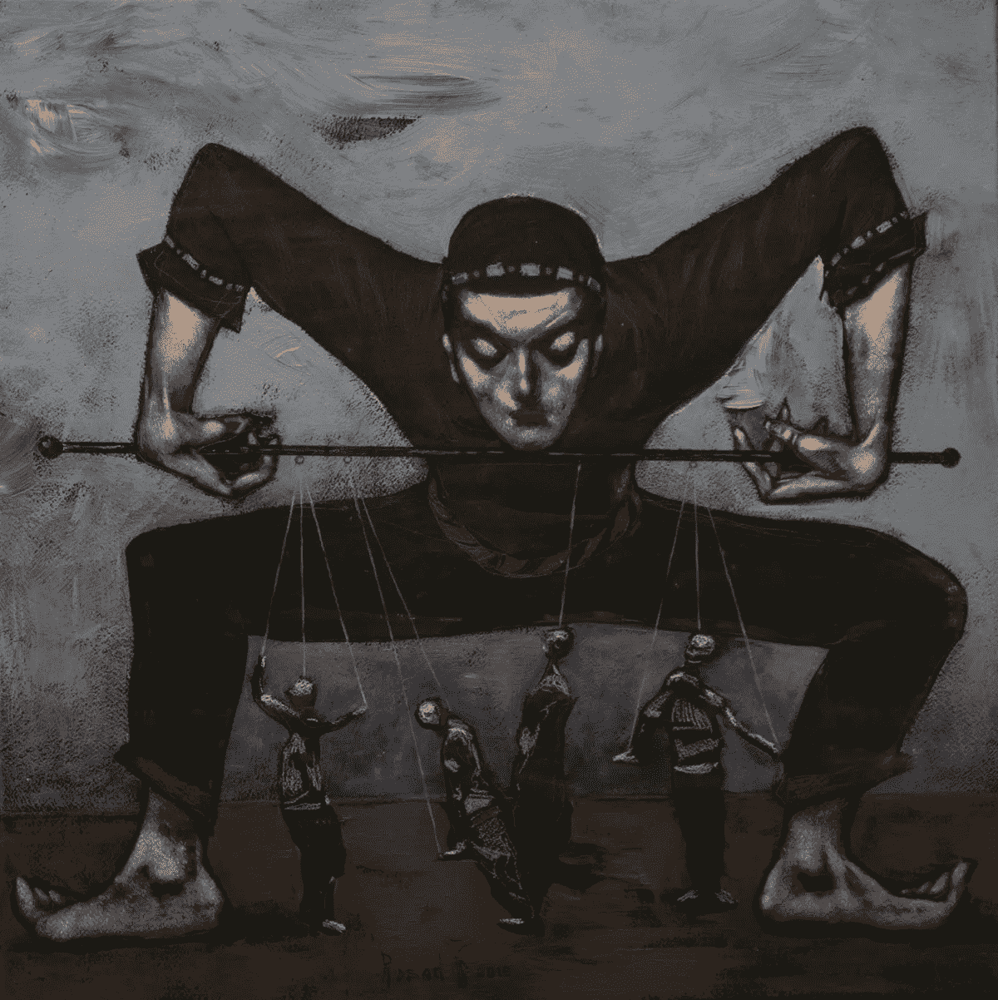

# 自恋者如何进行三角测量

> 原文：<https://medium.com/swlh/how-the-narcissist-triangulates-75e95265b10f>

Mir-Sadıx Huseynov [CC BY-SA 4.0 ([https://creativecommons.org/licenses/by-sa/4.0](https://creativecommons.org/licenses/by-sa/4.0))]

自我调节是自恋者通常依赖的策略。它涉及自恋者让一个支持者或支持者的民兵，也被称为使能者和飞猴，与目标对手对抗，以分而治之。