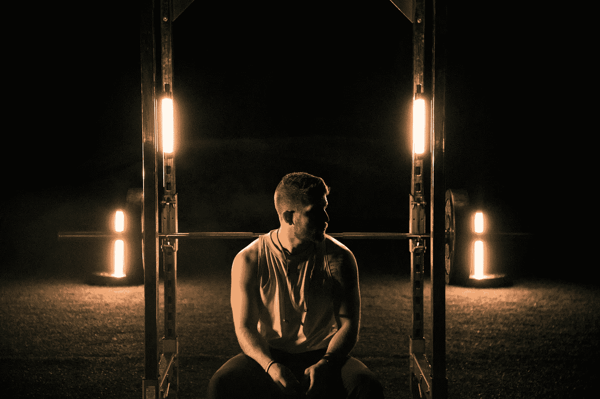

# “期望”的本质如何影响男性心理健康。

> 原文：<https://medium.com/swlh/how-the-nature-of-expectation-can-affect-male-mental-health-f42b0206899b>

Photo by [Brett Jackson](https://unsplash.com/@brettjackson11?utm_source=unsplash&utm_medium=referral&utm_content=creditCopyText) on [Unsplash](https://unsplash.com/search/photos/gym?utm_source=unsplash&utm_medium=referral&utm_content=creditCopyText)

原谅我说了这么明显的话。

当然，广义上的“期望”不仅仅局限于男性。

女性从各种角度面对她们自身固有的压力，但是为了这篇文章的目的，我坚持讨论男性的挑战才是公平的。作为一个男人，等等。