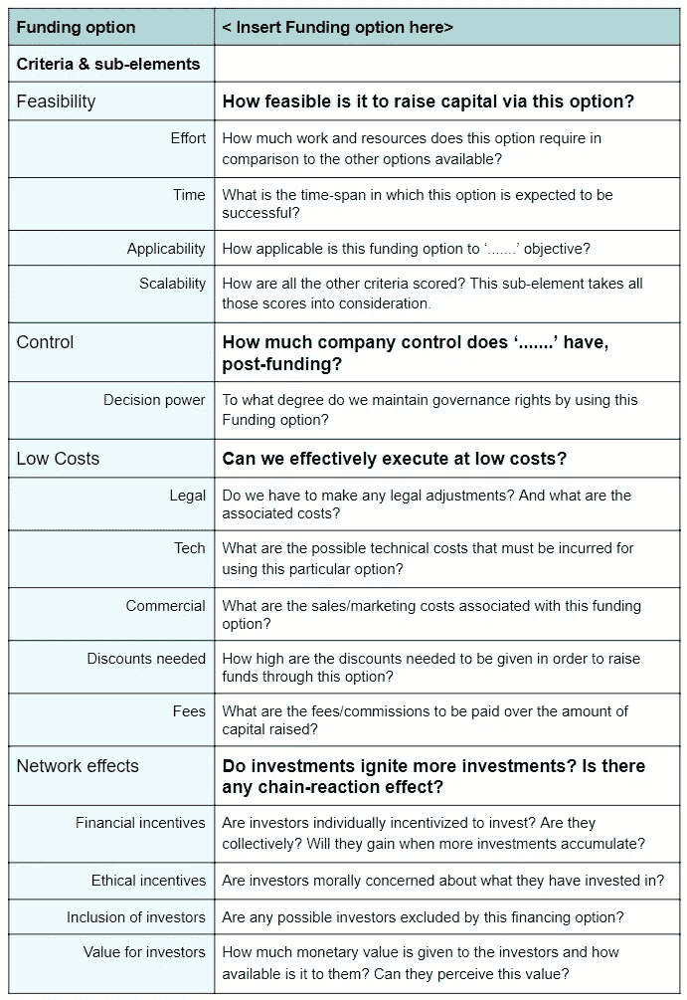
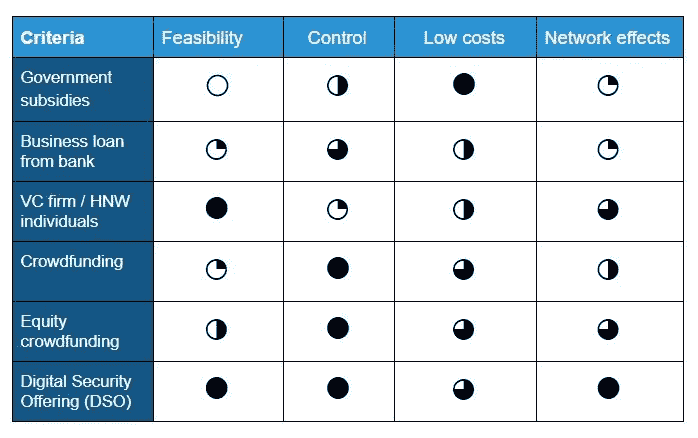

# 下一个百万初创企业将如何融资

> 原文：<https://medium.com/swlh/how-the-next-trillion-start-ups-will-be-funded-44f1f4452eea>

## 论企业成长融资的突破

The famous picture of a wave that breaks on the lighthouse at La Jument. Made by Jean Guichard.

> 假设你是一名企业家。你经营一家刚刚完成最低可行产品(MVP)或扩大现有客户规模的初创企业。在这两种情况下，你都有可能需要金融资本来继续发展和扩大你的业务。

据称，在这两个阶段，你应该有多种资金选择。

*一种选择是将你的灵魂卖给风险投资公司。*

*另一个选择可能是说服成千上万的人在一轮众筹中贡献+/-10 美元来换取一个杯子和两张贴纸。*

如果你问我，我觉得两者都不太好。

## 筹集资金总是一场斗争(即使你值得)

我在欧洲和非洲的创业领域活跃了很长时间，足以看到为业务增长筹集资金是大多数企业家苦苦挣扎的地方。在某些地理区域或商业领域，企业家比其他人更努力，但争取资金仍然是一场难以取胜的战斗。尽管如此，你的商业案例是超级坚实的，基于你的数字和预期的增长，你应该得到资助。

## 评估你的投资选择

在这篇文章中，我将提出一个客观的框架来评估私营公司和小企业通常可以获得的各种融资选择。

> ***TL；博士一路向下滚动查看比较矩阵。***

我曾用这个框架来比较作为融资选择的数字安全产品(DSO)和其他融资选择。

首先，我定义了四个标准来评估每个融资方案的潜力:

*   **可行性**
*   **控制**
*   **成本**
*   **网络效应**

每个标准由一个或多个子元素组成，如下所示:

*   可行性* 努力*时间*适用性*能力
*   **控制*** 决定权力
*   **成本*** 商业*费用*所需折扣*法律*技术
*   **网络效应*** 纳入投资者*投资者价值*道德激励*财务激励

随后，我在荷兰选择了一些可能的融资方案。

> *值得注意的是，这项工作最初是为一家需要增长资本的荷兰企业做的，作为我新企业的一部分:*[*FundMeUp*](https://www.fundmeup.com/)*。*

基于这些是最有利和最容易获得的选项的假设，关于在该地理区域(荷兰)筹集资本，我选择了以下选项:

*   政府基金/补贴
*   银行商业贷款
*   风险投资公司
*   众筹
*   股权众筹
*   数字安全产品(DSO)

每个资金选项根据标准分为五个不同的分数:0、25、50、75、100。

出于解释的目的，我将简要分享每个融资选项的得分和一些关键要点。

## 政府基金/补贴

通过政府基金和/或补贴筹集增长资本的可行性因国家和/或地区而异。一般来说，这种选择需要为相对较低的(在荷兰)产出[付出大量努力，而且非常耗时，因为人们必须等待招标和融资回合结束。不可能对这些过程施加任何影响，因为它们是由协调资金和补贴的机构管理的。](https://www.rvo.nl/subsidies-regelingen/stimulering-duurzame-energieproductie/feiten-en-cijfers/feiten-en-cijfers-sde-algemeen)

例如，许多补贴受制于许多将公司排除在外的法规和限制，因为它们处于后发展阶段。但是，大部分基金总额也是只需要每月报告的礼品。因此，决策权的丧失因基金而异。但是，平均而言，公司必须遵守基金提供商制定的大量规则和限制。

通过这种途径筹集资金成本不是很高，至少在荷兰不是，这很好。但是，这种融资方式并不涉及强烈的网络效应。该选项的评分如下:

> ***可行性— 0
> 控制— 50
> 低成本— 100
> 网络效应— 25***

## 银行商业贷款

出于几个原因，银行通常不会贷款给初创/扩大规模的企业。首先，创业没有大量的资产和抵押品可以转换成现金来偿还商业贷款。此外，处于成长阶段的公司可能没有记录和能力来证明它能够产生足够的收入来偿还贷款。

在大多数情况下，通过商业贷款资助私营企业的银行不需要行使任何决策权。然而，[治理结构与融资成本](https://watermark.silverchair.com/hhn111.pdf?token=AQECAHi208BE49Ooan9kkhW_Ercy7Dm3ZL_9Cf3qfKAc485ysgAAAlkwggJVBgkqhkiG9w0BBwagggJGMIICQgIBADCCAjsGCSqGSIb3DQEHATAeBglghkgBZQMEAS4wEQQM8LVamgFjsGV5ikedAgEQgIICDM7A8IFTU6iTwTwjkAVSkmsSqkKEqVCVOnGf6yhaVtQASScdeGfRHsEPtp113CF0vFS7lo_E3ExzpKVz_x9D7DH3-03aMckYmWy5K0JeMR2Ns2BEtX-AFODEGrU4VlNe-aqgfrAlHvA_M7GXt4h_hvTi_Z6amTIcKT9y_-iW11Lf7zyFvo_-4g6rAHPYDS8q51w96WA0Dp-r9gWAvdT17GxWgaREDyfNExEa8z_o5flZVegDtPNHI2OR_T-Q01RGVqfhvON_c4iM2wM69V0-Qe7fh-DR4axaI5AbWsCet-WzxNV1uXLE8xrP6k0ASjNxaox1gxuAOt5VtkPchXa6d5nOcgvRdHQO9CQVcS-UWfMqKMmC1etPPOTyVIfqOYIA1oi8K_D03k43NVxUUaKEQbV6G6fpxQsp1p7P76RiDw7qS8MwCmAoYoswwikIRDPVGFjj3Y1qeZHnOT7tYiqstptgHzgH00qVCFjMWeKmMtYuUjlSF0KXCsUpriOmWGwQ8xGJW-dFIIuZXtHOWIAHzQdpegsFDx-_6GbpLjP3QBvOedrAXhGJSKqVYi4WNtmlZDRH55H9lmvv5lo6qqsRyozn3X8z8e0WfLsHr8x4aIioWXi2u7yiFscWV3xkN5qznEZg1wriKyRNIACH0jyrnj25RZe3zPxRcy-ybJ5BOLN0qHg95gV8_Yyz5LBn)密切相关。不符合世行“首选模式”的治理结构将支付更高的贷款利率。

银行在财务上参与进来，因为它们不希望任何公司拖欠商业贷款。然而，当一家银行承诺提供贷款时，这些增量收益不会以更多投资的形式复合。一般来说，银行更多地参与金融服务，在道德上参与较少。尽管如此，随着更多有道德的银行进入金融业，这一趋势正在发生变化。驱动这些伦理动机的是个体力量而非集体力量。更简单地说:一家银行说服另一家银行或金融机构(仅仅)基于“更美好世界”的理由投入金融资本，这种情况在今天看来仍然不太可能发生。

> ***可行性— 25
> 控制— 75
> 低成本—50
> 网络效应— 25***

## 风险投资公司

与银行和政府相比，风险投资公司更习惯于在不同阶段向初创企业或扩大规模企业投入大量资金。一般来说，说服风投公司需要低努力和高收益。根据经验丰富的风险投资家的说法，一个(投资的)风险投资可以作为未来更多风险投资的催化剂。

风险资本家倾向于要求和行使大量的决策权，这不利于公司的可持续发展。在很多情况下，风险投资迫使私人公司退出，并要求在董事会中发挥影响力。风投公司这样做并不是因为他们邪恶，而是因为这是他们盈利并让有限合伙人开心的唯一途径。当[风险投资基金被令牌化](/spicevc/why-tokenizing-a-fund-is-a-good-thing-23a2cd524fd)时，这并不适用，但那是另一回事。

因为风投和高净值个人是唯一能够/愿意在相当长的一段时间内锁定其资本的人，他们可以要求私人公司资金的高折扣(高达 70%)。这种补偿也被称为[流动性溢价](https://www.investopedia.com/terms/l/liquiditypremium.asp)。

如前所述，一笔风险投资可以成为未来更多风险投资的催化剂。此外，风险投资者可以为他们投资的公司带来特定的技能和能力，从而通过影响关键业务来增加价值。

> ***可行性— 100
> 控制— 25
> 低成本— 50
> 网络效应— 75***

## 众筹

成功的众筹有点像艺术。许多众筹活动(尤其是在较小的平台上)在指定的时间框架内以失败告终。成功的众筹活动需要付出巨大的努力。此外，通过众筹筹集的资金相对较少——1%的国际众筹活动筹集的资金超过 10 万美元，75%的国际众筹活动筹集的资金不到 1 万美元。

几乎在所有情况下，通过众筹融资的公司都保留了对公司治理、融资前和融资后的完全控制权。

众筹的低成本吸引了很多企业选择这种融资方式:企业向众筹平台支付费用(从筹集的资金中)。然而，对于一些初创企业来说，与成功的众筹活动相关的不可预见的营销成本可能会有点令人震惊。

自然众筹的一个显著缺点是缺乏对投资者的财务激励。在这种类型的众筹活动中进行的所有投资都是礼物(尽管，给予者有时会收到产品)。没有任何个人或集体的财政激励来鼓励人们为一项运动捐款。道德激励是强大的，因为大多数众筹公司都渴望为社会事业做出贡献。

在**债务融资**中的众筹也获得了关注，但是在这篇博文中被排除在外，以便稍后成为社区驱动融资的中心点。

> ***可行性— 25
> 控制— 100
> 低成本— 75
> 网络效应— 50***

## 股权众筹

也有点艺术，类似于标准的众筹。除了这样一个事实，即投资者有更多的财务激励，这使得达到融资目标更加可行。因此，股权众筹融资金额更高:在美国，每轮融资略高于 226，000 美元。[在欧洲，股权众筹仍处于初级阶段，金额相对较低](https://www.fundedbyme.com/en/campaign/8327/hansolo-ab/?type=e)。

在大多数情况下，初创企业仍保持完全控制，类似于标准的众筹。然而，成本更高([由于法律、财务和年度经常性成本](https://www.bevilacquapllc.com/much-cost-raise-money-equity-crowdfunding/))。

股权众筹成功地解决了标准众筹的缺点，即缺乏资金激励。而且股权众筹具有包容性。在大多数司法管辖区，私人公司投资仅限于选定的少数几个(主要是由于高结算成本)。股权众筹成功地向机构投资者和散户投资者开放了私募股权投资机会。

> ***可行性— 50
> 控制— 100
> 低成本— 50
> 网络效应—75***

## 数字安全产品(DSO)

数字安全(或安全令牌)行业是一个新兴的行业，它将提供上述选项的所有有价值的组件。数字证券本质上是真实世界的资产，如带有数字包装的黄金、艺术品、房地产或股票。

2018 年，DSO 的亲戚——首次公开募股(IPO)和首次发行硬币(ICO)——平均每股筹资[、1.2 亿美元](https://www.statista.com/statistics/251149/median-deal-size-of-ipos-in-the-united-states/)和[2550 万美元](https://cointelegraph.com/news/pwc-report-finds-that-2018-ico-volume-is-already-double-that-of-previous-year)。第一批直销组织显示出或多或少的趋势，募集金额在[1 亿美元](https://tech.eu/brief/spice-vc-ico-fund/)和[1300 万美元](https://icorating.com/ico/modum-mod/)之间。

直销组织拥有结合风险投资和(股权)众筹优势的独特能力:**允许发行人保持对其组织的控制，同时实现融资规模。**

一家公司可以为机构投资者、高净值和低净值投资者提供投资机会。此外，公司可以改变风险投资的游戏规则——通过去除之前提到的[流动性溢价](https://www.investopedia.com/terms/l/liquiditypremium.asp)。

投资者的准入门槛将大幅降低，从而实现充满希望的社区驱动型增长，并提供真正的金融和道德激励。

> ***可行性— 100
> 控制— 100
> 低成本—75
> 网络效应— 100***

公司可以建立正确的法律结构，并通过获取令牌技术架构中的所有法律特征来“令牌化”其股份。一旦一切都符合法律和技术要求，公司就可以通过数字安全产品(DSO)向公众提供代币。

通过这样做，公司可以为投资者释放大量价值:流动资产(24/7 可在证券交易所交易)、[个人资产主权](https://gabrielshapiro.wordpress.com/2018/10/28/2/)、减少结算时间和成本、细分资产和互操作性——这意味着所有者可以在各种二级市场交易他们的资产。DSO 为私人公司融资带来的增量收益将是巨大的。

## 最后

总结一下，使用 [harvey balls](https://en.wikipedia.org/wiki/Harvey_Balls) 对所有资金选项及其总体得分进行了很好的监督:

⭘ = 0%

◔ = 25%

◑ = 50%

◕ = 75%

⬤ = 100%

在对不同融资选项的评估中，我试图客观地考虑启动和扩大规模的各种融资选项，尽管我以前写过关于数字证券(安全令牌)的潜力的文章。

我希望该框架将有助于其他投资者评估各种融资方案，以发展和发掘他们的全部潜力。

请随时在 Linkedin 上与我联系——保持联系！

## 这篇文章发表在[《创业](https://medium.com/swlh)》上，这是 Medium 最大的创业刊物，有+414，678 人关注。

## 订阅接收[我们的头条新闻](http://growthsupply.com/the-startup-newsletter/)。

