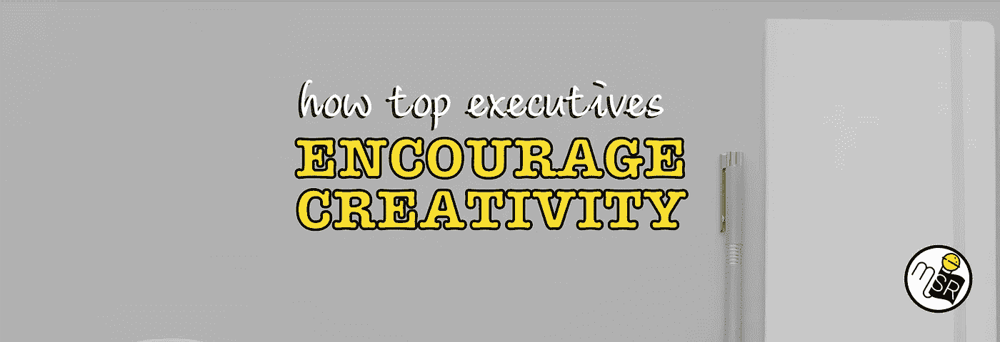

# 世界最佳高管如何鼓励团队更好的创造力

> 原文：<https://medium.com/swlh/how-the-worlds-best-executives-encourage-better-creativity-from-their-teams-fe2ff1c542dd>

***由杰伦阿昆佐。*** *杰伦是* [*营销达人*](http://marketingshowrunners.com) *的创始人，为专注于打造激情受众的营销高管提供洞察和分析。他是谷歌的前数字媒体策略师，HubSpot 的内容负责人，以及风投 NextView 的内容和社区副总裁。杰伦是《打破车轮》一书的作者，并作为一名演员在全球巡回演出*