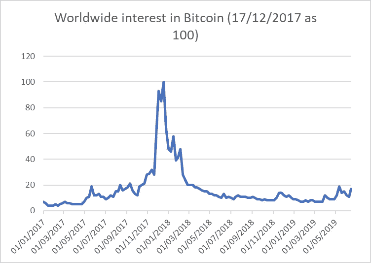
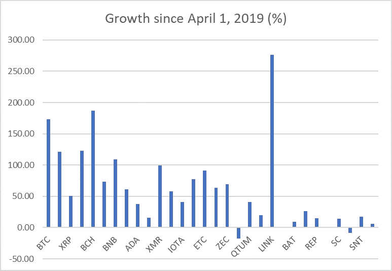
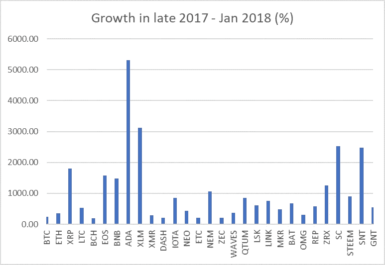

# 这种秘密价格繁荣与 2017 年底有何不同

> 原文：<https://medium.com/swlh/how-this-crypto-price-boom-is-different-from-late-2017-7f353d68189b>

在这一点上，我们或许可以有把握地说，我们正处于大约从 4 月 1 日开始的另一轮加密价格热潮之中。自那以后，BTC 的价格几乎翻了三倍，ETH 的价格翻了一倍多，许多其他加密资产也纷纷效仿。本文不会做出任何预测，但考虑一下当前繁荣与最近一次持续繁荣(即 2017 年末至 2018 年 1 月)之间的差异可能会很有趣。

**公众兴趣降低**

第一个有趣的区别是，与 2017 年相比，当前的繁荣没有伴随着任何类似于全球兴趣的激增。如果我们看看谷歌趋势的数据，我们会发现，如果以 2017 年 11 月 13 日为起点，人们的兴趣甚至没有达到 2017 年繁荣之前的水平。对于当前的繁荣，我认为 4 月 1 日是它的开端。[1]

Chart 1\. Source: Google Trends

很难对这一事实给出直截了当的解释。这在很大程度上取决于 2017 年公众兴趣的激增是否至少部分推动了当时的繁荣，或者这只是它的副产品。如果这是 2017 年的主要驱动因素，这可能表明当前的繁荣在其根本机制上有很大不同。然而，也可能是这样的情况，即潜在的机制是相同的，但当前的繁荣不像 2017 年那样引人注目，这正是因为没有出现世界性的关注高峰。

无论如何，秘密价格研究者尤其应该注意这一点。

**这次没有失控的价格爆炸**

如果我们比较 30 种主要加密资产(20 种区块链本地货币和 10 种特定应用货币)现在和 2017 年的价格增长直方图，首先突出的是这次没有超过 300%的爆炸式增长。在之前的持续繁荣时期，类似 Tron (15，889%，图表上未显示)、Cardano (5309%)、Stellar (3120%)、Sia (2531%)、Status (2477%)、Ripple (1805%)等项目。甚至与其他加密资产相比，它们的代币价格也在飙升。

Chart 2\. Source: Coinmarketcap

Chart 3\. Source: Coinmarketcap

这里需要说明的是，2017 年经历爆炸式增长的项目，这次要出名得多。然而，这一次似乎也没有新的代币以类似的速度飙升。这可能是加密市场某种程度成熟的标志，或者是多个主要加密资产在 2017 年末经历爆炸式增长所需的公众兴趣激增的标志。

**可疑项目增长率降低**

在主要的加密资产中，由于各种原因，许多都与相当可疑的项目有关。上面提到的 30 个项目包括 Ripple(集中式，没有令人信服的令牌用例)，lite coin(BTC 的克隆版，没有明显的用例)，EOS(可能甚至不是区块链)，Tron(一个集中式，一个人崇拜的项目，抄袭代码)，Stellar(与 Ripple 相同)和 IOTA(近乎骗局)。

有些令人鼓舞的是，除了莱特币，所有这些项目的代币增长速度都比 BTC 和瑞士联邦理工学院慢。这可能意味着加密市场越来越成熟，尽管在这个阶段，还为时过早。主要资产的价格增长率没有超过 1000%也可能指向相同的结论。

另一方面，就加密市场的质量而言，显然还有一段路要走。除了高度可疑项目的价格持续增长(如果相对较慢)，另一个证据是区块链相对高质量项目的存在，这些项目的令牌自 4 月 1 日以来几乎没有增长。其中有泰佐斯和齐力卡。

**特定应用资产的停滞**

再看上面的图 2 和图 3，除了 BNB 和林克之外，到目前为止，主要区块链项目的本机令牌表现远远超过了特定于应用程序的令牌。如果我们忽略 TRX 的巨大异常值，2017 年的情况就不是这样了，当时(和现在一样)市场营销非常积极。

这里最有趣的问题是，市场参与者对假人、奥格、奥米塞围棋等项目的这种相对悲观的态度。反映了他们面临的真正困难，如果是这样的话，这种对 DApps squares 的悲观情绪是如何随着以太坊价格的大幅上涨而产生的，以太坊预计将在未来为其规模版本提供动力。

一种解释是，与任何一个特定的 DApp 项目，甚至是当前大多数 DApp 项目相比，ETH 本身的未来充满了更少的不确定性。为了取得成功，以太坊不一定要迎合各种各样的用例，它只需要为一群真正受欢迎的 DApps 提供动力就足够了，它们甚至可能还不存在。

另一方面，也可以认为 DApps 比以太坊面临更少的不确定性，因为如果它在其他方面比以太坊更具可扩展性和(或)优势，他们总是可以切换到不同的智能合约区块链平台。最终，ETH 和 DApp 令牌价格之间的显著差异也表明需要进一步提高加密市场参与者的质量。

**链环有什么特别的吗？**

最后，当前价格暴涨令人惊讶的是前 100 名中增长最快的企业，即 Chainlink。它是唯一一个不是区块链本地令牌、加密交换令牌或前 30 名中的稳定币的加密资产。至于这个估值在多大程度上是合理的问题，相对于其他很多估值来说，它显得相对合理。首先，Chainlink 有望成为最受欢迎的甲骨文智能合约提供商，它是区块链不可知的，已经宣布它不仅可以与以太坊互操作，还可以与 Hedera Hashgraph 和 IOST 互操作。

然而，这里需要提醒的是，Chainlink 最近还与 Google 合作了一个项目，让智能合约可以使用 BigQuery 数据。因此，LINK 的价格大幅上涨可能只是加密市场对区块链项目和大公司之间互动的模糊消息反应过度的又一个例子。

[1]自然，在每种情况下，计算出一个繁荣开始的精确日期可能都很困难。然而，对于研究繁荣时期的趋势而非其直接因果联系来说，这似乎并不重要，至少在手头的案例中是如此。