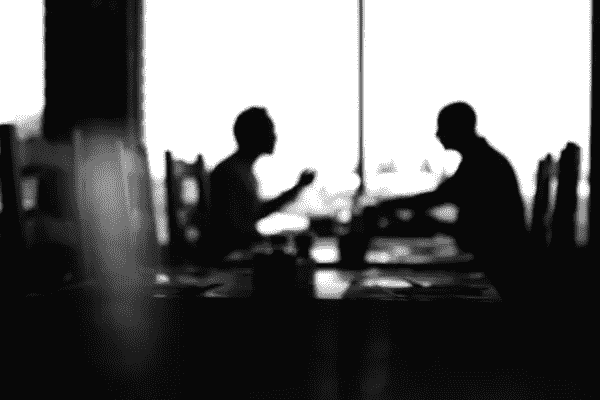

# 这位编辑如何衡量自由职业者的询问

> 原文：<https://medium.com/swlh/how-this-editor-weighs-up-freelance-enquiries-201bb9ac184a>

当一个自由作家接近我们时会发生什么？

首先，准备工作:我通常会直接收到一封电子邮件(因为我们在网站上公布了我的地址，并表示我们愿意接受询问)，其中通常包含一份简短的说明和简历。在里面，我通常会看到职业历史、工作样本的链接和社交媒体账户。