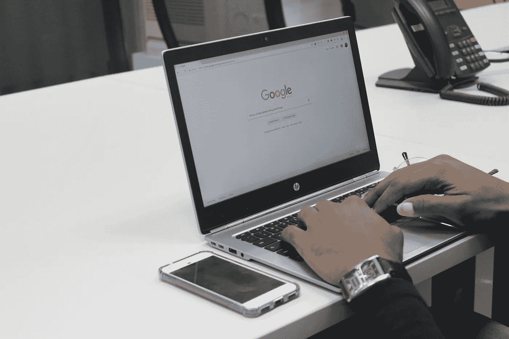

# 这家初创公司如何利用搜索引擎优化与大公司竞争

> 原文：<https://medium.com/swlh/how-this-startup-is-set-to-compete-with-big-boys-using-seo-42f68307c5b>

## 这个策略可以让你的竞争对手俯首称臣

## 我的 SEO 策略击败了 HomeAdvisor，Angie's List 和 Houzz

Photo by [Benjamin Dada](https://unsplash.com/@dadaben_?utm_source=unsplash&utm_medium=referral&utm_content=creditCopyText) on [Unsplash](https://unsplash.com/search/photos/google?utm_source=unsplash&utm_medium=referral&utm_content=creditCopyText)

自己创业并不是世界上最容易的事情。这需要大量的金钱和耐心以及许多其他的“东西”！