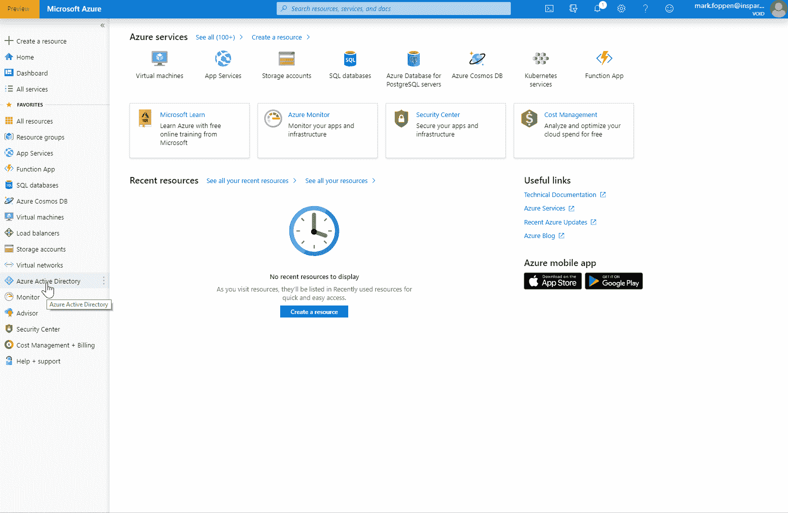
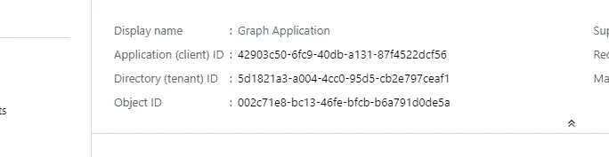
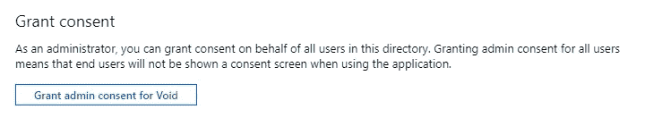
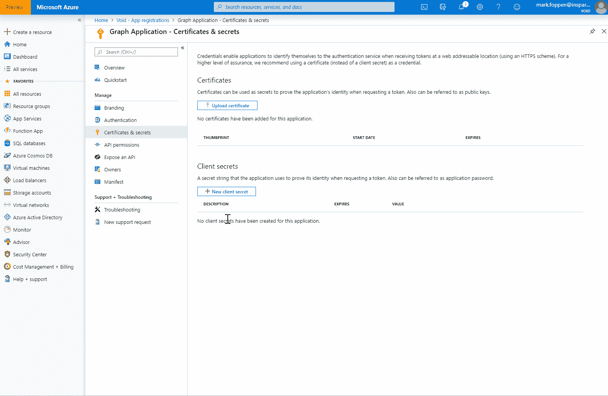

# 如何从 Graph API 的 Beta 通道访问数据

> 原文：<https://medium.com/swlh/how-to-access-data-from-the-beta-channel-of-graph-api-d22d95d3f23a>


Microsoft Graph API 的所有新功能首先在测试版中提供。通过使用测试版，您可以提前获得新功能。微软经常添加新功能，这可以在他们的 GitHub changelog [这里](https://github.com/microsoftgraph/microsoft-graph-docs/blob/master/concepts/changelog.md)看到。

在这篇文章中，我们将做三件事:

*   创建 Azure Active Directory 应用程序注册
*   通过注册的应用程序获取访问令牌
*   在测试版上调用图形 API

这都是通过使用 Azure 门户和实现代码来调用 C#中的 Graph API 来完成的。

# 向您的 Azure Active Directory 添加应用程序

为了访问 Graph API，我们需要在 Azure Active Directory (AAD)中注册一个应用程序。此应用程序可用于添加权限。然后，该 AAD 的管理员可以同意您选择的权限。让我们一步一步来。

打开 Azure 门户，转到要添加应用程序的 AAD。现在，您可以像这样添加新的应用程序



创建应用程序注册后，您可以看到我们在稍后阶段需要的两个重要 id。这是**应用程序(客户端)Id** 和**目录(租户)Id** 。



下一步是向应用程序注册添加权限。这些权限赋予应用程序访问资源的能力。在我们的例子中，这是 Graph API。让我们添加**目录。Read.All** 允许我们读取这个 AAD 中的所有内容，但不能修改它。


正如您可能已经看到的，有两种类型的权限:

*   **委托权限** —这些权限在有登录用户时使用。通常用于具有 AD 认证的门户或 Azure 功能。
*   **应用权限** —应该只在后台服务上使用。这些权限只能由管理员授予。

现在应用注册有了我们想要的权限，还是没有授予。要授予对此广告的权限，我们需要一个管理员帐户给予同意。这可以在我们刚刚添加新权限的“API 权限”页面上完成。



同意许可后，只剩下一件事要做，那就是给应用程序添加一个秘密。这基本上和给你使用应用程序的密码是一样的。只有在这种情况下，你可以有多个秘密，每个不同的到期时间。你也可以删除这些秘密。要添加密码，我们需要进入“证书和密码页”。



请记住，你只能看到这个秘密一次。现在我们已经完成了这项工作，我们需要在下一步中使用以下数据:

租户 id:' 5d 1821 a3-a004–4c 0–95 D5-cb2e 797 ceaf 1 '
应用 Id 或客户端 Id:' 42903 c50–6fc 9–40d b-a131–87f 4522 DCF 56 '
应用机密或客户端机密:' fe_？' xg+VhSxe_iq4RSw9TE4AUlddktg8 '

我们只为单个租户创建了一个应用程序注册，大部分是默认设置。如果你想了解更多关于多租户应用的详细信息，你可以点击这里进入微软文档[。](https://docs.microsoft.com/nl-nl/azure/active-directory/develop/quickstart-register-app)

# 获取访问令牌

为了访问 Graph API，我们首先需要获得一个访问令牌。这个令牌可以在以后用作承载授权报头。为此我使用了微软的 NuGet 包**。identity . Client**4.0 版本。

```
private async Task<string> GetAccessToken( string tenantId, string clientId, string clientSecret) { var builder = ConfidentialClientApplicationBuilder .Create(clientId) .WithClientSecret(clientSecret) .WithTenantId(tenantId) .WithRedirectUri("http://localhost/") .Build(); var acquiredTokenResult = builder.AcquireTokenForClient( // Here we set the scope to https://graph.microsoft.com/.default new List<string> { "https://graph.microsoft.com/.default" }); var tokenResult = await acquiredTokenResult.ExecuteAsync(); return tokenResult.AccessToken; }
```

# 调用图形 API

通常你只需要使用微软的图形 API 客户端 SDK。图但是即使是预览版也没有所有可用的调用。因此，我不使用这个 NuGet。相反，通过使用一个简单的 HttpClient，我们可以达到同样的效果。

下面的代码将执行以下操作:

*   检索访问令牌
*   将版本设置为 beta
*   设置端点和我们想要执行的操作
*   创建 HTTP 客户端
*   设置包括授权承载报头的报头
*   发送实际上是 HTTP get 的请求
*   将结果作为字符串读取，因为响应将采用 JSON 格式

```
private async Task CallGraphApiBetaChannel() { // Retrieve the access token var accessToken = await GetAccessToken( "5d1821a3-a004-4cc0-95d5-cb2e797ceaf1", "42903c50-6fc9-40db-a131-87f4522dcf56", "fe_?xg+VhSxe_iq4RSw9TE4AUlddktg8"); // Set the version to beta var graphApiVersion = "beta"; // 'beta' or 'v1.0' // Set the endpoint and the action we want to execute var endpoint = $"https://graph.microsoft.com/{graphApiVersion}"; var action = "/applications"; // Create the http client using (var client = new HttpClient()) using (var request = new HttpRequestMessage(HttpMethod.Get, endpoint + action)) { // Set the headers including the authorization bearer header request.Headers.Accept.Add(new MediaTypeWithQualityHeaderValue("application/json")); request.Headers.Authorization = new AuthenticationHeaderValue("Bearer", accessToken); // Sending the request which actually is a http get using (var response = await client.SendAsync(request)) { if (response.IsSuccessStatusCode) { // Read the result as string, since the response will be json var result = await response.Content.ReadAsStringAsync(); // Do something with the result } } } }
```

得到结果后，您可以按照自己的方式解析响应。请记住，如果您从 JSON 生成了一个类模型，它可能会在任何时候被破坏，因为他们会定期更新测试版。

如果一切顺利，你应该能够在 Azure Active Directory 中检索到所有可用的应用程序。在我看来，这非常容易使用，你可以将 action 变量更改为你在 beta 参考文档[中找到的任何方法。同样，通过使用这个，您可以控制如何解析响应。](https://docs.microsoft.com/en-us/graph/api/overview?view=graph-rest-beta)

源代码可以在我的 GitHub [这里](https://github.com/foppenm/Microsoft-Graph-API-Beta)找到

感谢阅读！

*原载于 2019 年 7 月 8 日 https://www.re-mark-able.net*[](https://www.re-mark-able.net/how-to-access-data-from-the-beta-channel-of-graph-api/)**。**