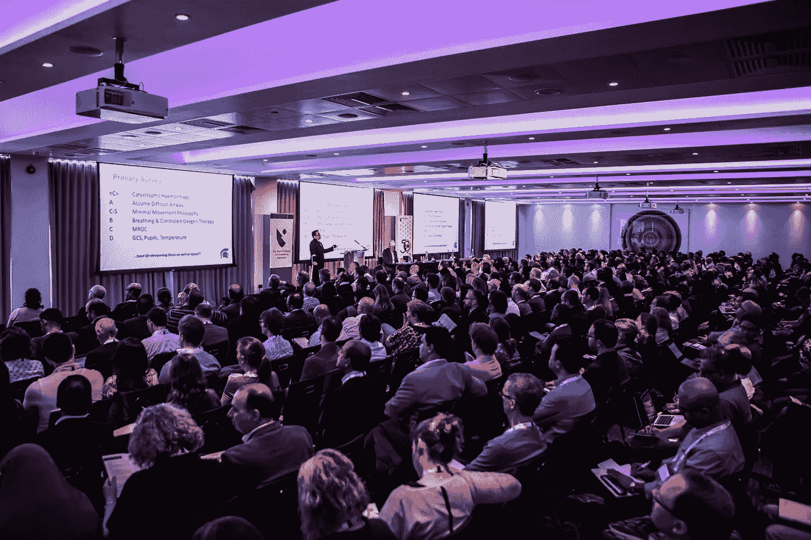

# 如何赢得公开演讲？

> 原文：<https://medium.com/swlh/how-to-ace-your-public-tech-talks-1058e57434b6>

麦克检查…准备。设置。说话

公众演讲一开始会让许多人不知所措。站在观众面前很伤脑筋。一次又一次，你面对人们；建立关系网、推销你的创业公司、传达观点或轶事、解释案例研究、解决工作中的问题。*说话是必然的*。那么，为什么会害怕公开演讲呢？只需一些提示和技巧来提升你的游戏，面对你所有的挑战，将环境带入你的步伐并向前迈进！

当你在一群人面前讲话时，你吸引了所有人的注意力；所有的眼睛都在看着你，你在聚光灯下。说到技术，你的听众会对你演讲的领域有各种各样的了解。

从我 3 年多的科技演讲经验来看，我相信某些不同的要点可以让你在舞台上的表现看起来很自然，你会感觉很放松(就像你在舞台上经历了一次旅行一样:P)所以让我们来看看如何直接赢得你的公共科技演讲。

# 1.研究你的受众

上台之前，你不能不研究你的观众。研究观众是你准备工作中最关键的部分。潜意识里知道一切不会伤害任何人！

你越了解你的观众，你的表演就会越好。根据你的观众希望理解的东西来策划你的内容。如果你的听众喜欢你的演讲或者他们在 Instagram 上，这真的很重要。

> 你不能教一个幼儿园的孩子达尔文的进化论

一切都是为了与人沟通！所以，我基本上认为我的听众是*初级-中级-专家*

b**b*eginner*级别的观众只需要最基本的。例如，在一个关于 UX 设计的演讲中，你需要为他们设置正确的基础。UX 基础，设计流程，UX 的过去，现在和未来。向他们解释这个话题的所有原因、地点、内容和方式。初级人群在你演讲的特定领域有 0-2 年的经验。**

一个 ***中级*** 级别的出勤就知道基础知识了。简单回顾一下基础知识，从它们的用途开始。如何利用备选方案、最佳实践、技巧和诀窍、经验图谱来发展——这些东西会让中间用户感到兴奋。他们将有 2-5 年的实地工作经验。

一个 ***专家*** 人群是优质内容的标尺。他们什么都知道！你可以把它打磨成施华洛世奇或蒂芙尼。x 的多少才算多，x 比 y 好吗，为商业做设计，为 B2B 和 B2C 做技术。跨学科的话题也很受欢迎。专家一定会有五年的经验。例外总是要假设的。

而如果观众是混杂的呢？到处都是？我喜欢把这样的人群看作是中间人群。你包括基础知识，在整个过程中自然地流动，并解释 1/2 的主题，这些主题是专家相关的，中间用户想要探索的，初学者想要开始的。我们站在舞台上是为了我们和他们好。

# 2.自己做好准备

> 你生命中的每一天都是新的篇章。你今天在写什么？

关键是你的演讲要有一个迷人自信的开头。你的听众会根据开场白本身来评判你。在最初的几分钟里，要么成功，要么放弃，因为那样你就没有第二次机会来建立你的第一印象了！

创建您的演示文稿/笔记以及幻灯片上没有的所有内容。

非常专注地准备你的开场白和结束语，试着学会在你的演讲中吸引听众，回忆回忆录、轶事、故事告诉你的听众。

我们的目标是相关性。记得吗？不要使用行话。

准备好你的思想去做博客上所有的事情。

# 3.利用你的空间

> 时间不是一条线，而是空间的一个维度。

1.  ***个人空间:*** 你用两种语言说话:身体和英语。而是你在舞台上的表现。你的肢体语言会说明一切。正确的身体交流对你的信息如何被接收和解释有着深远的影响。不要一直躲在桌子后面。在舞台上走来走去，如果需要的话，走下舞台，走到观众中间。用你的肢体语言和你的观众交流。伙计们，挺直腰板，抬起下巴，你们是来创造影响力的。
2.  ***舞台空间:*** 走上舞台，你可能有/没有讲台，但你肯定有的是空间。整个舞台就像你的画布——你想怎么画就怎么画。拥有舞台上可用的空间。

为你的下一次演讲提供一些好的肢体语言和空间使用技巧:

*   眼神交流，但不要太久！你不想显得令人毛骨悚然
*   不要保持坚决。自由移动，但不要太快——你不是一个钟摆。
*   避免双臂交叉，双手紧握在身体后面或前面。那说明你紧张。
*   不要乱动任何东西。让你的手空出来做有表情的手势。(我在台下的时候还在做这个——不是玩指甲:'/)
*   脸上保持微微的微笑，根据演示的内容或流程改变面部表情。

# 4.遵循 5 P 原则

1.  ***投射*** :确保你在房间后面的声音听得清楚，但不要把前面的人弄聋
2.  ***配速*** :保持稳定的配速。你的神经可能会敦促你说得更快，以消除痛苦，但这将使你难以理解，并将削弱你的信息。尝试改变节奏，让事情变得有趣。我个人讨厌那些对人们所说的话“感知”极其迟钝的人。你的观众不是一只等着做鸡肉汉堡的鸡。不要因为太慢而责备自己。字数应该是每分钟 125-150 字
3.  ***音高*** :变换你的音高，单调的声音很无聊，很难听但不要过了头。此外，尽量不要在所有句子的结尾使用向上的音调，这会让你听起来好像对你要说的事情没有把握
4.  ***发音*** :不要嗫嚅。确保所有的音节都清晰。努力练习说单词和短语。尽量不要听起来平庸
5.  ***暂停*** :使用暂停的力量。暂停有助于听众吸收他们刚刚听到的信息，也给你时间为下一部分做准备。这也让你有时间更好地整理思绪。专业提示:沉默比填充词“嗯”、“啊”和“你知道”要好

# 5.包含连接的内容！

在个人层面上与你的观众沟通是最重要的。你不能在舞台上朗诵诗歌。根据观众个性化内容是一种天堂般的感觉——观众的反应和他们脸上的微笑说明了一切！

包括模因、故事、轶事、案例研究、参考文献、图片和图像、GIF(顺便问一下，你是#TeamGIF 还是#TeamJIF？)

Slides from my talk on Design Thinking and UI/UX Design for a beginner audience

# 6.联系你的观众

告诉听众他们会从你的演讲中获得什么。

告诉他们有多好。

如果你的演讲超过 3 小时，包括 1 分钟的游戏或活动。

享受在舞台上的乐趣或者至少让它看起来像。

问一问镜头之间的对话使用的首选语言。

如果你的听众中有你熟悉的人，回忆一下你与那个人的一次相遇，并举杯祝酒——讲一件趣闻，让你看起来像一个平易近人、友好的演讲者。

同样，在你的演讲结束后，你会被“粉丝”包围，这是关键词。永远不要让任何接近你的人失望。我知道至少在演讲者面前表现出来需要多大的勇气。如果你赶时间，把你的卡借给他们，或者拿走他们的卡，以后再联系。网络从这里开始。

# 7.拥抱挑战，每次都要学习

公开演讲是技术爱好者生活的一部分。我说你应该抓住每一个可能的机会来宣传你的工作、学习、探索和经历。如果没有人了解这些技术，那么了解 10 项技术又有什么意义呢？

让自己在公开演讲中获得学习经验的最好方法是拥抱它；意识到它将如何帮助你和你的听众，享受它引发的对话。

每次你演讲的时候，花些时间思考一下什么有效，什么失败，什么失败了。

如果一切进展顺利，仔细想想是什么让它进展顺利。

如果很可怕，保持冷静；分析哪里出了问题，是如何出的问题，这样下次你就可以改变你的策略，确保同样的事情不会再次发生。

学习是你想乘坐去看巴黎圣母院的跳上跳下的公共汽车！(我指的是努力 xD 的美好)

## 专业提示

在你的谈话中，一定要感谢团队和组织者。别忘了带上一个*追星族！！*

就这样，我在公开技术演讲中获得了 a。现在轮到你了。下次你填写 CFP 表格或被邀请发表演讲时，我希望这 7 点能帮助你在公共技术演讲中胜出。感谢阅读:)

说得开心！干杯！

## 这篇文章发表在[《创业](https://medium.com/swlh)》上，这是 Medium 最大的创业刊物，有+441，678 人关注。

## 在这里订阅接收[我们的头条新闻](https://growthsupply.com/the-startup-newsletter/)。

