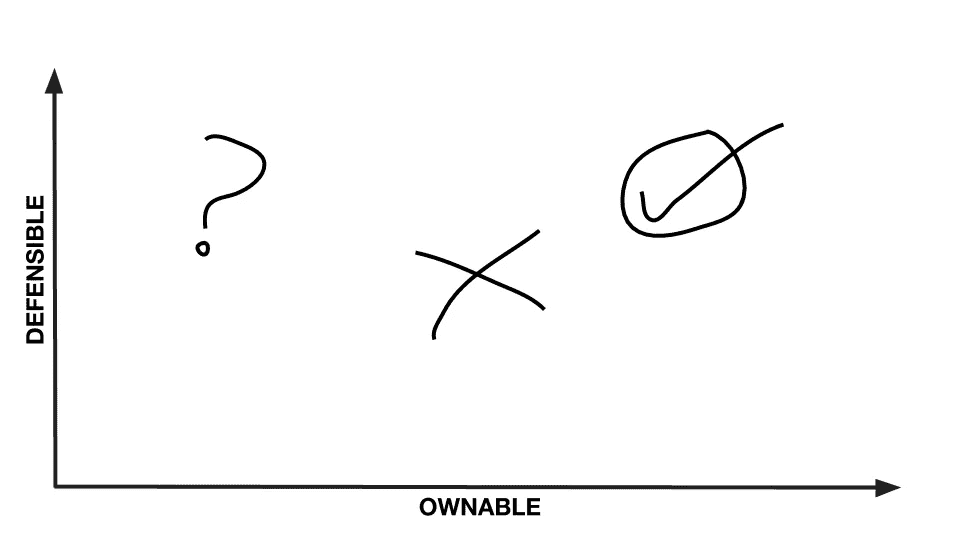

# 如何实现直通状态

> 原文：<https://medium.com/swlh/how-to-achieve-cut-through-status-dd17ce17ebc3>

Photo by [rawpixel](https://unsplash.com/photos/4BN81q7DXvs?utm_source=unsplash&utm_medium=referral&utm_content=creditCopyText) on [Unsplash](https://unsplash.com/search/photos/cut?utm_source=unsplash&utm_medium=referral&utm_content=creditCopyText)

品牌营销中有一个概念叫做“直通”。

正如你所想象的，这指的是让你的品牌在信息海洋中脱颖而出并引起注意。

有切入的品牌有与众不同的品质。它与众不同。它有值得注意的事情要说。值得关注。

不用说，对于一个品牌来说，穿越是一个非常值得拥有的(老实说，是必要的)品质。现在比以往任何时候都更加如此，因为大量的竞争要求占用了我们的时间和注意力。

直通原则也可以应用于新产品概念；新的创新；新的创业想法。

## **问自己一些基本问题**

*我该如何让我的新产品与众不同？*

我该如何帮助我的新想法脱颖而出？

我如何确保人们关注我的新公司？

当你开始的时候，为你的新产品或想法实现突破应该是你的首要任务。这是增加你成功机会的关键支柱。

这样做将确保你的努力做出有意义的贡献，而不仅仅是增加混乱。人们将能够选择一个明显比他们现有的更好的选项。消费者的问题将不再是无法解决的。你将在现有的基础上有实质性的提高，消费者很可能会因为选择你的产品而感谢你。

相反，没有直通会让你成为人群中的另一张脸，另一个要过滤的噪音源，另一个要跳过的复选框。没有太多人会选择那条路。

选择使用直通方式；脱颖而出，引人注目，与众不同。

## **你如何实现这种难以捉摸的突破？**

消费者的意见可能是变化无常的，没有灵丹妙药可以保证你会实现直通。然而，你可以采取一些重要的步骤来大大提高你实现你所寻找的捷径的机会。

你的目标是开发你的产品或想法，使其与众不同，并在市场中脱颖而出。它应该比其他可用的东西好得多(最好是独一无二的)。它应该让消费者感到惊讶、印象深刻或高兴，从而引起他们的注意。有了它，人们的生活会变得更好。

针对以下五个问题，尽可能多地列出答案:

1.  人们应该知道我的产品/想法有哪些优点？
2.  我欣赏哪些竞争对手，为什么？
3.  我的产品/创意将参与竞争的类别或市场的当前惯例(功能、优势、设计等)是什么？大多数竞争对手已经在做什么？消费者‘期望’什么？
4.  与现有产品相比，我的产品/想法有何不同？
5.  我的产品/想法比当前可用的产品/想法更好？

你会注意到，第一个问题集中在你的产品或想法擅长什么；第二个是关于你的竞争对手的优点；而问题 3-5 旨在将您的产品或想法置于竞争环境中，并发现脱颖而出的机会。

## **弄清楚什么是可拥有的，什么是可防御的**

下一步是用你对这五个问题的回答来确定什么是你的产品/想法独有的和可辩护的。

**可拥有的:**你认为你的产品/想法的特点或方面是你的特别优势(你独特的资质)

**可辩护:**你认为你的产品/想法的特点或方面使你有别于竞争对手(你的产品/想法的优点；竞争对手的弱点)

Ownable x Defensible (feel free to use)

你可以在 X-Y 轴上画出你的反应，水平方向是可控制的，垂直方向是可防御的。和任何好的策略一样，你的最佳点将会在右上象限。

这将让你很好地了解你的产品或想法中最值得拥有(独一无二)和可防御(应对竞争挑战)的是什么。

这不是一个保证成功的公式，但它是一个彻底的方法来批判性地思考你的产品或想法及其竞争格局。这样做将有助于您识别要制造噪音和放大的特征；会帮助你发现从人群中脱颖而出的机会；想办法让你的消费者关注你在做什么。

如果你能够以一种客观的、可掌控的、可辩护的方式开发你的产品或想法，你将有更大的机会实现可能带来更大成功的捷径。

## 这篇文章发表在 [The Startup](https://medium.com/swlh) 上，这是 Medium 最大的创业刊物，拥有+417，678 名读者。

## 订阅接收[我们的头条新闻](http://growthsupply.com/the-startup-newsletter/)。

