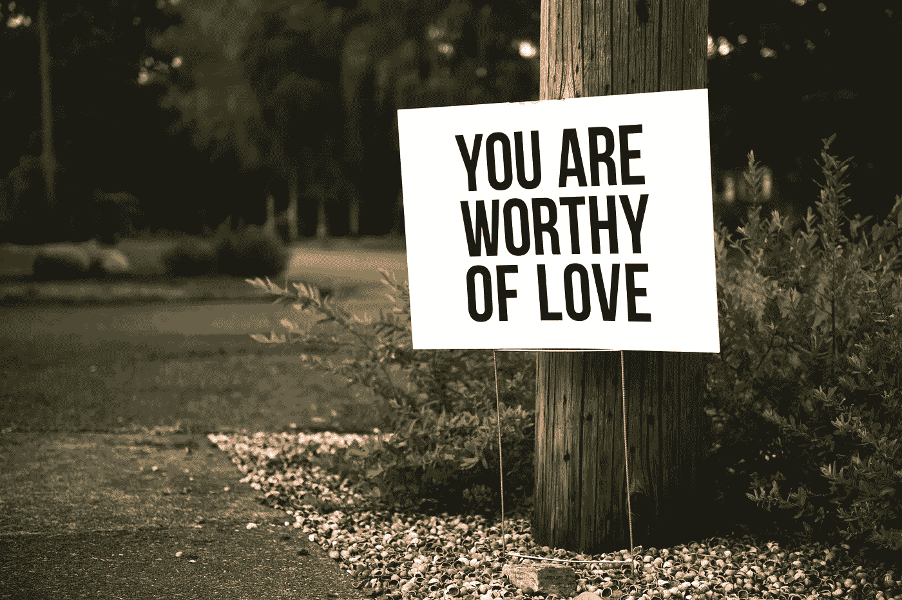

# 如何真正发展自爱

> 原文：<https://medium.com/swlh/how-to-actually-develop-self-love-d6513778b3d5>

“自爱”现在是一个非常流行的术语，这是有充分理由的。

当我们真正无条件地爱和接受自己时，我们会更快乐、更健康，并能为周围的世界做出更多贡献——因为我们不会浪费时间从外部寻求认可，也不会将自己的恐惧投射到他人身上。