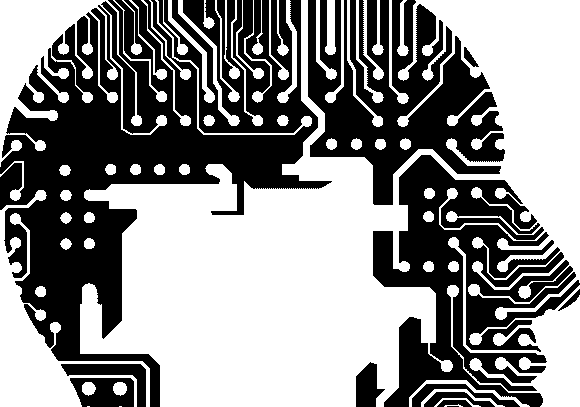

# 如何让您公司的安全实践与人脑保持一致

> 原文：<https://medium.com/swlh/how-to-align-your-companys-security-practices-with-the-human-brain-c87a20074f0d>

当你想到网络安全时，你会想到什么？加密？防火墙？杀毒软件？虽然这些都是网络安全平台的重要组成部分，但有一个硬件没有得到应有的重视:人脑。

最有能力应对来自黑客和其他威胁的公司…