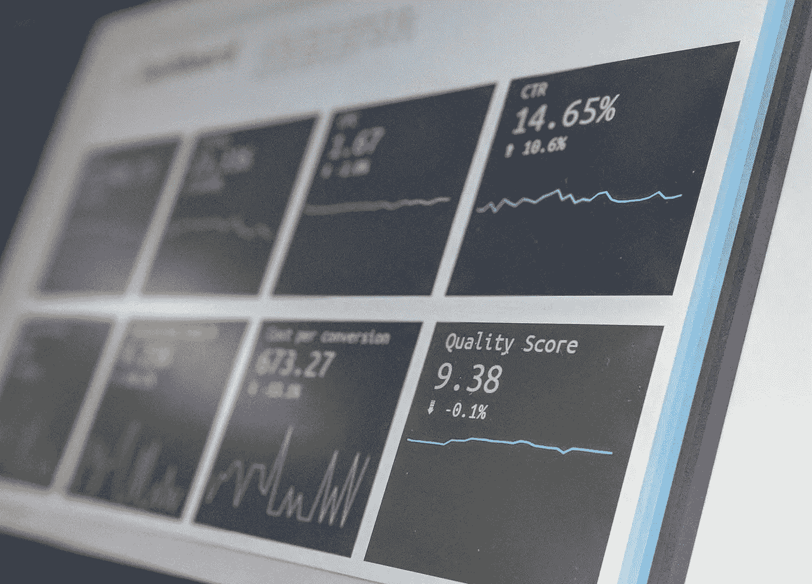

# 如何分析你的周中表现

> 原文：<https://medium.com/swlh/how-to-analyse-your-weekly-medium-performance-df441d36af50>

Photo by [Stephen Dawson](https://unsplash.com/@srd844?utm_source=unsplash&utm_medium=referral&utm_content=creditCopyText) on [Unsplash](https://unsplash.com/search/photos/stats?utm_source=unsplash&utm_medium=referral&utm_content=creditCopyText)

周三对任何媒体作家来说都是重要的一天。今天是发薪日。是的，我们都喜欢看自己那一周挣了多少钱。

但是周三不仅仅是看最后的分数。这是一个反思那一周文章的机会，并确定什么有效，什么无效。