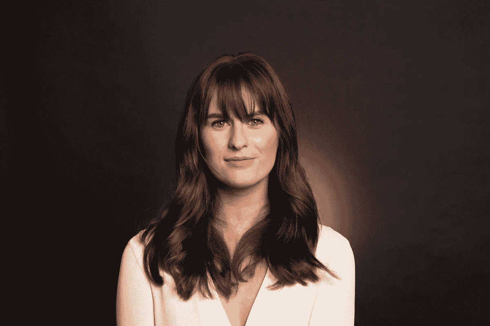

# 如何在经验不足的情况下显得更可信

> 原文：<https://medium.com/swlh/how-to-appear-more-credible-when-you-have-minimal-experience-fa2dd513687a>

昨晚我去了第一次约会。

我卷好头发，涂上我最喜欢的红色唇膏，穿上一双高跟鞋，出门了。

旧金山的约会场景有相当多的困惑，(这是另一个时间的另一篇博客文章)，但考虑到所有的事情，这是相当难以置信的。的…