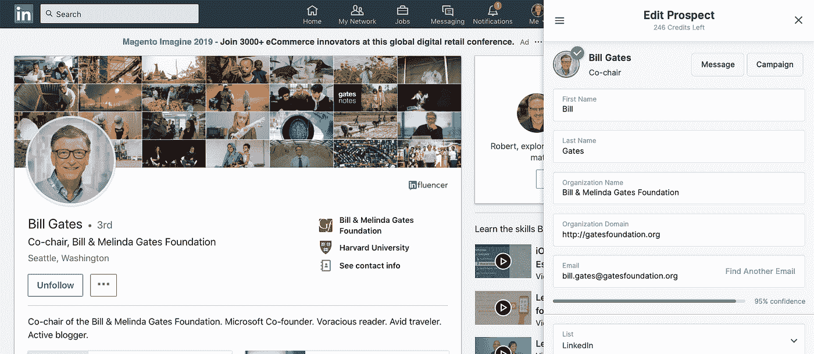
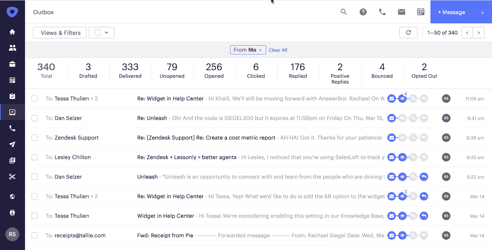
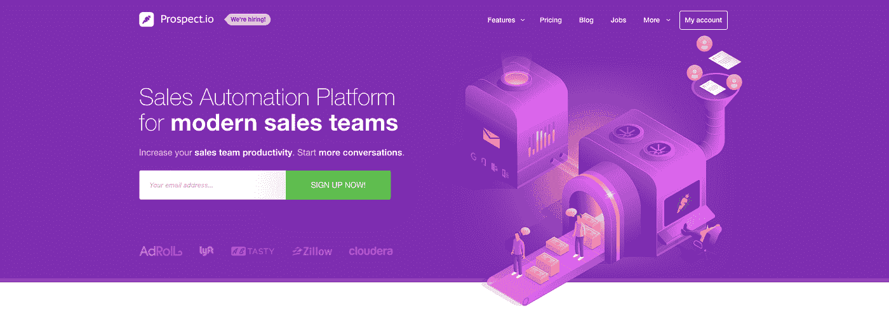

# 如何自动化您的销售推广活动

> 原文：<https://medium.com/swlh/how-to-automate-your-sales-outreach-campaigns-83cfc98cc6c0>

罗伯特·福斯特撰写

最近，我帮助一家年轻的初创公司在一个成熟且受监管的行业迈出了最初的商业步伐。这家公司自筹资金，并通过利用个人关系设法获得了几个试点，但尚未在有限的营销预算下做出重大销售或品牌宣传。

在此之前，我已经在海外生活了几年，除了少数例外，我的行业联系充其量也是陈旧的，我被留下来直接研究和联系潜在客户。在参加了几次行业会议后，带着为数不多的几个联系人离开，我意识到我需要一种更有效的方式来 1) **识别**和 2) **接触潜在的客户和合作伙伴。**

最初的努力被证明是徒劳的——尽管使用了 LinkedIn 的高级销售导航器，它在帮助细分和识别潜在客户方面做了很大的工作。我发现，当我努力处理 LinkedIn 信息、个人电子邮件地址和公司总机接线员时，我的外联努力在最后一英里受到了影响。

一定有更好的方法。

**行业工具**

经过大量的研究和反复试验，我尝试了几家新贵供应商，最终找到了我想要的东西(实际上，比我需要的多一点)。我发现有两类供应商可以同时满足我的即时需求:

**销售智能解决方案(SIS)**

这些解决方案为我的目标客户群中的 C-Level、决策者和有影响力的人提供了迫切需要的工作电子邮件地址和直拨电话号码。通过安装该解决方案的 Chrome 插件，我可以使用 LinkedIn 导航到我的目标，然后在一个方便的弹出窗口中显示他/她的联系信息。

**销售支持解决方案(SES)**

另一个同样重要的难题是如何有效地为新调查的潜在客户创建点滴式电子邮件活动。没有选择加入，MailChimp 或 ActiveCampaign 等传统 ESP 供应商无法开展活动。SES 供应商有一个内置的“节流阀”，它可以获取数百个电子邮件地址的列表，并快速解析每个潜在客户的个人电子邮件，避开域黑名单触发器。更好的是，可以直接从 Chrome 插件启动潜在客户的活动，这是一种非常方便的一步到位的直接接触潜在客户的方式。

在与供应商签订合同后，我能够在公司最大的行业贸易展之前开展活动，并用合格的会议来填充 3 天的活动，这是一个巨大的胜利，也是对管道的推动。

在改造了公司的集客营销网站后，我还能够利用一份白皮书和一篇行业杂志封面文章开展营销活动，以获得合格的销售线索。

**企业解决方案**

需要指出的是，我在这些营销活动中使用了企业解决方案，回想起来，这些解决方案足以满足公司的需求。在销售智能方面，我们与 ZoomInfo 签订了合同，后者后来被另一家高端解决方案公司 Discover.Org 收购。我们使用的销售支持解决方案是 Outreach.io，它在高端市场上与 SalesLoft 竞争。对于使用 Salesforce.com 的公司来说，这些解决方案通过 API 得到了很好的集成，并且非常适合他们的技术预算。

**面向中小型企业的解决方案**

我最近发现了[prospect . io](http://bit.ly/2UwDfsO)——一个可能非常适合小公司和企业家的解决方案。它不仅将销售支持和销售智能结合到一个集成的解决方案中，而且还具有每月 99 美元的起价和可以根据短期需求进行调整的灵活合同。

Source: Prospect.io

当然，它没有企业版的所有花哨功能，但确实提供了一个更直观的用户界面，帮助用户快速入门，并与中小企业 CRM 解决方案集成，如 [PipeDrive](http://bit.ly/2VMFnsE) 以及 Gmail 和 Outlook 电子邮件。