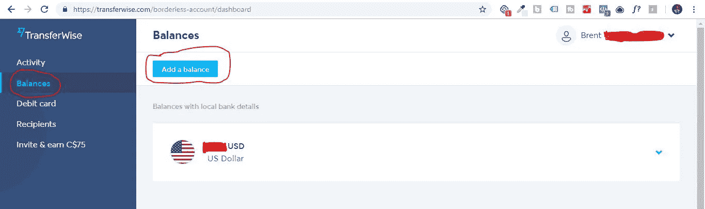

# 如何避免贝宝转换费和糟糕的汇率

> 原文：<https://medium.com/swlh/how-to-avoid-paypal-conversion-fees-poor-exchange-rates-5a456277d9fe>

许多较小(甚至较大)的机构所有者遇到的一个常见问题是总是被如此多的费用所困扰，这些费用真的会侵蚀我们的收入。随着你业务的持续增长，一项费用会变得更糟，那就是将你的收入从一种货币转换成另一种货币的费用。对我来说，作为一家加拿大代理公司，有很多美国客户是很典型的，我的大部分工作都是以美元支付的。我发现使用 Paypal 是获得这些工作报酬的一个很好的方式，但不是将我的收入从美元转换成加元的最佳方式。对我来说，仅仅是把钱兑换成加拿大货币就损失 4%的收入是很常见的。幸运的是，我发现了一个超级简单的方法，可以帮你节省 4%的转换费，我会解释下面的步骤！

在我进入步骤之前，我想提一下，我遇到了这个方法，因为不久前脸书的一个小组中有人发布了关于这个网站的帖子，我记下了这个网站，最近我自己也尝试了一下。所以我也为没有记住他的名字表示歉意。

# 第一步。创建一个转账账户

因此，简而言之，Transferwise 是一个允许你以最优惠的价格寄钱、收钱和换钱的网站。您可以免费创建多达 40 种不同货币的在线无国界账户，这让您在接受和兑换货币时有很大的自由度。如果你想了解更多关于 Transferwise 的信息，请访问他们位于 https://transferwise.com 的网站，他们在网站上有大量解释其工作原理的精彩内容。如果你想支持我(和你自己，因为你得到了价值 800 美元的免费国际转会),你可以注册并访问他们发给我的链接的网站【https://transferwise.com/u/brentg27 

# 第二步。设置一个无边界帐户

一旦你注册了，你要做的下一件事就是用你想转换的货币建立一个无边界账户，所以在我的情况下，我想把美元兑换成加元，所以我建立了一个美元无边界账户。如果你不确定什么是无边界账户，你可以[在这里](https://transferwise.com/help/article/2900855/borderless-account/whats-a-borderless-account)了解更多。简而言之，无边界账户是一个多货币账户，可以让你用 40 多种货币存钱，并在你需要的时候用实际汇率在它们之间转换(很不错)。

如果你还没有[注册](https://transferwise.com/u/brentg27)账户，你可以在这里的“收款”下找到“无边界账户”选项:

如果你已经注册了一个帐户，并且已经登录，你可以通过进入你的余额选项卡，点击蓝色按钮“添加余额”来设置一个无边界帐户。

# 第三步。接收您的无国界银行详情，并将其添加到 Paypal。

一旦您在 Transferwise 上注册了一个帐户，您将被要求验证该帐户，一旦该程序完成，您将获得您的无国界银行帐户的银行详细信息。您可以通过进入您的余额页面并点击账户旁边的下拉箭头找到银行详细信息。

一旦您收到这些详细信息，这些信息将会添加到您的 Paypal 帐户中。要在 Paypal 上开设新帐户，只需登录您的帐户，然后在顶部菜单中点击钱包。

进入钱包页面后，您需要点击“链接银行”

在下一页点击链接银行后，选择“我有一个不同的银行”

Your options may be different than mine since I am Canadian

在下一页，确保您选择了您想要的账户类型(我想要一个美国银行账户)，然后输入您的无国界账户的详细信息。

一旦你建立了你的帐户，Paypal 会给你两笔验证存款(大约需要 1 天)以确保该帐户是合法的。

# 第四步。将您的主要银行账户添加到 Transferwise

因此，为了让你的钱转出，你必须用你的主要银行账户将自己设置为收款人。要在您的 Transferwise 帐户中执行此操作，请转到收件人，然后单击添加银行。您可以在这里输入您的银行信息，以便将您兑换的钱转到哪里(不到 24 小时就可以验证我的主要银行)。

# 第五步。将您的 Paypal 余额转入您的 Transferwise 帐户。

一旦您的 Transferwise 无国界帐户通过 Paypal 验证，您就可以将钱转入您的 Transferwise 帐户。例如，我从我的 Paypal 中取出我的美元，并将其转移到我的 USD Transferwise 帐户(对我来说，转移时间不到 24 小时)，从 Paypal 向 Transferwise 帐户转移资金是免费的。一旦美元出现在我的 Transferwise 帐户中，我就可以在它发送到我的主要加元银行帐户之前，按实际汇率将其转换为加元(加上前期显示的少量费用),就这样！查看我最近一次付款的转账，查看我得到的汇率，并与当天的汇率进行比较。

# 摘要

我花了大约 40 分钟来完成以上所有步骤，然后整个验证和把钱从一个账户转到另一个账户的过程花了大约 2 天。通过能够将我的美元按实际汇率转换成加元，可以为你节省数百美元，例如，建立一个 10，000 美元的网站通常会花费我 400 美元的转换费，但使用这种方法，我几乎可以节省所有的费用。我强烈建议查看 [Transferwise](https://transferwise.com/u/brentg27) 来为自己了解更多，看看你能得到什么样的转换率，但对我来说，这非常有效！像往常一样，如果你有任何问题，随时给我发电子邮件到 brentgodkin@gmail.com

## 这篇文章发表在[《创业](https://medium.com/swlh)》上，这是 Medium 最大的创业刊物，有+411，714 人关注。

## 订阅接收[我们的头条新闻](http://growthsupply.com/the-startup-newsletter/)。

