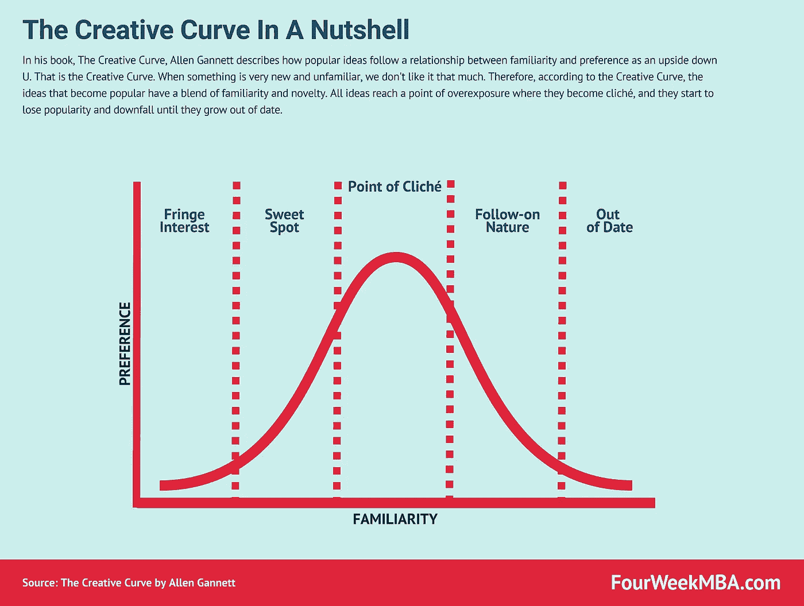

# 如何避免艾伦·甘尼特的陈词滥调[面试]

> 原文：<https://medium.com/swlh/how-to-avoid-the-point-of-clich%C3%A9-with-allen-gannett-interview-d326d46687e5>

今天我们请到了艾伦·甘尼特。他是 Skyword 的首席战略官，是大数据分析公司 TrackMaven 的创始人；他也是《[创意曲线](https://www.amazon.com/dp/B075PVQ99T/ref=dp-kindle-redirect?_encoding=UTF8&btkr=1)》的作者。一本我喜欢的书，我建议每个人都去读。

今天我们实际上要和艾伦一起探索，关于创造力的见解，它是如何工作的。以及我们对创造力运作方式的误解。艾伦，谢谢你今天和我们在一起。

***Allen Gannett, author of The Creative Curve***

**艾伦**:谢谢你邀请我，伙计，有很多误解，所以我们有很多要谈的。

在读你的书之前，我对创造力有很多误解。所以从那里开始可能会更好。

# 什么是真正的创造力？你在研究中有什么发现？

艾伦:对我来说，创造力最有趣的事情是它的定义随着时间的推移发生了多大的变化。我在书中谈到的一件事是艺术家随着时间推移的想法，以及他们在古代是如何被看待的。艺术家被视为模仿上帝的人。

然后在现代创意中，一个新概念出现了。那是在黄金时代，从资本主义的角度来看也是黄金时代。资金大量涌入，人们买得起艺术品，他们想要更多的艺术品，供求关系开始起作用。艺术家开始能够赢得更多的尊重。

有史以来第一次，这位名人艺术家和这种创意的概念，因为这种大师级的人会出现。

你知道，随着时间的推移，我们也发展了一些关于创造力的其他观念，人们是半神或者他们是怪异的，或者他们是古怪的和英勇的，但同时他们也是很棒的。

有趣的是，当你看着围绕创造力的科学时，实际上有很多关于创造力如何工作的共识。所以，简而言之，创造力就是创造新奇而有价值的事物的能力。

这不仅仅是新奇，这只是创造力，真的。不仅仅是价值的问题。它是关于创造既新颖又有价值的东西。那是因为我们的大脑依赖于右半球，而右半球非常擅长将新的和不同的想法联系在一起。因此，它不是某种神奇的力量。

这是一个非常正常的生物过程。我们研究了它，观察了核磁共振扫描。这实际上是可以解释的。

Gennaro :这可能是第一个误解。创造力是突如其来的。事实上不是每个人都能掌握它，但是你生来就有。但在书中，你实际上有一个过程，实际上，我认为看着你放在一起的框架是非常有趣的，这就是“创意曲线”

# 创意曲线是如何工作的？

**艾伦**:说到创造力，我认为有三个要素很重要。所以，**一个是技术技能**，拥有你所在领域的技术技能。**二是** [**营销**](https://fourweekmba.com/market-segmentation/) [**分销**](https://fourweekmba.com/distribution-channels/) 。

所以能够把你的想法表达出来。**第三是时机**。我在这本书里花了很多时间，围绕着时间，我称之为创造性曲线，作为我使用的框架。创造性曲线并不新鲜，它是一个相当严肃的学术概念的流行心理学版本。这就是所谓的倒 U 型关系。

这个理论发现，接触某种事物的比率，我们对某种事物的熟悉程度，对我们对它的感知有相当大的影响。熟悉度和偏好之间的关系是倒 u 型的。

这就是创意曲线。当一件事很新，当一件事很陌生时，我们就不那么喜欢它了。但是当我们接触到更多的东西时，比如想想你第一次听到一首新歌；你就像“哦，这真的很好，我有点喜欢这个。”然后你一遍又一遍地听，就熟悉了。

那是因为我们实际上不喜欢不稳定的新事物。想想看，如果你看一部九个小时的电影，没有像你这样的主角，你会非常无聊。就像,《星球大战》是太空中的西部片。事实上，**事实证明，最有价值的想法是那些足够熟悉到令人舒适，但又足够新奇到令人感兴趣的想法。**

所以创意曲线是熟悉度和偏好之间的关系，它基本上显示了这一点，这种增长是这样的，即倾向于获得并迅速流行的想法是熟悉度和新奇度的混合。

现在最终，所有的想法都达到了过度曝光的程度，变成了陈词滥调，开始不受欢迎，这就是衰落的原因。因此，当你谈论创造性天才时，我们真正谈论的是这样一个事实，即有些人有这种真正巧妙的能力来创造处于创造性曲线最佳点的东西，他们足够熟悉以至于可以安全地接近，但又足够新奇以至于有趣。

在人口层面上，你知道，有些想法让人觉得很舒服，以至于人们想去尝试一下；随着越来越多的人接触到它，他们会更感兴趣，他们可以很快建立人气。这才是真正的创造性天才；这不是，你知道，神，这只是一种时机。

**根纳罗**:对。很有意思。而且正如你在书中提到的，有一种**所谓的陈词滥调。**如今，有了社交媒体，人们相信你出现得越多，曝光率越高，对你的品牌越有利，无论是个人品牌还是职业品牌。然而，正如你所解释的，过度曝光并不是一件好事。实际上，它稀释了你的品牌；我不知道这是正确的表达方式…

# 陈词滥调的观点是如何运作的？

**艾伦**:是的！有趣的是，你基本上是这条创造性曲线，你应该看看影响人们对它的看法的曝光率。事实上，暴露的频率显然决定了事物在曲线上移动的速度。

所以社交媒体真的很有趣，因为内容的单位很小，人们的曝光率很高。例如，Twitter 上的模因在几小时或几天内就会发生变化，品牌会遇到麻烦，因为，你知道，有一些模因，一周后他们会在模因上制造一些裂缝，但那时已经太晚了。

我认为企业家和营销人员感兴趣的一件事是，你开始看到这种从短形式的社交媒体向更长形式的体验和内容的转移。例如，你看到品牌开始创作迷你纪录片或电影，或电视节目，因为社交媒体内的军备竞赛，以保持相关性，因为你的表演很快就通过了创作曲线。

所以很多人说“你知道，去他妈的，我不想再玩那个游戏了！”

**Gennaro** :是的！实际上， [LUSH 发出了一条有趣的推文，要求退出其社交媒体账户](https://www.independent.co.uk/life-style/fashion/lush-quit-close-social-why-accounts-gone-twitter-instagram-a8861836.html)，因为他们将在自己控制的频道上管理与社区的互动。

从我的角度来看，这也非常有趣，我的意思是，我更倾向于内容写作，因为我的主要沟通渠道是博客。要想在博客上取得成功，你需要创造伟大的内容，这是高度研究和策划，这需要大量的投资。创作过程一点也不容易。我的意思是，这真的是需要你加班才能掌握的东西！

让我回到你身上，是什么驱使你去研究创造力？我的意思是，我喜欢你是因为你是一名实践者，你曾经是 CMO，一家公司的创始人，现在你是首席[战略](https://fourweekmba.com/business-strategy/)官。所以我猜在现实世界中看到你的作品真的很有趣。

# 最初是什么驱使你去研究创造力？

艾伦:是的，我在经营我的公司，10 月份，我们和另一家公司合并了。我的公司和很多大品牌合作过。这些名字包括通用电气、美元剃须俱乐部和 NBA。所有这些标志性的现代品牌。有趣的是，即使在那些品牌，甚至更小的品牌，你也会听到人们说，“我没那么有创造力。”我一直坚信人类的潜力，你知道，很多生活都是后天培养的；不是关于自然。

这只是我成长的过程。我想只是，我习惯了那样。

所以当我从人们那里听到这些的时候，我会非常沮丧。我听到了很多消极的自我对话。我开始挖掘它，开始阅读它，我发现有很多学术共识认为创造力是可以获得的。

所以我开始发表演讲，这可以说是这本书的缩影。所有关于创造性天才的神话，如果你看看像莫扎特这样的人的故事，例如，它实际上不是一个人醒来弹钢琴的故事，它实际上是一个小孩的故事，他的父亲运用有条件的爱，让他从三岁开始每天练习三个小时，一周七天。对吗？

所以我开始做这个演讲，它真的引起了共鸣，它就像滚雪球一样变成了书，我刚刚意识到这里有很多东西要解开，我认为他们有如此大的潜力，但受到人们告诉自己的关于创造力的事情的限制。就像，“哦，就像，你知道，我太老了，学不了那个技能了。”我的意思是所有这些疯狂的东西和现实是，我们正在进入一个时代，创造力是最未来的证明技能。

前几天我看到一篇文章，说雇主因为机器的年龄而寻找的第一技能…

Gennaro :这是唯一不能自动化的东西！

**艾伦**:是的，没错。他们用人工智能做这些实验，试图让人工智能创造艺术，但有点蹩脚。

**根纳罗**:有趣的一点。对于读过另一本书的人来说，这本书是“[跨越鸿沟](https://fourweekmba.com/technology-adoption-curve/)”，这是一本关于高科技[营销](https://fourweekmba.com/market-segmentation/)的经典书籍。可能很容易将创新曲线与技术采用曲线混淆。但这是两个不同的概念，对吗？

# 创意曲线和技术采用曲线的主要区别是什么？

**Allen** :所以技术采用曲线基本上显示了随着时间的推移，某样东西的使用率是如何从 0%上升到 100%的。这尤其与商品或公用事业相关，对吗？所以考虑一下硬盘处理器。

我说的是，任何有偏好的东西。依赖偏好的东西来来去去都是偏好。**有趣的是，流行度可能从 0%上升到 80%,然后下降到 0 或接近 0！与商品和公用事业相比，事物会达到 100%,并且经常保持在 100%,直到有东西完全取代它。**

这就是最大的细微差别。

很好，所以还有另一个关于先发优势的误解。在你的博客中，你提到了一个有趣的案例，是关于社交媒体领域的第一个行动者。哪一个不是脸书，尽管许多人认为是脸书，实际上他们是如何消失的。你有什么理论吗？

# 为什么脸书成功了，尽管它不是第一个行动者？

艾伦:所以，我认为这很重要。我认为企业家总是会犯这种错误。这就是认为最好的功能会胜出的错误。或者最高质量的功能或最先进的功能胜出。不是这样的。获胜的公司在正确的时间拥有正确的特性。

让我解释一下我的意思。在书中，我举了一个校园网和脸书的例子。因此，校园网是一个社交媒体网络，比哥伦比亚大学的脸书早一个月推出，哥伦比亚大学是另一所常春藤盟校。它也在校园里疯传，变得非常受欢迎。

创始人也从学校起飞尝试和规模，他们非常聪明和有能力。有一段时间，你回头看 2004 年的文章，它有点像校园网和脸书之间的战争(你可以在这里阅读文章:[“有超过一个](https://stanforddailyarchive.com/cgi-bin/stanford?a=d&d=stanford20041020-01.2.15&srpos=2&e=-------en-20--1-byDA-txt-txIN--ARTICLE-----)的空间吗？”)每个校区谁会胜出。

这是件大事。有趣的是，校园网实际上更先进。它实际上有更多的功能；它有照片、活动提要、新闻提要、群组等内容。所有这些在很久很久以后才进入脸书的东西，校园网都有了。但是，有趣的是，观众还没有准备好。

**脸书获胜的部分原因是脸书更简单。**所以，在 2004 年，我们刚刚从使用网名和假名过渡到使用你的名字，这在当时是很疯狂的想法，对吗？那是人们正在做的跳跃，那是人们感到舒服的跳跃。

他们还不习惯不断地向每个人广播他们的所有活动。就像，现在，我们假设它一直都是这样。因此，脸书在正确的时间是正确的想法。这是为合适的观众准备的合适的节目。

很多时候，企业家，因为我们是早期采用者，因为我们痴迷于产品，我们会说，这是具有最好功能的产品，这是人们想要的。通常，人们实际上只是想要更简单的功能。**这些功能足够熟悉，既安全又平易近人，** **但又有新奇的变化，有些东西很吸引人，他们想进一步了解和探索。**

Gennaro :我知道这个过程，因为我也在一家科技公司工作，很容易喜欢上你的产品的功能或产品，而不是了解人们习惯或实际上在你的产品中使用什么功能。此外，当谈到[业务建模](https://fourweekmba.com/what-is-a-business-model/)时，创造力非常重要，因为你需要能够在正确的时机将所有的部分混合在一起。

# 谈到商业建模，你有什么偏好吗？

**艾伦**:是的，我喜欢关注的一件事是创造力的互动方面，我们对创造力有这样的印象，一个作家去写作小屋，六周后出来，一部完成的小说，嘣。事实上，大多数非常成功的创意人员都非常非常具有互动性。那是因为他们意识到他们的工作是为观众创造一种体验，而不是为他们自己创造。

这是创造力不太成功的人说的话。事实上，如果你看看安迪·沃霍尔的采访或所有这些他们为观众创造的东西，那种互动，那种观众与艺术家的互动，那才是他们真正感兴趣的。因此，他们知道这一点，而且在这个过程中，他们会尽早并经常尝试从观众那里获得反馈。没错，这可能是一个例子。

想想一个单口喜剧演员，你知道单口喜剧演员，当他们在做他们的喜剧中心特别节目，或者其他什么的时候，他们多年来一直在研究那些笑话和麦克风之夜，以及在小俱乐部的公开麦克风之夜。这就是为什么大喜剧演员去小喜剧俱乐部尝试笑话，因为有这种迭代的元素来完成笑话，把它带到观众喜欢的完美地方，对吗？这不是关于你这个创作者，而是关于观众。

所以我认为，当谈到****商业模式时，我想说的是，你如何能够尽早地、经常地整合受众反馈**。因为否则，你只是在为一个受众创造，这不是一个好的市场。**

**根纳罗:我完全同意。为了让产品发挥作用，甚至在产品准备好的几个月前，你就需要收集你的观众反馈。**

# **你最喜欢的商界人士是谁？**

**艾伦:我最喜欢的商业书籍是本·霍洛维茨的《关于困难的困难》。在我看来，他在以非常实际的方式谈论企业家方面做得最好。他有一章讲的是如何解雇你的朋友。比如，当你在创业的时候，这是一个真正的问题。我要说，他绝对可能是目前对我最有影响力的商业人士。我每六个月重读他的书。我认为这应该是任何试图建立一家公司的人的必读书。**

****根纳罗**:**

# **你还有其他推荐的读物吗？**

****艾伦**:艾德·卡内拉斯的书《创意墨水》对我的书是一个很好的补充，这本书完全是关于皮克斯的，所以我的书中有一章是关于本和杰瑞的，在《创新循环》中有许多与本和杰瑞的工作以及皮克斯的工作相似的地方，我认为如果你读了这两本书，你就有了一个框架。你知道简短版的**皮克斯做的事情非常有趣，因为他们的产品实际上不是电影。他们的产品是他们的创造过程，那是他们重复的东西。**这是他们的创新点和思维方式。我认为这很有趣，所以如果你对太空感兴趣，这绝对是一个不错的选择。**

****Gennaro** :有意思！谢谢您们。任何人都应该读你的书《创造曲线》,因为它让你了解创造力的真正本质。**

**感谢你加入我们，艾伦！**

**你可以在 LinkedIn 上与艾伦联系。**

**艾伦:谢谢邀请我！**

***原载于 2019 年 4 月 12 日*[*fourweekmba.com*](https://fourweekmba.com/creative-curve-allen-gannet/)*。***

****

## **这篇文章发表在 [The Startup](https://medium.com/swlh) 上，这是 Medium 最大的创业刊物，拥有+442，678 名读者。**

## **在这里订阅接收[我们的头条新闻](https://growthsupply.com/the-startup-newsletter/)。**

****