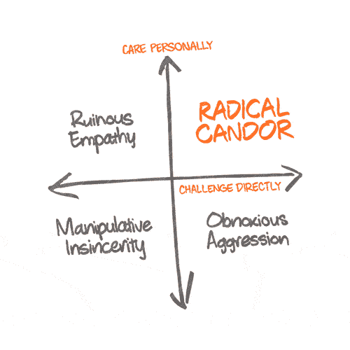

# 如何通过培养“激进的坦诚”成为更好的领导者

> 原文：<https://medium.com/swlh/how-to-be-a-better-leader-by-developing-radical-candor-2c08db3ff5d7>

## 最好的老板亲自关心，直接挑战

[Ashley Gerlach @ Unsplash](https://unsplash.com/@ashmger)

作为一名经理，我的目标是创造一个没有废话的环境，让人们喜欢他们所做的事情，喜欢和谁一起做。说起来容易做起来难。作为一个局外人，我认为谷歌在创造一种鼓励冲突、反对反击的文化方面做得很好。

> **彻底的坦诚是成为一名好老板的秘诀。**

我最近看完了[金·斯科特](https://medium.com/u/f302f1eb7108?source=post_page-----2c08db3ff5d7--------------------------------)的《纽约时报》畅销书[彻底坦白:做一个牛逼的老板而不失去你的人性](https://www.amazon.com/Radical-Candor-Kick-Ass-Without-Humanity/dp/1250103509/ref=sr_1_1?ie=UTF8&qid=1549991511&sr=8-1&keywords=radical+candor)。我非常喜欢这本书，它带你开始了一段旅程，分享了来自科技巨头高管(苹果、谷歌、Twitter 等)的惊人故事，并揭示了最佳管理实践，因为它们与金的“激进坦率”哲学有关。

把这篇文章想成是一篇书评，或者是*傻瓜的彻底坦白，如果你愿意的话*。我强烈推荐这本书给那些在管理岗位上的人。

自从读了这本书，我和我的 16 人团队的每一次谈话都发生了变化。我将这一理念铭记于心，并总是试图对我直接管理的每个人都非常坦诚。Kim 在她的最后一章中做了很好的解释，你可以如何使用你所学的工具向你的团队介绍这种管理策略。

## 简介—谁是金·斯科特？

*   纽约时报和华尔街日报畅销书作家
*   领导谷歌的 AdSense、YouTube 和 Doubleclick 在线销售和运营
*   在苹果开发并教授领导力研讨会
*   Dropbox、Qualtrics、Twitter 和其他几家科技公司的首席执行官教练。

## 什么是彻底的坦白？

Kim 解释说，良好的管理可以在两两图表上进行分解，axis **直接挑战**和**亲自关心**。通过同时做这两件事，你将从你的团队得到最好的工作，同时建立你职业生涯中最好的关系。简而言之，彻底的坦诚意味着说出你的真实想法，同时也关心你的听众。那么，我们如何建立一种完全坦诚的关系呢？

## 1.亲自关心

又名，给一个该死的。与你的直接下属建立良好关系的关键是真诚地关心他们。从个人层面去了解他们。他们结婚有孩子了吗？单身妈妈？他们的爱好是什么？他们通勤时间长吗？这些细节是展示你关心的很好的话题。大多数老板确实关心他们的团队成员，但是他们没有表现出来。抽出一周的时间与你的团队进行一对一的快速检查，并询问他们做得如何。今天的通勤怎么样？昨晚你看网球比赛了吗？你要带你的儿子去看新的蜘蛛侠电影吗？！ 🕷

不要害怕涉及个人隐私，但要注意不要越界。政治、宗教、性别、种族、民族和健康都是你应该避免的话题。亲自关心你的同事会让你更容易直接挑战他们，你的反馈也会更容易被接受。

## 2.直接挑战

关心个人可能对工作关系有害，除非你直接完成挑战象限。这意味着，如果你觉得一个人没有按照你的期望出色地履行职责，就提供直接反馈。信不信由你，只要反馈以正确的方式呈现，人们实际上很喜欢收到反馈。不要保留你的拳头，但是在直接批评之前，一定要让他们知道你在乎他们。

直接挑战的最佳方式是从提供一些积极的反馈开始。他们工作中的哪些方面进展顺利？当评论一个设计时，我经常这样做，首先说你喜欢它什么。他们做的事情中有你真正喜欢的吗？让他们知道！然后，放松进入批判。

## 狗屁三明治:

小心屁话三明治，当你给予表扬，然后是反馈，最后又是表扬。

如果你个人不关心，直接挑战，你可能会在离职面谈中失去一名员工，看起来像这样:

Michael Scott Interviews Toby on The Office

# 当你没有亲自关心和直接挑战时会发生什么？

以下是金·斯科特对未能提供彻底坦诚的常见错误的解释。

1.  **讨厌的攻击性**是当你挑战但不在乎时发生的事情。它是感觉不真诚的表扬或不友善的批评。这是你表现得像个混蛋的时候，如果你像我一样，当我缺乏耐心时就会发生。
2.  **毁灭性的同理心**是当你关心但不挑战时发生的事情。这是不够具体的赞美，以帮助人们理解什么是好的，或批评是糖衣和不明确的。这种情况发生在你不想伤害他们的感情，你又太好的时候。
3.  当你既不关心也不挑战的时候，就会出现虚伪。是不具体不真诚的表扬还是不明确不善意的批评。操纵虚伪的结果是消极的攻击性，背后捅刀子，通常会导致不健康的工作环境。

[Jack Sharp @ Unsplash](https://unsplash.com/@jsharp9066)

# 摇滚明星对超级明星

理解摇滚明星和超级明星之间的差异真的帮助我把人们放在正确的位置。我总是理解公司里不同的个性，但这个概念给了它一个标签，让我可以理解并与我的团队沟通。摇滚明星和超级明星同样有价值，但他们的成长轨迹大相径庭，这是你需要关注的。

## 谁是摇滚明星？

摇滚明星是那些对自己的职位感到满意的人，他们不需要进入管理角色，也没有经营一个部门或公司的目标。他们加入进来，完成工作，并且表现得非常出色。摇滚明星应该通过不断改进他们的技艺，通过经验来教导他们的同事，并保持在潮流的顶端，从而在内部成长。最终，当他们开始指导他们的同伴时，他们将挑选他们想要从事的项目。

## 谁是超级明星？

超级明星是希望在组织中向上发展的个人，随着他们的成长，承担新的责任和挑战。他们通常渴望领导团队，最终，他们会希望管理一个部门或加入管理团队。不是每个人都有相同的目标，在面试和报到时从他们身上获取这些信息是很重要的。确保你让他们的职责与他们的长期目标相一致，这样你就能让他们做得最好。

# 向下踢和向上吻

我想从书中分享的最后一个概念是“向下踢，向上吻”。这是一种表达方式，用来描述一个组织中的中层员工对上级彬彬有礼，谄媚奉承，但对下属恶语相向的情况。我要补充的是，这适用于小企业，人们对客户很好，但当客户生气时，他们会将这种愤怒传递给员工。在我的职业生涯中，我见过太多这样的事情，这让我抓狂。

如果你选择不读《激进的坦白》,我希望这些课程能鼓励你有意识地改变与团队的互动方式。让我们努力建立促进冲突、支持有意义的关系和鼓励增长的公司。最上乘的白兰地酒（特陈级）

Kim Scott explaining it first hand.

## 这篇文章发表在[《创业](https://medium.com/swlh)》上，这是 Medium 最大的创业刊物，有+424，678 人关注。

## 订阅接收[我们的头条新闻](https://growthsupply.com/the-startup-newsletter/)。

