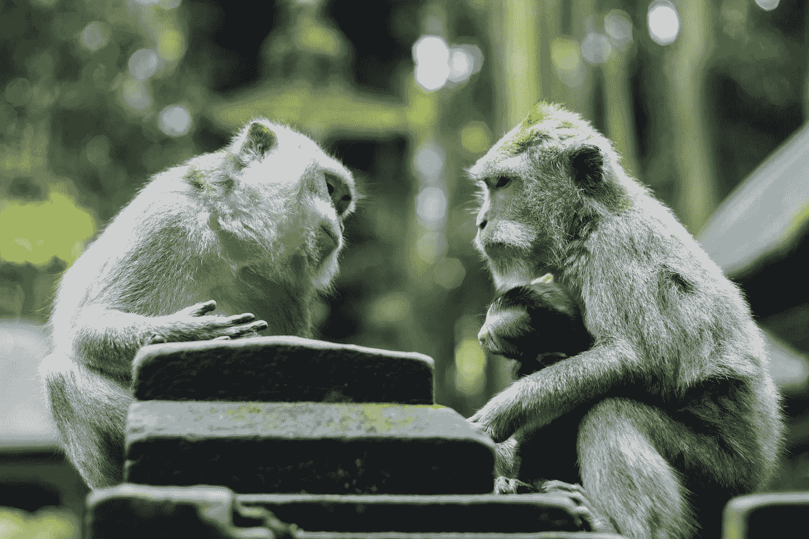

# 如何在人人都在谈论的世界里成为一个更好的倾听者

> 原文：<https://medium.com/swlh/how-to-be-a-better-listener-in-a-world-where-everyones-talking-5b271891b606>

Originally published on [**JOTFORM.COM**](https://www.jotform.com/blog/better-listening/)

“哦，是的，你说得对，”他回答。

这是我参观我们旧金山办事处的第二天早上。

我和我的同事之间隔着一个电脑屏幕，一部智能手机，还有一个我试图解释的时间敏感问题。