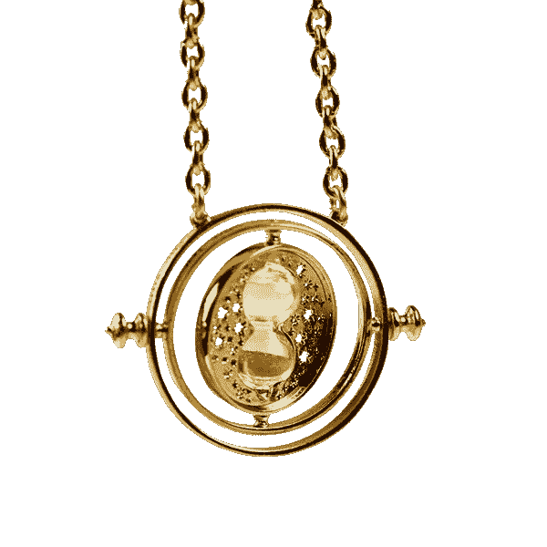

# 如何成为一个时间旅行的生产力向导并把事情做好？

> 原文：<https://medium.com/swlh/how-to-be-a-time-travelling-productivity-wizard-and-get-things-done-bf928c23a3df>

你希望你能操纵时间吗？如果我以正确的心态告诉你:你可以做到。

我相信我们都熟悉这种沮丧的感觉——当你看着时钟，意识到在手机上滚动社交媒体的 5 分钟变成了一个小时？还有你必须写的那份报告——唉，今晚是写不完了；又来了。

当你开心的时候，时间过得很快。不，真的，那是科学事实。你越专注于某件事，时间似乎过得越快——有时这似乎会适得其反。

那是因为我们作为人类，无法准确感知时间。我们都是主观的，这意味着任何形式的集中注意力，如从事工作，有趣的拖延，或只是不注意时间，都可能让时间在瞬间流逝，加快你的生物钟，导致晚上的生产力严重下降。

不要误会我的意思，在社交媒体上放松绝对没有错，但也许不是当你知道你可能会后悔的时候，当你本可以做一些对你明天有益的事情的时候。

一个实验；沃尔特·米歇尔在 20 世纪 60 年代进行了一项研究，这项研究塑造了我们今天所知的心理学世界。米谢尔是一位专攻社会心理学的美国心理学家；对人类、我们的大脑如何工作以及我们的互动如何相互影响的研究。这个伟大的实验研究了延迟即时满足和冲动的影响，以及这种行为的长期好处。它的要点是这样的:相同社会经济地位的孩子被带到一个空荡荡的房间，给他们一个棉花糖吃，或者如果他们等待研究人员返回房间的时间长度未知，奖励加倍(两个棉花糖)。在任何阶段，孩子们都可以用铃声把研究人员叫回房间，告诉他们他们放弃了，只想要一个棉花糖。

结果被记录下来，这些同样的孩子在成长过程中被监测。令人惊讶的是，那些推迟奖励两个棉花糖的孩子的社会和经济地位平均来说更高。根据米谢尔的报告，令人惊讶的是，这些孩子中的一些人成功地控制住了按铃的冲动，直到他们的研究员回到房间，为了更大、更令人满意的奖励而推迟了即时满足——他们中的一些人坐着，一些人唱歌来分散自己的注意力，还有一个小男孩为了抵制单个棉花糖的诱惑，假装吃了整个蛋糕！

同样的理论可以应用到今天——当我们需要时，能够进入正确的顶部空间以停止冲动行为，并将我们的目光放在更长远的愿景上，这很重要。我们可以通过留意客观的时间流逝、时间盒任务或者甚至是喝咖啡来帮助你！

这就是为什么时钟很可能是人类最古老的提高生产力的技术——它们让我们的大脑体验到没有机器我们永远无法体验的东西:客观时间。

今天，我将占用大家一点宝贵的时间，谈谈如何通过一些头脑风暴、技巧和窍门，让你在工作场所内外都能体验到更高的生产力和动力。

> **善待自己**

我的出发点，也是我自己必须通过火的考验来学习的一点是，要想富有成效，你必须善待自己。如果你不善待自己，你就无法善待或同情他人。如果你总是对自己的投入持否定态度，你将无法有效地与他人合作。这种消极情绪通常始于对失败的感知。我们“失败”了，突然，我们记起了我们所有的错误，我们的内心独白变成了一个苛刻的法官，我们抛弃了自己，去寻找能给我们安慰的人或事。

克莉丝汀·内夫，一位领先的自我同情研究人员和 TED 演讲者，已经确定了自我同情的三个主要组成部分:自我善良，人性和正念。

自善是指以善良和理解的方式对待自己。比如，不要吹毛求疵(“我太没条理了！我永远不会成功！”)，不如抓住那些消极的想法，重新框定情境:“我努力了，下次一定会成功的。这不是世界末日。”。认真对待放松也真的很重要，从网络无休止的喧嚣中拔下插头，培养丰富的非工作生活。

我们还需要意识到每个人都会犯错！我们并不孤单；尽管脸书告诉我们，每个人都有缺点！接受我们在苦难中并不孤独，会让我们感到包容而不是疏远。

最后，[正念](http://self-compassion.org/wp-content/uploads/2015/12/SC.SE_.Well-being.pdf)对我们的困难提供了一个“元视角”，帮助我们不夸大我们的痛苦，不被它吞没。如果你客观地看待自己的想法，而不是淹没在被动的情绪中，那么你会得到更冷静、更平静的回应。例如，如果你认为你的问题是小说中的一种情况，这有助于你退一步，从一个更客观的角度来评估情况。这与我之前提到的棉花糖实验中孩子们使用的自我控制机制有关。

所以当你感到不知所措时，问自己三个问题:

“我需要什么？”

*“我怎样才能照顾好自己呢？我能尽快充电吗？”*

*“在这种情况下，我会对我亲爱的朋友说些什么，我会怎么说？”*

当我们挣扎时，我们倾向于练习自怜不是为了感觉更好，而是因为我们感觉不好。重要的是要认识到，当谈到自我保健时，需要的是预防性的，而不是反应性的解决方案——这是一个系统，而不是一个目标，我稍后会谈到这一点。

> **找到平衡——家庭、朋友、健康、工作**

人们总是谈论工作与生活的平衡，以及他们是多么嫉妒那些“拥有一切”的人——健康的身体、一份好工作、一个支持他们的家庭和一大堆朋友。

思考工作与生活平衡问题的一种方法是使用一个被称为四个燃烧器理论或四个灯泡理论的概念。它是这样工作的:

想象一下，你的生活由一个装有四个灯泡的盒子来代表。每个灯泡象征着你生活的一个主要象限。

1.  第一个灯泡代表你的家庭。
2.  第二个灯泡是你的朋友和社交生活。
3.  第三个灯泡是你的健康和身体健康。
4.  第四个灯泡是你的事业和工作生活。

作为一个人，你的总能量或时间输出是有限的——想象它是炉子的煤气，或者灯泡的电。因为你的输出是有限的，而且你必须睡觉，在任何时候你都不可能把四个灯泡/燃烧器全部打开。每一种都有一个调光开关，你需要做出选择:所有这些类别之间总是需要协商。虽然将精力分配到这四个方面是完全合理和明智的，但你可能需要接受这意味着在其中任何一个方面都没有发挥出你的最终全部潜力。

这种思维方式起初可能会不舒服或奇怪，但如果你像我一样担心，它可以帮助你通过有意识地决定你把精力放在哪里来减少对不做其他事情(锻炼、花时间做健康的饭菜、跳过与朋友在一起的时间来工作)的愧疚感。如果你不花时间去做，没有成为你想成为的人并不丢人。例如，如果你对自己的精力做了一个全面的决定，而不是把所有精力都投入到健康领域，不要因为没有成为奥运会游泳运动员而感到内疚。

但这是真正的问题:生活充满了权衡。如果你想在工作和家庭生活中出类拔萃，那么你的社交灯泡和健康灯泡可能会不幸地受到一点影响。如果你想健康并成功地为人父母，那么你可能会被迫放弃你的职业抱负。

处理这些工作生活平衡问题的最好方法是什么？我不敢说我已经搞清楚了，但是这里有三种思考四个灯泡理论的方法。

**免责声明:这一部分引自 jamesclear.com 的订阅邮件，并摘自 CGP Grey & Brady Haren 的“你好，互联网”播客中的观点。**

**选项 1:外包灯泡**

我们总是把生活中的一些小事情外包出去。我们买快餐，这样我们就不用做饭了。我们去干洗店以节省洗衣服的时间。

将你生活中的一小部分外包出去可以让你节省时间，把时间花在其他地方。工作是最好的例子——企业家和企业主可以外包工作。他们通过雇佣员工来实现。

外包的好处是，你不用花时间就能让灯泡一直亮着。不幸的是，把你自己从等式中去掉也是一个缺点。

外包让灯泡一直亮着，但它以一种有意义的方式照亮了你的生活吗？

**选择 2:接受约束:**讽刺的是，四个灯泡理论中最令人沮丧的一点是，它照亮了你尚未开发的潜力。人们很容易想，“如果我有更多的时间，我就能赚更多的钱，保持体形，或者花更多的时间在家里。”

解决这个问题的一个方法是把你的注意力从希望你有更多的时间转移到最大化你拥有的时间。换句话说，你接受了自己的局限。你要问自己的问题是，“假设有一组特定的约束，我怎样才能尽可能地有效？”

例如:

*   假设我只能从早上 9 点工作到下午 5 点，我如何尽可能多的工作？
*   假设我每周只能锻炼 2 小时，我该如何最大限度地锻炼我的肌肉和心血管训练？

这一系列的问题将你的注意力引向积极的事情，担心没有足够的时间。

管理你的四个灯泡的第三种方法是把你的生活分成几个有时间限制的阶段。改变燃烧器的输出，必要时在你生命的不同阶段进行权衡。如果你不是一直在寻找完美的工作生活平衡，而是把你的生活分成几个季节，专注于某个特定的领域，会怎么样？

你的灯泡的重要性可能会在一生中发生变化。当你 20 多岁或 30 多岁还没有孩子时，追逐职业抱负会更容易。健康和工作灯泡发出最大亮度的光。几年后，你可能组建了一个家庭，突然健康灯泡变暗，而你的家庭灯泡变亮了几级。又一个十年过去了，你可能会恢复与老朋友的关系，或者继续你一直推迟的商业想法。事情的轻重缓急是变化的，认识到这一点并意识到你如何度过时间是很重要的。如果你不愿意做出改变或花时间去实现目标，渴望某样东西只会带来沮丧。

你不必永远放弃你的梦想，但生活很少允许你同时保持四个燃烧者。也许这个季节你需要放下一些东西。你可以在一生中做到这一切，但不能同时做到这一切。"用你所拥有的一切投入你的热情——一个赛季."

然后就不干了。

> 知道何时停止

但是你怎么知道什么时候该放弃呢？

生活中最困难的事情之一是知道什么时候继续前进，什么时候继续前进，这是我一直在苦苦挣扎的事情。

一方面，毅力和勇气是在任何领域取得成功的关键。

另一方面，告诉某人永远不要放弃是一个糟糕的建议。成功的人总是放弃。如果某件事行不通，聪明人不会没完没了地重复。他们修改。他们重新评估。它们旋转。他们辞职了。俗话说，“精神错乱就是一遍又一遍地做着同样的事情，却期待着不同的结果。”

生活需要这两种策略。但是你怎么知道什么时候该放弃，什么时候该坚持呢？我将从我自己的经历中告诉你，因为当我辞掉第一份工作时，它已经被证明是我为了自己的幸福和理智所做的最好的决定之一。

所以你要问自己的第一个问题是——你是否有一种不安的感觉，觉得有些事情不太对劲？如果是这样，也许是时候开始探究为什么会这样，以及你可以采取什么步骤来纠正它。放弃并不总是最好的选择，但当你权衡一种情况时，你肯定要考虑它，这可能是因为你不快乐或不满足。

如果你的目标不再与你正在做的任务一致，或者它不再有趣，那么是时候放弃了。如果你看到隧道尽头的亮光，坚持下去，但如果你看不到最终可能带来益处和幸福的未来；是时候重新评估了。

另一件要考虑的事是你的健康。当谈到幸福时，你的身体是你潜意识的最大镜子。如果你的身体疼痛，你的朋友和家人告诉你慢下来，你的睡眠被关于你的任务的讨厌的梦打断，那么是时候后退一步，评估你在哪里了。

免责声明，这绝不是什么时候退出的公式；这只是我的经验之谈，在放弃一项承诺之前，你应该咨询你的朋友和家人——仅仅因为某事具有挑战性并不意味着你应该放弃！

> **衡量你的进步**

然而，为了达到这种巅峰状态，你不仅需要以适当的难度应对挑战，还需要衡量你的进步。你需要能够看到自己目前取得的进步，无论是通过绩效评估、完成分配的工作单、修复 bug，还是开一个有益的会议，如果我们要长期保持动力，我们需要能够看到我们的小胜利。

想要改善你的生活很容易。坚持下去就是另一回事了。如果你想永远保持动力，那就从一个可以应付的挑战开始，衡量你的进步，并重复这个过程，向自己展示它每天都在发挥作用。

> **可持续行为与冲刺目标**

我们都有想要改善生活的事情，不是吗？—进入更好的状态，建立成功的写作生涯，与我们重要的另一半保持成功的关系。

对我们大多数人来说，通往这些事情的道路始于设定一个具体的、可行的目标。然而，我开始意识到的是，当谈到真正完成事情并取得进展时，有一种更好的方式来做事。

这都归结于目标和制度的区别。

让我解释一下。

*   **如果你是一名跑步者，**你的目标是跑马拉松。你的系统就是你这个月的训练计划。
*   **如果你是一名企业家，**你的目标是建立一个百万美元的企业。你的系统就是你的销售和营销过程。

现在是真正有趣的问题:

如果你完全忽略你的目标，只关注你的系统，你还会得到结果吗？

我想你会的。

当你朝着一个目标努力时，你实际上是在说，“我还不够好，但当我达到目标时，我会变得更好。”这是一件有限的事情，让你的大脑只需要努力，直到达到这个想象的目标。这实质上是训练你的大脑一旦达到某个水平就会变得快乐。但是人类的大脑并不是这样工作的，一旦目标达成，我们很容易松懈下来，回到我们的老路上去。例如，我的一个朋友花了 3 个月的时间训练马拉松。她每周虔诚地训练三次，但一旦马拉松结束，她就完全停止了跑步，并在第二年再次开始训练时后悔了。她又回到了起点，而前一年她已经取得了很大的成就。

因此，致力于一个过程和一种生活方式，而不是一个目标。

我们给自己施加不必要的压力来减肥或在商业上取得成功，而基于目标的心态的问题是，你在教自己总是把幸福和成功推迟到下一个里程碑的实现。

当你专注于练习而不是表演时，你可以享受当下，同时也可以提高。

你可能认为你的目标会让你长期保持动力，但事实并非总是如此。一旦你实现了一个目标；还剩下什么继续推动你前进？每次你的大脑成功了，你就改变了成功的目标。如果幸福在成功的另一面，那么，你的大脑永远不会到达那里。作为一个社会，我们已经将幸福和成就感推到了认知的地平线之上——当你颠倒过来，从更长远、更积极的角度看待事物时，我们的大脑实际上是繁荣的。

这就是为什么系统比目标更有价值。目标是关于短期结果的。系统是关于长期的过程，在短期内，可管理的规模。最终，过程总是胜利的，因为一点一点地追求幸福，而不是跳到想象的目标上，可以带来真正值得过的生活。

最后，唯一阻止你的，就是你自己。

来源:

 [## 詹姆斯·克利尔

### 我是《原子习惯》的作者，习惯学院的创建者，一名举重运动员，和一名旅行摄影师…

jamesclear.com](https://jamesclear.com/) 

*   沃尔特·米歇尔的“棉花糖测试”[https://www . Amazon . co . uk/Marshmallow-Test-understand-Self-control-Master/DP/0552168866](https://www.amazon.co.uk/Marshmallow-Test-Understanding-Self-control-Master/dp/0552168866)
*   [https://www . discover magazine . com/mind/how-your-brain-can-control-time](https://www.discovermagazine.com/mind/how-your-brain-can-control-time)
*   什么是正念？【http://self-compassion.org/wp-content/uploads/2015/12/SC. SE_。Well-being.pdf
*   CGP Grey 和 Brady Haren 制作的“你好互联网”播客[https://www.cgpgrey.com/blog/hi-3-four-light-bulbs](https://www.cgpgrey.com/blog/hi-3-four-light-bulbs)