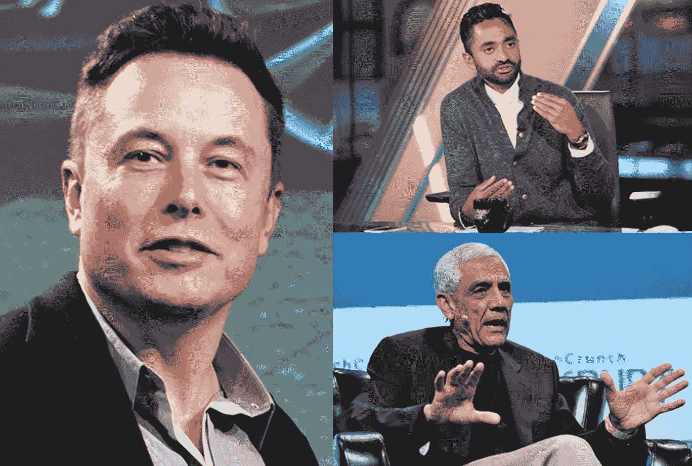
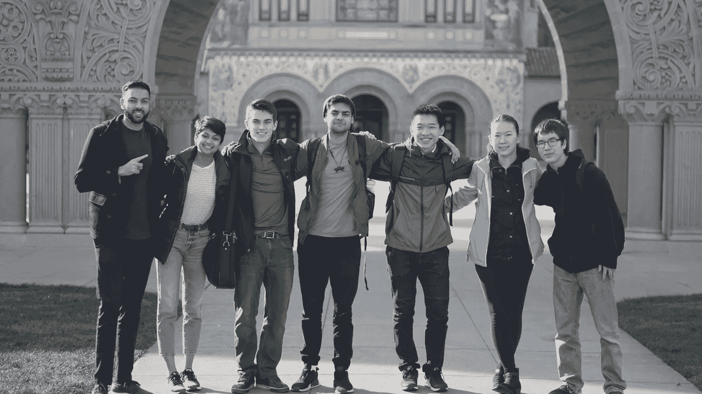
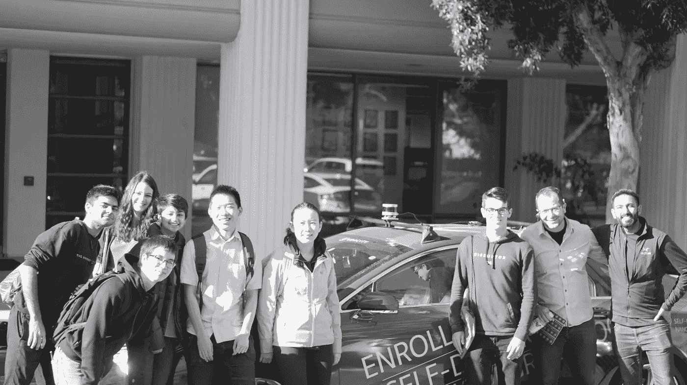
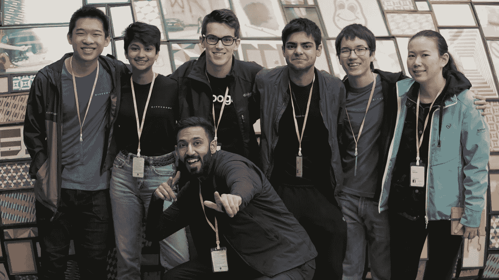

# 如何做一个独角兽人

> 原文：<https://medium.com/swlh/how-to-be-a-unicorn-person-3927e4a32e49>

## ——我 16 岁时在硅谷度过一周的想法和收获

我需要感觉特别。这是我最大的不安全感。

我总是需要比别人更优秀——做事有点与众不同，比别人更聪明一点，更有魅力一点，更风趣一点。

当我看到别人从根本上比我强时，我会对自己说:“哦，他们可能太情绪化了”或“是的，他们只是一开始就比我拥有更多的资源或更好的环境”。

有意识地，我意识到我可能没那么特别。大多数人都很普通。普通的智力，普通的身高，普通的长相。我可能属于他们，尽管我需要感觉自己是独一无二的。

但这篇文章不是关于我如何摆脱不安全感；这是关于我如何学会如何变得特别。通过参观 Linkedin、脸书、谷歌、Twitter、科斯拉风投、M12、Kitty Hawk 和 Udacity 的公司总部，并与在那里工作的一些非常聪明的人交谈，我了解了成为一名独角兽需要什么。

# 但什么是独角兽人呢？

Not the kind of unicorn people I’m talking about

**U 妮玉米每儿**

**/ˈyo͞onəˌkôrn ˈpərs(ə)n/**

***名词***

1.  与独角兽公司(估值超过 10 亿美元的私人控股初创公司)的概念类似，这是一个影响超过 10 亿人的人。 *同义词:比尔·盖茨、埃隆·马斯克、查马斯·帕里哈皮蒂亚、维诺德·科斯拉、乔布斯、纳瓦·拉维康德、拉里·佩奇、苏格拉底、阿尔伯特·爱因斯坦、尼古拉·特斯拉等。*

你可能在其他地方找不到这个正式的定义(除了 TKS 网站之外)，但是当孩子们说他们想在万圣节成为独角兽时，这确实是他们的意思🦄。

New favourite Halloween costumes 😍

但我想做一辈子独角兽。**我想用指数技术和科学影响 10 亿人**。我想留下一份遗产，让人们在我死后长久记住我的名字，而不仅仅是因为这篇文章。

但还是那句话，我很一般。这个远大而崇高的目标是我现在都无法概念化的。任何人都有做大事的意图，但重要的是将意图转化为行动。

所以我制定了一个行动计划。根据我在旧金山学到的东西，以下是我从现在开始要做的不同的事情。

1.  不舒服
2.  有趣点
3.  出席

# 变得超级舒服

如果你连汗都没流过，你就不可能成为 NBA 级别的篮球运动员。如果你只是在半场，背后投篮，你有 0%的机会进入 NBA。

同样的事情也适用于我的野心；如果事情感觉很容易，那是我没有给自己足够大的压力。如果我想成为 NBA 级别的首席执行官或变革者，如果我开始变得自满，我绝对不会成功。

在我们在硅谷遇到的疯狂聪明的人当中，不舒服是一个巨大的主题。萨米尔是 [M12](https://m12.vc/) 公司的董事总经理，他谈到了拓宽我们的舒适区对于成为一名优秀的创始人是多么重要:

> “抓住机会，让自己变得超级不舒服是关键。认识那些会为你敞开大门的人。”
> 
> “毅力是磨砺和不合理追求一个目标的责任感。即使你感到不舒服，也从不接受拒绝。**当你坚信某件事，以至于不需要别人指导你如何解决问题时，你就去做吧。**

在整个旅途中，我们置身于数不清的不舒适环境中。当我们去斯坦福大学时，我们没有在英伟达礼堂(NVIDIA auditorium)观看一场关于人工智能的讲座(这是我们这些书呆子首先被宣传要去的地方)，而是花了一个小时(有点尴尬)试图与试图在公共区域学习的学生开始对话。

The squad pre-discomfort

起初，我只是四处走了 5 分钟，寻找一个友好的人，但一旦我进入其中，我就遇到了一些了不起的人，他们正在攻读 ML 和密码学的博士学位，参观了一个机器人实验室，并带回家一个甜美的蓝色香蕉(由设计实验室的好人用激光从丙烯酸中切割出来)。

现在我和斯坦福的一些人有联系，了解了 ML 的研究生是什么样的，CAD 软件是如何工作的。如果我只是去听讲座，我会安静地坐着，可能一个月内都不会记住任何信息。

从现在开始，如果做某事的想法让我有一种奇怪的感觉，我会自动去做。

# 做 99%的人不会做的事情

你的俏皮话是什么？你的 IRL tinder 简历来确保某人不会向左滑动？什么让你与众不同？

就我个人而言，在我们去深度学习会议的路上，当我的导师在优步第一次问我这些问题时，我没有一个好的答案。我只是一个真正热爱科技的孩子。但是有数以亿计的孩子可以说同样的话。**我真的没那么有趣。**

硅谷充满了一些世界上最有趣的人，他们在一些世界上最有趣的愿景和目标下从事一些世界上最有趣的事情。

老实说，我真的没赢。

但现在我把它归结为一个公式。

**(独特的经历+独特的知识+独特的视角)**成长心态=有趣的人**

让我们稍微分解一下。

**独特经历:**这是最重要的。任何人都可以想出一百万件他们*想要*做或者*正在计划* 要做的酷事但是有一个切实的项目或经验可以分享会让你与众不同。换句话说，做了大多数人不做的事情。

比如在孟加拉国骑一周的驴，搞一场直运，或者建立一个癌症检测机器学习模型。如果你去过很多不同的地方，或者做过很多很酷的东西，那么你很有趣。

**独特的知识:**知道别人不知道的事情，并且能够教别人。特别是如果你是一个博学的人，因为大多数人都是专家，他们不知道当不同的专业领域交叉时会发生什么。如果你知道很多，你很有趣。

**独特视角:**以不同于他人的方式思考问题，并能够让他人从情感上理解你的个人观点。这是关于获取一些一般的、共同的知识，并添加你自己的小东西，从而创造出独特的外卖。如果你的思维模式密集，并且能够很好地表达你的想法，那么你是有趣的。

**成长心态:**让一个人变得有趣的所有其他品质的倍增器——保持有趣的关键，因为你总是渴望更多的知识和经验，并希望结识新朋友。如果你总是寻求进步，当事情变得艰难时，你会更加努力，你会非常有趣。

额外收获——认识独一无二的人:每个人都知道一些你不知道的事情，并能教会你一些新东西。如果你出去寻找，每一刻都可能是偶然的。在飞机上坐在你旁边的那个人可能有一个姐夫，他可能是你未来的联合创始人。如果你和很多很酷的人建立关系，并问他们好问题，你可能很有趣。

Unique experience with unique people and a decent mindset — 2.5/5 I’m halfway there

那次优步之旅，我想不出自己在做什么让自己变得有趣——那对我来说是一个关键时刻。我意识到我并不像我想的那样与众不同，我也不像我想的那样知道很多。

但我还是可以自信的知道自己不知道的事情。就像一个探险者在一个黑暗的洞穴中前行，他知道自己对这个洞穴知之甚少，但他继续追求探索和发现事物。

至少我知道神奇的公式。

# 最重要的是——活在当下。

在我们参观的每家公司，我们通常会参观一下大楼，去自助餐厅(很快就习惯了免费食物和小吃)或会议室，向一些聪明人提问大约一个小时。

Also pictures. We took pictures everywhere.

这些会议就像是提出好问题的训练场。这就像我们 6 个人有自己的播客，我们在 3 天内采访了来自湾区最大公司的 15 位客人，谈论了从创业、生活和成功到 Meta RL 的状态和碳纳米管的未来用途的一切(如果不是 NDA，我们也会记录这些对话)。

但关键是我们学会了如何进行良好的对话。如何问好的、吸引人的问题？如何表现出热情和活力？如何听而不思考接下来要说什么？这些技能是人生成功的关键，但却是学校里没有教授的。

**问好问题的快速总结**:

*   **了解你的意图，有目的的问**。想想你问的问题是否能给你增加价值，或者只是随机的，有哲理的。人们可以看出你是否真诚。
*   **揣摩对方所知**。如果他们是会计，而你不断地询问机器学习，那对话会很快结束。
*   真诚地好奇。如果你天生对向他人学习感兴趣，好问题自然会出现。

"每一个作用力都有一个大小相等方向相反的反作用力."—当牛顿说到每一个动作时，他是认真的。即使在交谈中，你得到的回答的质量也取决于你提出的问题的质量。你表现出的热情反映了其他人散发出的能量。如果你听，那么人们会听你的。

如此简单却又如此重要。

# 我将如何成为一个独角兽

我不知道。

我还是不知道。

这次旅行并不像是给了我一根魔杖，让我所有的问题都消失了。我只是刚刚开始内化一些我需要做些什么的想法，以便在我不可思议的漫长旅程中取得进展。

当我面对自己并不像我想象的那么特别的事实时，感觉很糟糕，但知道我可以改变还是很安慰的，尤其是因为我现在在 TKS 的环境非常好。

Chamath 曾经说过大多数成功人士都极度缺乏安全感。我认为我不同意，但对我来说有意义。并不是说我一定会成功，因为我没有安全感，但是对平凡和满足于无聊的纯粹恐惧绝对是我去 GSD(完成任务)的一个激励因素。

但是按照我在回家的飞机上列出的这个清单，尽管我有一个小小的身份危机，这是一个开始。对我来说，这是一个开始，让我终于明白如何变得特别。

# 关键要点

*   要战胜平均水平，你必须做大多数人不做的事情
*   知道自己不知道的事情并希望改进，这是一种安慰
*   如果你想和有趣的人在一起，你自己也要有趣
*   寻找不适，积极寻找意外情况

感谢你的阅读，我希望你能从我的旅程中学到一些东西！联系 [*LinkedIn*](https://www.linkedin.com/in/aadillpickles/) *并访问我的* [*网站*](https://aadilali.com) *，在那里您可以注册我的* [*简讯*](https://aadilali.us19.list-manage.com/subscribe?u=b1a0190d700080e749848161b&id=75ee2a93f6) *以获得我的每月进展更新！*

另外，如果你真的喜欢这个，就寄 ETH 😉**:**0x 539 FFE 107590 a4 df 0 c 42 f 96 ef 923 c 636 ff 2c 19 EB

## 这篇文章发表在 [The Startup](https://medium.com/swlh) 上，这是 Medium 最大的创业刊物，拥有+424，678 名读者。

## 在这里订阅接收[我们的头条新闻](https://growthsupply.com/the-startup-newsletter/)。

