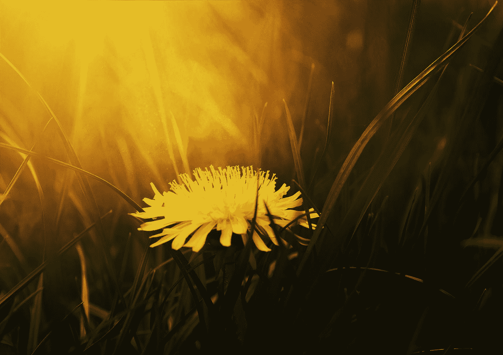

# 如何成为一株杂草

> 原文：<https://medium.com/swlh/how-to-be-a-weed-79f64cf983ba>

## 几乎权威的指南

## 像杂草一样拥抱你的生活所需的光荣属性

Photo by [Natalia Luchanko](https://unsplash.com/@gvinevra38?utm_source=medium&utm_medium=referral) on [Unsplash](https://unsplash.com?utm_source=medium&utm_medium=referral)

> 在花的世界里，做一株杂草。

根据全知百科[维基百科](https://en.wikipedia.org/wiki/Weed) …

> 杂草是一种在特定情况下被认为是不受欢迎的植物