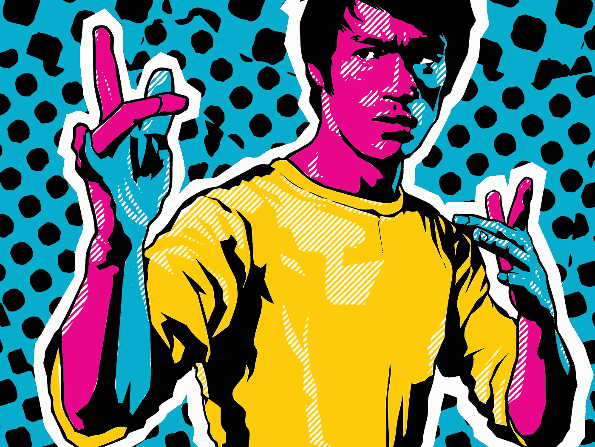

# 当你被吓得屁滚尿流时如何变得勇敢

> 原文：<https://medium.com/swlh/how-to-be-brave-when-you-are-scared-shitless-721c8879386d>

Image Credit: [Benjamin Wachenje](http://www.benjaminwachenje.com/2015/6/26/2015/6/26/bruce-lee)

你可以到达一个顶峰，然后它就会从你身边消失。我失业的时候也遇到过这种情况。我以前从未被解雇过，我非常害怕。我能想到的就是这句话:

> “勇敢的人不是不害怕的人，而是战胜恐惧的人。”——纳尔逊·曼德拉